# Cấu Trúc Mã Nguồn & Bản Đồ Kiến Trúc (Architecture Master Map)

Tài liệu này là **Bản đồ chỉ đường (Entry Point)** cho toàn bộ dự án `ifol-animation`. Nó định nghĩa quy hoạch thư mục mã nguồn và quy tắc phụ thuộc nghiêm ngặt giữa các tầng.

> **Quy tắc Bất Biến (The Golden Law):**
> $$\text{Core định nghĩa luật chơi} \longrightarrow \text{Feature định nghĩa quân cờ} \longrightarrow \text{Project chọn bộ quân cờ}$$
> $$\text{Host giữ loop} \longrightarrow \text{Engine dựng runtime} \longrightarrow \text{ECS chạy một step} \longrightarrow \text{Package/Service làm việc chuyên biệt}$$

---

## 1. Mô Hình Bậc Thang Tự Chạy (The Runnable Ladder)

Dự án được xây dựng theo triết lý **Bottom-Up (Từ dưới lên)**: Mỗi tầng tự nó đã chạy được độc lập, tầng trên chỉ lắp thêm năng lực chứ không biến tầng dưới thành phụ thuộc của một hệ thống khổng lồ.

```mermaid
flowchart TB
    subgraph T0 ["TẦNG 0: SUBSYSTEM/UTILITY MÙ (Chạy và test độc lập)"]
        GPU["ifol-gpu (GPU Execution Substrate)"]
        Math["ifol-math (Pure Math Primitives)"]
        Asset["ifol-asset (Asset Catalog · Importer · Artifact Cache)"]
        Decode["ifol-decode (Image/Video/Audio Decoder)"]
        Encode["ifol-encode (Video/Image Encoder)"]
        Font["ifol-font (MSDF Font Atlas Generator)"]
        Mesh3D["ifol-import-3d (glTF/OBJ Parser)"]
    end

    subgraph T1 ["TẦNG 1: KERNEL & HEADLESS HOST"]
        ECS["ifol-ecs (World · Registries · Phase Graph · Query · Executor)"]
        Engine["ifol-engine (Headless Composition · Project · Package · Step)"]
    end

    subgraph T2 ["TẦNG 2: HỆ THỐNG GÓI TÍNH NĂNG (Feature Packages)"]
        RenderCore["feature-render-core (RenderCache · SubmitSystem)"]
        Shape["feature-shape (ShapeComponent)"]
        Image["feature-image (ImageComponent · Texture contribution)"]
        Video["feature-video (VideoComponent · FrameSelect)"]
        Anim["feature-animation (Keyframes · Curves)"]
    end

    subgraph T3 ["TẦNG 3: DÒNG LỆNH ĐIỀU KHIỂN (CLI First)"]
        CLI["ifol-cli (Headless Runner · Inspect · Mutate · Render · Export)"]
    end

    subgraph T4 ["TẦNG 4: GIAO DIỆN HIỂN THỊ & AI (Adapters / Shells)"]
        Desktop["studio-desktop (Tauri + Svelte UI)"]
        Web["studio-web (WASM + WebGPU Canvas)"]
        MCP["mcp-server (AI Coding Assistant Tool Gateway)"]
    end

    %% Dependencies: mũi tên đi từ consumer tới provider
    Engine --> ECS
    RenderCore --> ECS

    RenderCore --> GPU
    Shape --> RenderCore
    Shape --> ECS
    Image --> RenderCore
    Image --> Asset
    Image --> Decode
    Video --> RenderCore
    Video --> Asset
    Video --> Decode
    Anim --> ECS
    Anim --> Math

    CLI --> Engine
    Desktop --> Engine
    Web --> Engine
    MCP --> Engine
```



Các khối trong sơ đồ là **kiến trúc mục tiêu**, không phải danh sách phải triển
khai đồng thời. Mỗi subsystem/feature chỉ được tạo khi có use case thật và phải
có ví dụ chạy độc lập. `ifol-ecs` tự chạy độc lập. Vertical
slice render đầu tiên chỉ cần `ifol-ecs`, `ifol-gpu`, `feature-render-core` và
`feature-shape`. Profile project/CLI mới thêm `ifol-engine` và `ifol-cli` để
chứng minh open/save/render không cần UI. Schema/project là module thuộc engine
cho tới khi có consumer độc lập thật sự chứng minh cần tách crate.

`ifol-engine` là composition root bên ngoài ECS: nó tạo runtime, gọi registration
API và cung cấp một `step()` hữu hạn; platform host điều khiển outer loop.
`ifol-ecs` sở hữu bên trong các instance World,
registry, phase graph, compiled schedule, query/cache và executor. Feature có thể
gắn handle transient lên `WORLD_ENTITY` để system query bằng cơ chế component thống nhất. Từ
"singleton" trong tài liệu cấp workspace luôn có nghĩa **một instance trong một
`EngineRuntime`**, không phải global mutable static của toàn process.

---

## 2. Quy Hoạch Thư Mục Mã Nguồn (Codebase Layout)

Đây là layout mục tiêu. Workspace hiện tại có thể còn các placeholder tên cũ;
không rename/xóa hàng loạt trong một thay đổi tài liệu. Việc migration vật lý
phải diễn ra theo từng vertical slice, giữ workspace build/test xanh.

```text
ifol-animation/
├── Cargo.toml                  # Quản lý toàn bộ Rust Workspace
├── .agents/                    # [System] Rules và tài liệu Thiết kế Kiến trúc
│
├── crates/                     # [Core Libraries & Subsystems]
│   ├── ifol-ecs/               # [Core] Pure ECS runtime (World, Storage, Query, Phase DAG)
│   ├── ifol-engine/            # [Core] Headless composition, project/package/session/step
│   ├── ifol-gpu/               # [Subsystem] Agnostic GPU engine (wgpu, Graph, Barrier)
│   ├── ifol-math/              # [Utility, tăng dần] Math/value interpolation primitives
│   ├── ifol-asset/             # [Planned] Asset identity, catalog, importer/artifact cache
│   ├── ifol-decode/            # [Planned] Image/Video/Audio decoder host
│   └── ifol-encode/            # [Planned] Video/Image encoder host
│
├── features/                   # [Feature Packages — Đăng ký vào Engine & ECS]
│   ├── feature-render-core/    # Render contribution, graph build, submit
│   ├── feature-shape/          # ShapeComponent, systems, optional shader data
│   ├── feature-image/          # ImageComponent và integrations đã đăng ký
│   ├── feature-animation/      # Curve interpolation, Keyframes
│   └── feature-video/          # VideoComponent, frame selection
│
└── apps/                       # [Application Shells & Adapters]
    ├── ifol-cli/               # CLI Headless (Tạo project, mutate, render ra ảnh/video)
    ├── studio-desktop/         # Tauri App (Svelte UI trên Desktop)
    ├── studio-web/             # WASM Web App (Svelte UI + WebGPU)
    └── mcp-server/             # MCP Server cho AI Agent
```

---

## 3. Bản Đồ Tài Liệu Thiết Kế (Design Map)

Tài liệu trong `.agents/design/` được chuẩn hóa theo đúng 3 nhóm:

1. **Nhóm 1: Core Engine & Subsystems**
   * [`core_engine/01_ecs_manifest.md`](file:///c:/Users/abc/.AI/Code/ifol-animation/.agents/design/core_engine/01_ecs_manifest.md): Lõi ECS thuần túy (`ifol-ecs`).
   * [`core_engine/02_engine_manifest.md`](file:///c:/Users/abc/.AI/Code/ifol-animation/.agents/design/core_engine/02_engine_manifest.md): Contract headless composition runtime (`ifol-engine`).
   * [`crates/ifol-engine/docs/README.md`](file:///c:/Users/abc/.AI/Code/ifol-animation/crates/ifol-engine/docs/README.md): Manual triển khai, lifecycle, package/project và acceptance suite của engine.
   * [`crates/ifol-ecs/docs/README.md`](file:///c:/Users/abc/.AI/Code/ifol-animation/crates/ifol-ecs/docs/README.md): Manual trực quan về Entity, World, Registry, Query, System, Graph, Execute, Cache và Lifecycle.
   * [`crates/ifol-gpu/docs/`](file:///c:/Users/abc/.AI/Code/ifol-animation/crates/ifol-gpu/docs/): Tài liệu kỹ thuật chuyên sâu của `ifol-gpu`.
   * [`core_engine/03_scene_to_drawcall_translation.md`](file:///c:/Users/abc/.AI/Code/ifol-animation/.agents/design/core_engine/03_scene_to_drawcall_translation.md): Cầu nối `feature-render-core` dịch Scene sang `RenderGraph`.
   * [`core_engine/04_render_execution_trace.md`](file:///c:/Users/abc/.AI/Code/ifol-animation/.agents/design/core_engine/04_render_execution_trace.md): Luồng thực thi 1 frame.
   * [`core_engine/05_resource_lifecycle_and_ui_integration.md`](file:///c:/Users/abc/.AI/Code/ifol-animation/.agents/design/core_engine/05_resource_lifecycle_and_ui_integration.md): Ownership service/resource và output boundary.
2. **Nhóm 2: Application Host & Shell**
   * [`application_shell/01_platform_strategy.md`](file:///c:/Users/abc/.AI/Code/ifol-animation/.agents/design/application_shell/01_platform_strategy.md): Chiến lược đa nền tảng Desktop/Web/Mobile/CLI.
   * [`application_shell/02_ui_and_mcp_command_bus.md`](file:///c:/Users/abc/.AI/Code/ifol-animation/.agents/design/application_shell/02_ui_and_mcp_command_bus.md): Typed command/query/event mechanism, transactions và adapter parity.
   * [`application_shell/03_project_and_asset_management.md`](file:///c:/Users/abc/.AI/Code/ifol-animation/.agents/design/application_shell/03_project_and_asset_management.md): Project storage, Virtual Path, VFS.
3. **Nhóm 3: Ecosystem & Extensibility**
   * [`ecosystem/01_plugin_architecture.md`](file:///c:/Users/abc/.AI/Code/ifol-animation/.agents/design/ecosystem/01_plugin_architecture.md): Package contract, dependency và transactional registration.
   * [`ecosystem/02_versioning_and_migration.md`](file:///c:/Users/abc/.AI/Code/ifol-animation/.agents/design/ecosystem/02_versioning_and_migration.md): Nâng cấp tương thích ngược Schema.

---

## 4. Quy Tắc Phụ Thuộc (Dependency Rules) - Cấm Vi Phạm

1. **`ifol-gpu` và `ifol-ecs` KHÔNG BAO GIỜ biết nhau:** `ifol-ecs` là lõi tính toán logic, `ifol-gpu` là cỗ máy vẽ mù. Cầu nối duy nhất là `feature-render-core`.
2. **Mọi Subsystem mù (Decode, Font, 3D, GPU) KHÔNG BAO GIỜ gọi ECS:** Chúng chỉ nhận dữ liệu thô $\rightarrow$ trả về dữ liệu thô.
3. **External mutation đi qua typed contract:** UI, MCP, Agent và CLI không
   mutate trực tiếp ECS World. Package đăng ký concrete command/query/event;
   engine chỉ cung cấp dispatch/transaction mechanism generic.
4. **CLI First:** Bất kỳ tính năng nào cũng phải chạy và kiểm thử được qua dòng lệnh CLI trước khi gắn vào UI Svelte.
5. **Subsystem không phải Feature:** Subsystem cung cấp mechanism qua interface
   (`Graph -> Report`, `DecodeRequest -> Frame`, `AssetId -> Artifact`). Feature
   mới là nơi nối ECS data với subsystem đó.
6. **Không tạo trước vì roadmap:** Tên crate/feature được đánh dấu `[Planned]`
   chỉ là reservation kiến trúc. Không tạo crate rỗng hoặc abstraction chưa có
   consumer thực tế.
7. **Project lưu ID ổn định, không lưu đường dẫn package tuyệt đối:** Project khai
   báo `PackageId + version`; engine resolver chọn package khả dụng
   trên Desktop/Web/Mobile/CLI.

---

## 5. Định Nghĩa "Chạy Độc Lập" Ở Mỗi Tầng

| Tầng | Input | Output tối thiểu | Không cần |
|---|---|---|---|
| `ifol-gpu` | `RenderGraph` + resources | execution report/readback | ECS, project, UI |
| `ifol-ecs` | registration API + World data | `RunReport` + state changes | schema, clock, input, GPU, project, UI |
| `feature-render-core` | ECS render data + GPU service handle | graph execution/frame result | editor UI |
| `ifol-engine` | package set + generic project + typed input | `StepReport`, snapshot, diagnostics | platform loop, GUI |
| `ifol-cli` | command-line arguments | stdout/files/exit code | Desktop/Web UI |

`ifol-math` là pure utility tăng dần theo consumer thật. Stable project schema,
codec, migration và generic project container là module của `ifol-engine` trong
baseline. Chỉ tách crate khi có consumer độc lập thật sự; ECS chỉ cần runtime
`ComponentId`/type registry của chính nó và không phụ thuộc persistence/math/domain.
