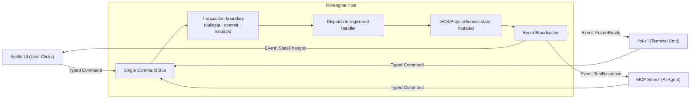

# Giao Tiếp: Single Command Bus, Transactions & Parity Giữa UI, CLI & AI (MCP)

Tài liệu này định nghĩa backend boundary của `ifol-engine`. UI, CLI, MCP và Agent
dùng cùng semantic capability; chúng có thể khác transport, permission và cách
nhận stream. Parity không có nghĩa mọi actor mặc định có toàn quyền.

---

## 1. Single Command Bus (Cổng Nhận Lệnh Độc Nhất)

Trong `ifol-engine`, external mutation đi qua typed command contract do package
đăng ký. Engine cung cấp dispatch/transaction mechanism generic; nó không chứa
enum `Command` trung tâm hoặc command nghiệp vụ như thêm Shape/nạp Asset.

---

## 2. Sự Bình Đẳng Giữa 3 Loại Tác Nhân (UI, CLI, AI)

| Tác nhân | Cách gửi lệnh | Cách nhận phản hồi |
| :--- | :--- | :--- |
| **1. CLI Terminal** | `ifol-cli entity add --type shape` | Nhận kết quả trực tiếp qua stdout hoặc mã thoát (Exit code). |
| **2. Svelte UI** | User bấm chuột trên giao diện $\rightarrow$ gửi `Command::AddShape` qua IPC/WASM binding | Lắng nghe `Event::StateChanged` để cập nhật Svelte 5 `$state`. |
| **3. AI Agent (MCP)**| AI gọi Tool Call `add_shape({ rect, color })` qua MCP Protocol | Nhận JSON kết quả và lắng nghe Event để biết thao tác đã thành công. |

👉 **Lợi ích:** Không có bất kỳ logic đặc biệt nào dành riêng cho UI hay AI. Nếu CLI làm được, AI làm được và UI làm được.

Typed command là representation nội bộ. JSON/IPC/MCP arguments chỉ là wire
format và phải được deserialize/validate trước khi dispatch.

Backend API gồm bốn nhóm tách biệt:

| Nhóm | Tác dụng |
|---|---|
| Command | Thay đổi state trong transaction |
| Query | Đọc state, không mutate |
| Event | Thông báo state/job/frame đã commit |
| Job | Công việc dài có progress/cancel như import/render/export |

Command envelope tối thiểu chứa command ID/version, actor, correlation ID,
transaction ID và capability context. Concrete command nằm cạnh feature sở hữu
nó và đăng ký vào Command Registry; không tạo một enum trung tâm phải sửa mỗi
khi thêm feature.

---

## 3. Transaction Và History Policy

Mỗi Command khi thực thi được bọc trong một `Transaction`:
1. validate command, actor capability và precondition;
2. handler tạo mutation patch/inverse command/snapshot phù hợp;
3. chỉ broadcast event sau khi transaction commit;
4. rollback toàn transaction nếu handler thất bại giữa chừng;
5. coalesce history cho thao tác kéo liên tục khi command policy cho phép.

Undo/redo không phải trách nhiệm bắt buộc của engine core. Package có thể đăng ký
inverse/patch policy; application/editor layer có thể xây history service trên
transaction result. Engine không giữ history stack mặc định. Save project dùng
schema registry của engine và package codecs, không serialize trực tiếp layout
bộ nhớ ECS.

---

## 4. Live Sync

Sau commit, Event Broadcaster phát event có revision/correlation ID. UI cập nhật
state từ event hoặc query lại projection cần thiết. MCP/Agent nhận cùng kết quả
semantic, nhưng transport có thể trả response trực tiếp thay vì giữ subscription
dài hạn. Không phát `StateChanged` chung chung nếu có thể phát event typed và hẹp.
