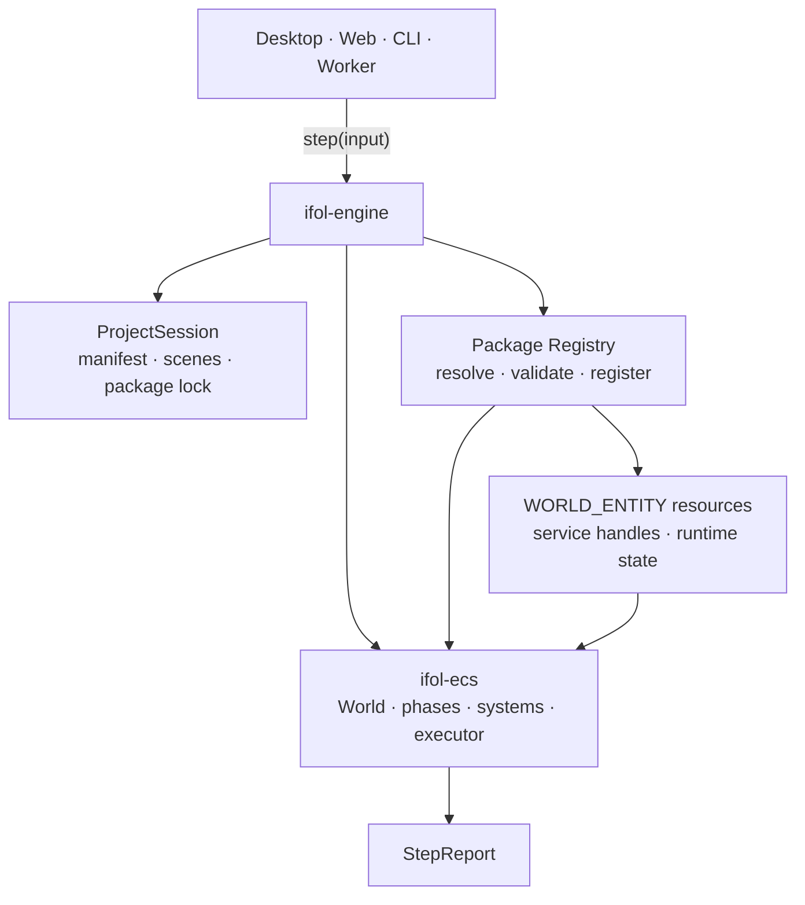
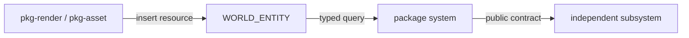

# ifol-engine: Headless Composition Runtime

Đây là contract kiến trúc cấp workspace của `ifol-engine`. Engine được xây như
một runtime hoàn chỉnh, có thể feature-freeze sau khi acceptance suite xanh;
không phải MVP, prototype hay lớp bọc đổi tên của `ifol-ecs`.

## 1. Mục tiêu duy nhất

`ifol-engine` biến một project generic và tập package đã resolve thành một
`EcsRuntime` có thể `step()` trên mọi host headless.



Engine không định nghĩa Shape, Asset, GPU, Animation, Time hay Render phase.
Không package nào active thì engine vẫn build, compile và step một runtime rỗng
hợp lệ.

`ifol-ecs` được build như library dependency của `ifol-engine`. Mandatory direct
production dependency của engine không được kéo `ifol-gpu`, `ifol-asset` hoặc
production feature package; các capability đó đến qua package registration và
typed root resource. Thư viện utility chỉ được thêm khi phục vụ contract engine
thật, không vì roadmap.

## 2. Ownership

`ifol-engine` sở hữu:

- đúng một `EcsRuntime` cho mỗi `EngineRuntime`;
- package catalog/selection và registration transaction;
- project manifest, package lock và scene documents generic;
- schema/codec registry cần để chuyển scene record sang component runtime;
- lifecycle `build -> ready -> step -> reconfigure/shutdown`;
- typed diagnostics của composition, load và step.

`ifol-engine` không sở hữu:

- platform event loop, window, surface, timer cadence hoặc thread chính;
- semantic component/system/phase của feature;
- implementation GPU, asset, codec, network hoặc filesystem;
- editor command history, selection, panel/layout hoặc UI state;
- đường dẫn/nội dung namespace project do package claim.

Host giữ loop. Engine chỉ cung cấp một đơn vị chạy hữu hạn:

```text
poll host/platform
  -> engine.step(input)
  -> receive StepReport
  -> host quyết định present/wait/next job
```

## 3. ECS là trung tâm runtime

Mọi state dùng chung mà system cần query là world component trên
`EntityId::WORLD`. Không tạo resource store hoặc change tracker thứ hai.

```text
WORLD_ENTITY
├── package-owned runtime resources
├── service handles
├── time/input state nếu package tương ứng đăng ký
└── project/session projection nếu system thật sự cần
```

Entity component và world resource dùng cùng component/storage model. Khác biệt
là registration và cardinality:

- `register_component<T>()`: type có thể gắn lên entity thường;
- `register_resource<T>(provider)`: đăng ký world singleton và provider tạo đúng
  một instance trên `WORLD_ENTITY`.

Resource initialization phải explicit và transactional. Không gọi `Default`
ngầm, không global singleton và không giữ một service registry song song.

System là behavior, không phải component. Package đăng ký component/resource,
system và phase qua các API khác nhau dù tất cả cùng góp vào một runtime.

## 4. Subsystem và service handle

Subsystem mù như `ifol-gpu` hoặc `ifol-asset` được package tạo/gắn vào runtime,
không được engine hard-code:



ECS resource giữ typed façade/handle và state quan sát được. Subsystem vẫn sở hữu
implementation, worker, cache và lifetime nội bộ của nó.

## 5. Project và namespace

Engine chỉ chuẩn hóa phần nó quản lý:

```text
project/
├── project.toml
├── package.lock
├── packages/          # optional project-local package sources/artifacts
├── scenes/            # generic entity/component records
└── runtime/
    └── <package-id>/  # opaque namespace do package claim
```

Không có thư mục `assets`, `presets`, `render` hoặc `animation` bắt buộc. Package
tương ứng tự claim namespace và định nghĩa schema/migration cho dữ liệu của nó.
Cache có thể tái tạo phải được đánh dấu rõ và không trở thành điều kiện mở
project.

Scene là document generic gồm entity identity và component records có stable
schema ID/version. Engine không hiểu semantic record; package owner đăng ký
codec, validation và migration.

## 6. Package contract

Package là đơn vị phân phối; feature là contribution được package đăng ký.
Runtime không phân loại foundation/content/composition. Dependency và phase graph
đã đủ mô tả quan hệ.

Registration phải theo pipeline fail-closed:

```text
discover candidates
  -> resolve version/dependency DAG
  -> validate capability + namespace ownership
  -> prepare schema/resource/system/phase contributions
  -> validate toàn bộ
  -> commit atomically
  -> compile ECS
  -> instantiate scene
  -> Ready
```

Không publish registration một phần. Không chạy package code chưa validate.
Không lưu absolute implementation path vào project.

## 7. API boundary dự kiến

```rust
EngineBuilder::new()
    .with_project_source(...)
    .with_package_source(...)
    .register_package(...)
    .build()?;

engine.step(frame_input)?;
engine.snapshot()?;
engine.reconfigure(change_set)?;
engine.shutdown()?;
```

Tên type cuối cùng được chốt trong implementation plan, nhưng semantics trên là
bất biến. `step()` không poll window, sleep, block vô hạn hoặc tự tạo loop.

## 8. Definition of Done

Engine chỉ được feature-freeze khi:

- project trống và runtime không package hoạt động hợp lệ;
- package registration/dependency/namespace/schema đều transactional;
- scene load/save giữ opaque record khi thiếu owner package;
- resource provider tạo đúng một root instance và rollback sạch khi lỗi;
- reconfigure không để schedule cũ executable;
- cùng input/project/package lock tạo registration và execution order ổn định;
- host desktop/web/CLI/test đều dùng cùng headless API;
- public API đủ dùng mà không mở raw mutable registries ngoài bootstrap scope;
- mọi acceptance slice và edge-case matrix trong manual `ifol-engine` xanh;
- fmt, clippy `-D warnings`, unit, integration, doc tests và feature-free builds
  đều xanh.

Sau mốc này, Name/Hierarchy/Transform/Render/Asset/Shape/Image chỉ được thêm như
package; nếu cần sửa engine thì phải chứng minh contract generic thực sự thiếu.
