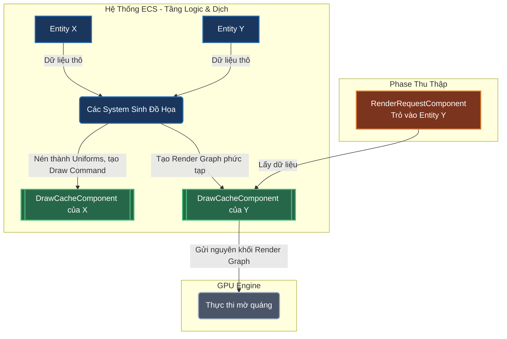

# Mảnh Ghép Cuối: Quá Trình Phiên Dịch (Translation Pipeline)

Tài liệu này đặc tả cơ chế "Phiên dịch" — Cây cầu nối giữa hệ thống **ECS Logic (Tài liệu 01)** và hệ thống **GPU Engine Mù Quáng (Tài liệu 02)**. 

Tài liệu này tuyệt đối không phụ thuộc vào bất kỳ Component nghiệp vụ nào (không Camera, không Composition, không Shape). Nó chỉ định nghĩa **cách dòng chảy dữ liệu đi qua ECS để biến thành Render Graph**.

---

## 1. Bản Chất Quá Trình Phiên Dịch

Quá trình dịch từ Scene sang lệnh vẽ thực chất **là một chuỗi các System nằm trong ECS**. Hệ thống không có một "Draw Compiler" ngoại lai nào cả. Mọi thứ tuân thủ chặt chẽ vòng đời của ECS.

Dòng chảy dữ liệu diễn ra qua 3 bước cốt lõi:

### Bước 1: Tính toán logic (Logic Phases)
Các System nghiệp vụ (vd: System tính toán tọa độ, System nội suy xương khớp) chạy trước.
*   **Đầu vào:** Các Component dữ liệu thô (tọa độ tương đối, kích thước).
*   **Đầu ra:** Dữ liệu đã được chuyển thành tuyệt đối (World Matrix).

### Bước 2: Sinh dữ liệu vẽ (Draw Generation Phase)
Các System chịu trách nhiệm đồ họa bắt đầu chạy. Nhiệm vụ của chúng là đọc dữ liệu tuyệt đối ở Bước 1, và nén thành các `Draw Command` hoặc `Render Pass`.
*   **Cơ chế:** Thay vì gọi lệnh vẽ ngay, các System này sẽ tạo ra một Component runtime (chỉ tồn tại trong lúc chạy) gắn ngược lại vào Entity đó, gọi là **`DrawCacheComponent`**.
*   **Ý nghĩa:** `DrawCacheComponent` chính là kết quả phiên dịch. Nó chứa sẵn một phần hoặc toàn bộ **Render Graph**.
    *   *Trường hợp 1 (Entity đơn giản):* System của nó chỉ tạo ra 1 `Draw Command` phẳng, bọc trong 1 `Render Pass` và lưu vào `DrawCacheComponent`.
    *   *Trường hợp 2 (Entity gom nhóm/phức tạp):* System của nó sẽ đi đọc `DrawCacheComponent` của các Entity khác, tổng hợp lại, sắp xếp Layer, và tạo ra một **Render Graph** hoàn chỉnh (chứa nhiều Pass) rồi lưu vào `DrawCacheComponent` của chính nó.

### Bước 3: Thu thập và Gửi đi (Render Dispatch Phase)
Đây là Phase cuối cùng của ECS.
*   Nó tìm kiếm tất cả các Entity mang `RenderRequestComponent` (Entity đánh dấu yêu cầu xuất ra màn hình/viewport).
*   Từ đó, nó tra cứu Entity đích.
*   Nó lấy cái `DrawCacheComponent` (chính là cái Render Graph đã được dịch ở Bước 2) của Entity đích.
*   Gửi thẳng cái Render Graph đó xuống GPU Engine (`ifol-gpu`). GPU Engine không cần biết ai đã sinh ra nó, chỉ việc nhắm mắt thực thi (như đã mô tả ở Tài liệu 02).

---

## 2. Các Component Bắt Buộc Của Khung Xương (Core Components)

Để kiến trúc phiên dịch này hoạt động độc lập với nghiệp vụ, khung xương ECS phải định nghĩa sẵn 2 Component cốt lõi sau (Bổ sung cho Tài liệu 01):

### 2.1. `DrawCacheComponent`
Là nơi chứa kết quả sau khi một Entity được "phiên dịch" thành lệnh đồ họa.
*   **Kiểu dữ liệu:** Chứa một `RenderGraph` (bao gồm các `RenderPass` và `DrawCommand`).
*   **Tính chất:** Là dữ liệu trung gian. Có thể tái sử dụng (Cache) nếu Entity không bị thay đổi (không có Dirty Flag), giúp CPU không phải tốn công tính toán và nén Uniforms lại mỗi khung hình.

### 2.2. `RenderRequestComponent`
Là điểm kích hoạt việc gửi dữ liệu xuống GPU.
*   **Kiểu dữ liệu:** Trỏ đến ID của một Entity đích, kèm theo thông tin Viewport (render ra đâu).
*   **Tính chất:** Bắt buộc phải có để GPU Engine biết cần lấy `DrawCacheComponent` của ai để đem đi vẽ. Hỗ trợ đa Viewport (nhiều Entity cùng yêu cầu render).

---

## 3. Sơ Đồ Khái Niệm (Trực Quan Hóa Dòng Chảy)

Sơ đồ dưới đây minh họa cách dữ liệu chảy từ trên xuống dưới mà không cần biết Entity đó là gì.

---

## 4. Đặc Tính Tối Ưu Bẩm Sinh Của Kiến Trúc

Bằng việc đặt việc phiên dịch thành một Phase của ECS và lưu kết quả vào `DrawCacheComponent`, kiến trúc này tự động thừa hưởng các tối ưu sau:

1.  **Zero-copy (Không sao chép thừa):** Các System sinh đồ họa sẽ nén dữ liệu (như tính toán ma trận tọa độ) và ghi thẳng vào mảng `f32` của `Draw Command` nằm trong `DrawCacheComponent`. Không sinh ra các struct trung gian (như `FlatEntity` ở dự án cũ).
2.  **Tái sử dụng (Pass Caching):** Nếu một Entity (và các con của nó) không có sự thay đổi về mặt vật lý hay hình ảnh, System sinh đồ họa sẽ bỏ qua nó. `DrawCacheComponent` của nó ở frame trước sẽ được giữ nguyên và tái sử dụng cho GPU ở frame này.
3.  **Tự do nghiệp vụ:** Bất kể tương lai bạn phát triển Entity có cách vẽ phức tạp đến đâu (camera tự lùi, đệ quy đứt gãy), System của bạn chỉ cần tuân thủ 1 luật: **Lắp ráp kết quả cuối cùng thành Render Graph và nhét vào `DrawCacheComponent`.** Hệ thống tự động vận hành trơn tru.
