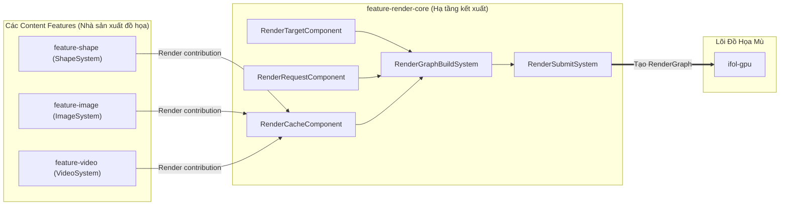

# Cầu Nối Kết Xuất: Phiên Dịch Scene Sang RenderGraph (`feature-render-core`)

Tài liệu này đặc tả cơ chế "Phiên dịch" — Cầu nối kết xuất giữa **ECS World**
và lõi đồ họa mù `ifol-gpu`. World có thể có hoặc không có hierarchy; Render
Core không được giả định `Transform`, `Camera`, `Group` hay loại nội dung cụ thể.

---

## 1. Vị Trí Của `feature-render-core`

`feature-render-core` là một **Foundation Feature** được đăng ký vào Engine Host và ECS World:
* **Không làm ô nhiễm `ifol-ecs`:** ECS thuần túy không cần biết `RenderGraph` là gì.
* **Không làm ô nhiễm `ifol-gpu`:** GPU Engine không cần biết `EntityId` hay `Transform` là gì.
* **Nhiệm vụ:** Cung cấp contract render chung, gọi API của `ifol-ecs` để đăng ký
  phase/system render, gom render contribution do Content Feature tạo, dựng
  `RenderGraph` và gọi public checked execution API của `ifol-gpu`.

---

## 2. Contract Của Render Core

### 2.1. `RenderTargetComponent`

Mô tả output logic mà host muốn render: kích thước, format/capability yêu cầu và
target identity. Surface hoặc offscreen texture cụ thể được resolve qua render/GPU
service; component không giữ platform window object.

### 2.2. `RenderRequestComponent`

Mô tả một yêu cầu render: source/query hoặc output set, target, time/frame và
settings. Viewport, thumbnail và offline export đều dùng cùng contract; UI không
phải điều kiện tồn tại của request.

### 2.3. `RenderCacheComponent`

Lưu render contribution đã chuẩn hóa hoặc handle tới render-owned cache của một
Entity. Chi tiết representation (`RenderNodeId`, descriptor key, revision...) là
contract của Render Core và có thể tiến hóa theo API `ifol-gpu`; không được đồng
nhất cờ dirty của ECS với cache `RenderBundle` nội bộ GPU.

Invalidation dựa trên revision/dependency từ change tracking và resource version.
Mọi tuyên bố tiết kiệm CPU phải được chứng minh bằng benchmark.

### 2.4. Phase contribution qua ifol-ecs

1. `render.prepare`: Content Feature query component của chính nó và cập nhật
   render contribution. Shape có thể chỉ tạo quad màu; Image có thể resolve
   artifact; Video có thể chọn frame qua decode service.
2. `render.graph-build`: Render Core thu thập request/target/contribution và dựng
   graph deterministic.
3. `render.submit`: gọi checked API của `ifol-gpu`, ghi execution/frame result và
   diagnostics vào report/event của host.

Render Core chỉ đóng góp các phase này qua registration API. Sau khi đăng ký,
`ifol-ecs` sở hữu phase graph, binding và compiled schedule; các phase không tồn
tại nếu Render Core không được cài.

---

## 3. Quyền Sở Hữu DrawBatch Và SubGraph

Render Core không tự suy luận semantic của Entity:

1. Content Feature như Shape/Image/Text thường tạo contribution có thể hạ thành
   `DrawBatch`.
2. Composition/Effect Feature hiểu Group/Blur/Mask của chính nó và tạo graph
   fragment/subgraph cùng dependency/offscreen target cần thiết.
3. Render Core validate và compose các fragment thành root graph; nó không đoán
   một Entity là Shape, Group hay Camera.

Nhờ vậy thêm content/composition feature mới không cần sửa một
`TranslationSystem` trung tâm.

---

## 4. Ranh Giới Màu Sắc & Working Color Space

Color management là policy của render/product profile, không phải ECS/GPU kernel.
Profile phải khai báo working space, transfer function và output conversion rõ
ràng. `Rgba8UnormSrgb` là format có sRGB transfer behavior, không phải ví dụ
texture lưu trữ linear tương đương `Rgba16Float`.

Render Core chuyển policy đã chuẩn hóa thành physical texture formats và graph
passes. Surface capability khác nhau có thể cần fallback; không được cam kết
pixel parity trên platform chưa có runtime evidence.
