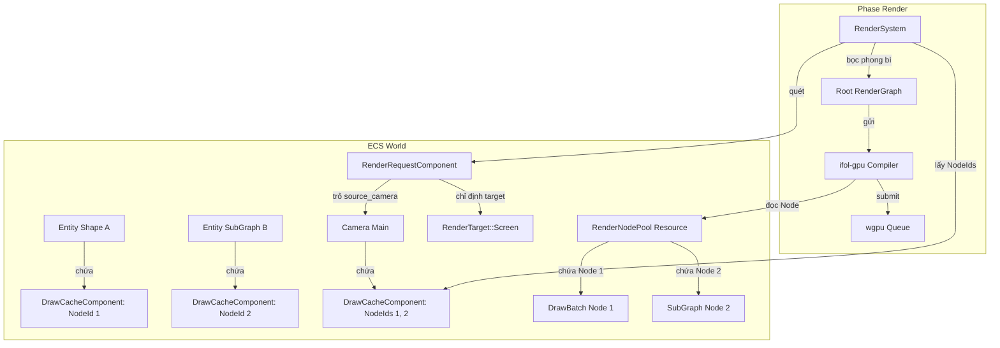

# 05. Master Render Architecture V2: Thiết Kế Tổng Hợp Hoàn Chỉnh

Tài liệu này là **Bản thiết kế Master (Chuẩn mực cao nhất)** của lõi `ifol-gpu` và cầu nối `ifol-ecs`. Nó tổng hợp toàn bộ 10 chân lý kiến trúc đã được thống nhất và tinh chỉnh.

---

## 1. Triết Lý Thiết Kế Cốt Lõi (10 Chân Lý Kiến Trúc)

1. **Shader chỉ có 1 loại duy nhất:** Đọc dữ liệu từ ổ cắm `@binding(N)` -> Tính toán -> Nhả pixel ra cổng `@location(0)`. Shader hoàn toàn mù quáng về nguồn gốc input (từ file hay từ SubGraph) và đích đến target.
2. **DrawAction có 2 dạng:** `Indexed` (vẽ Mesh có sẵn đỉnh/mặt) và `Procedural` (Shader tự sinh đỉnh từ `vertex_index`). Đây là hình thức quẹt cọ, không phải loại Shader.
3. **1 Entity = 1 Node = 1 DrawCommand (90% phổ biến):** Mỗi Entity có hành vi vẽ tương ứng với 1 Node trong Pool. Danh sách `Vec<DrawCommand>` phục vụ ngoại lệ (multi-material, multi-pass filter).
4. **1 RenderGraph = 1 RenderTarget = 1 RenderPass:** Sửa triệt để sai lầm cũ. Mọi Node trong cùng 1 Graph chia sẻ duy nhất 1 GPU RenderPass. Mỗi Node chỉ phát (`execute_bundles`) băng ghi âm của nó bên trong Pass đó.
5. **SubGraph tồn tại vì Input Texture chưa tồn tại:** SubGraph không phải vì Shader đặc biệt, mà vì texture input cho bước sau chưa được vẽ xong — buộc phải vẽ ra Offscreen trước.
6. **Compiler 2-Phase (Depth-First Execution):**
   - **Phase 1 (Bottom-up):** Đệ quy duyệt tất cả SubGraph con, mở RenderPass vẽ chúng ra Offscreen Textures.
   - **Phase 2 (Top-level):** Mở 1 RenderPass duy nhất cho Graph hiện tại, phát toàn bộ Bundles của các Node con.
7. **`ifol-gpu` là Thư viện thuần túy:** Định nghĩa kiểu dữ liệu (`RenderGraph`, `RenderNode`, `DrawCommand`) và cung cấp API thao tác. ECS là bên sở hữu instance và gọi API.
8. **Arena Pattern (`RenderNodePool`):** Node sống trong Pool trung tâm (HashMap/SlotMap), các nơi tham chiếu bằng `RenderNodeId` (u64). Giải quyết triệt để Rust borrow checker, đạt $O(1)$ lookup và cho phép multi-viewport chia sẻ chung Node.
9. **RenderBundle nằm trong Node:** `DrawBatch` và `SubGraph` sở hữu `bundle: Option<wgpu::RenderBundle>`. Cập nhật Transform (di chuyển/xoay) KHÔNG làm dirty bundle nhờ cơ chế Dynamic Offset / Ring Buffer.
10. **`RenderRequestComponent` quyết định Target:** Camera Entity không sở hữu Target hay RenderGraph. Camera chỉ chứa danh sách Node con. `RenderRequestComponent` chỉ định Target. `RenderSystem` bọc "phong bì" `RenderGraph` tạm thời ở mỗi frame gửi xuống `ifol-gpu`.

---

## 2. Cấu Trúc Dữ Liệu Lõi (Rust Data Structures)

```rust
// ═══════════════════════════════════════════════════════════
// 1. HỆ THỐNG ĐỊNH DANH (HANDLES & IDS)
// ═══════════════════════════════════════════════════════════

#[derive(Debug, Clone, Copy, PartialEq, Eq, Hash)]
pub struct PipelineHandle(pub u64);   // ID của Shader + Render Pipeline

#[derive(Debug, Clone, Copy, PartialEq, Eq, Hash)]
pub struct TextureHandle(pub u64);    // ID của Ảnh/Video/Offscreen Texture

#[derive(Debug, Clone, Copy, PartialEq, Eq, Hash)]
pub struct BindGroupHandle(pub u64);  // ID của túi dữ liệu (Uniforms + Textures + Samplers)

#[derive(Debug, Clone, Copy, PartialEq, Eq, Hash)]
pub struct MeshHandle(pub u64);       // ID của Vertex/Index Buffer

#[derive(Debug, Clone, Copy, PartialEq, Eq, Hash)]
pub struct RenderNodeId(pub u64);     // ID duy nhất của Node trong RenderNodePool

// ═══════════════════════════════════════════════════════════
// 2. HÀNH ĐỘNG VẼ (DRAW ACTION) & LỆNH VẼ (DRAW COMMAND)
// ═══════════════════════════════════════════════════════════

#[derive(Debug, Clone, PartialEq, Eq)]
pub enum DrawAction {
    /// Vẽ theo Mesh có sẵn trong VRAM (Vertex + Index Buffer)
    Indexed {
        mesh: MeshHandle,
        index_range: std::ops::Range<u32>,
        instance_range: std::ops::Range<u32>,
    },
    /// Shader tự sinh đỉnh từ vertex_index (dùng cho Fullscreen Quad / Post-FX)
    Procedural {
        vertex_count: u32,
        instance_range: std::ops::Range<u32>,
    },
}

#[derive(Debug, Clone, PartialEq, Eq)]
pub struct DrawCommand {
    pub pipeline: PipelineHandle,
    pub bind_groups: Vec<(u32, BindGroupHandle, Vec<u32>)>, // (Slot, Handle, Dynamic_Offsets)
    pub action: DrawAction,
}

// ═══════════════════════════════════════════════════════════
// 3. NÚT VẼ (RENDER NODE) & ARENA POOL
// ═══════════════════════════════════════════════════════════

#[derive(Debug, Clone)]
pub enum RenderNode {
    /// Nhóm đệ quy: Vẽ graph con ra Offscreen trước, sau đó phát commands để in kết quả lên cha
    SubGraph {
        name: String,
        graph: Box<RenderGraph>,
        commands: Vec<DrawCommand>,
        is_dirty: bool,
        bundle: Option<wgpu::RenderBundle>,
    },
    /// Danh sách lệnh vẽ phẳng trên cùng một Target
    DrawBatch {
        commands: Vec<DrawCommand>,
        is_dirty: bool,
        bundle: Option<wgpu::RenderBundle>,
    },
}

/// Pool trung tâm quản lý toàn bộ Node (Arena Pattern)
#[derive(Default)]
pub struct RenderNodePool {
    nodes: std::collections::HashMap<RenderNodeId, RenderNode>,
    next_id: u64,
}

impl RenderNodePool {
    pub fn new() -> Self { Self::default() }

    pub fn alloc_batch(&mut self, commands: Vec<DrawCommand>) -> RenderNodeId {
        self.next_id += 1;
        let id = RenderNodeId(self.next_id);
        self.nodes.insert(id, RenderNode::DrawBatch {
            commands,
            is_dirty: true,
            bundle: None,
        });
        id
    }

    pub fn alloc_subgraph(&mut self, name: &str, graph: RenderGraph, commands: Vec<DrawCommand>) -> RenderNodeId {
        self.next_id += 1;
        let id = RenderNodeId(self.next_id);
        self.nodes.insert(id, RenderNode::SubGraph {
            name: name.to_string(),
            graph: Box::new(graph),
            commands,
            is_dirty: true,
            bundle: None,
        });
        id
    }

    pub fn get(&self, id: RenderNodeId) -> Option<&RenderNode> { self.nodes.get(&id) }
    pub fn get_mut(&mut self, id: RenderNodeId) -> Option<&mut RenderNode> { self.nodes.get_mut(&id) }
    
    pub fn update_commands(&mut self, id: RenderNodeId, commands: Vec<DrawCommand>) -> bool {
        if let Some(node) = self.nodes.get_mut(&id) {
            match node {
                RenderNode::DrawBatch { commands: cmds, is_dirty, bundle } => {
                    *cmds = commands;
                    *is_dirty = true;
                    *bundle = None;
                }
                RenderNode::SubGraph { commands: cmds, is_dirty, bundle, .. } => {
                    *cmds = commands;
                    *is_dirty = true;
                    *bundle = None;
                }
            }
            true
        } else { false }
    }

    pub fn mark_dirty(&mut self, id: RenderNodeId) {
        if let Some(node) = self.nodes.get_mut(&id) {
            match node {
                RenderNode::DrawBatch { is_dirty, bundle, .. } |
                RenderNode::SubGraph { is_dirty, bundle, .. } => {
                    *is_dirty = true;
                    *bundle = None;
                }
            }
        }
    }
}

// ═══════════════════════════════════════════════════════════
// 4. ĐÍCH ĐẾN (RENDER TARGET) & ĐỒ THỊ VẼ (RENDER GRAPH)
// ═══════════════════════════════════════════════════════════

#[derive(Debug, Clone, PartialEq, Eq)]
pub enum RenderTarget {
    Screen,
    Offscreen {
        color: TextureHandle,
        width: u32,
        height: u32,
    },
}

#[derive(Debug, Clone)]
pub struct RenderGraph {
    pub target: RenderTarget,
    pub clear_color: Option<[f32; 4]>,
    pub depth_stencil: Option<TextureHandle>,
    pub node_ids: Vec<RenderNodeId>,
}
```

---

## 3. Thuật Toán Compiler 2-Phase (1 Graph = 1 RenderPass)

```text
┌─────────────────────────────────────────────────────────────────────────┐
│                     RenderGraphExecutor::execute                        │
└─────────────────────────────────────────────────────────────────────────┘
                                     │
                                     ▼
┌─────────────────────────────────────────────────────────────────────────┐
│ PHASE 1: Đệ Quy Xử Lý SubGraphs (Bottom-Up)                            │
│ Duyệt qua tất cả node_ids, nếu node là SubGraph:                        │
│ 1. Đệ quy compile_graph(subgraph.graph)                                 │
│ 2. Kết quả: Offscreen Texture của SubGraph được vẽ xong trước!          │
└─────────────────────────────────────────────────────────────────────────┘
                                     │
                                     ▼
┌─────────────────────────────────────────────────────────────────────────┐
│ PHASE 2: Mở 1 GPU RenderPass Duy Nhất Cho Graph Hiện Tại               │
│ let pass = encoder.begin_render_pass(graph.target);                    │
│                                                                         │
│ Duyệt qua tất cả node_ids:                                              │
│ - Nếu node.is_dirty == true:                                            │
│     * Thu âm commands thành wgpu::RenderBundle                          │
│     * node.bundle = Some(recorded_bundle); node.is_dirty = false;       │
│ - pass.execute_bundles(&[node.bundle]);                                 │
│                                                                         │
│ end_render_pass();                                                      │
└─────────────────────────────────────────────────────────────────────────┘
                                     │
                                     ▼
┌─────────────────────────────────────────────────────────────────────────┐
│ queue.submit(encoder.finish()) → Ném CommandBuffer duy nhất xuống GPU   │
└─────────────────────────────────────────────────────────────────────────┘
```

---

## 4. Cơ Chế Đọc/Ghi Tự Động (Binding & Location)

```wgsl
// WGSL Shader
@group(0) @binding(0) var tex_input: texture_2d<f32>; // ĐỌC từ slot 0
@group(0) @binding(1) var tex_sampler: sampler;

@fragment
fn fs_main(in: VertexOutput) -> @location(0) vec4<f32> { // GHI ra cổng 0
    return textureSample(tex_input, tex_sampler, in.uv);
}
```

- **ĐỌC (Input):** Shader ghi `@binding(0)`. CPU (Rust) cắm `TextureHandle` cụ thể vào `BindGroup` slot 0. Cho dù `TextureHandle` là ảnh file `hero.png` hay là Offscreen Texture `TextureHandle(B)` từ SubGraph, Shader đọc **hệt như nhau**.
- **GHI (Output):** Shader nhả màu ra `@location(0)`. Compiler khi mở `begin_render_pass` đấu nối `location(0)` với `graph.target`. Pixel tự động chảy vào đúng Target.

---

## 5. Tích Hợp ECS (RenderSystem & Component)



- `DrawCacheComponent`: Lưu `node_id: RenderNodeId`.
- `RenderRequestComponent`: Chứa `source_camera: EntityId` và `output_target: RenderTarget`.
- `RenderSystem`: Đóng vai trò bọc phong bì `RenderGraph` ở cuối frame:
  ```rust
  let root_graph = RenderGraph {
      target: request.output_target.clone(),
      clear_color: Some([0.1, 0.1, 0.1, 1.0]),
      depth_stencil: camera_cache.depth_handle,
      node_ids: camera_cache.node_ids.clone(),
  };
  executor.execute(&gpu_engine, &registry, &mut node_pool, &root_graph);
  ```

---

## 6. Tổng Kết Quy Trình Chạy 1 Frame (End-to-End Trace)

1. **ECS System Phase:** Tính toán tọa độ, animation, update `UniformRingBuffer` trên VRAM. Nếu Entity thay đổi material/structure -> gọi `pool.update_commands(node_id, new_cmds)` (bật `is_dirty = true`).
2. **ECS Render Phase:** `RenderSystem` tìm `RenderRequestComponent`, đọc `node_ids` từ Camera, tạo `RenderGraph` tạm thời.
3. **GPU Phase 1 (SubGraph Offscreens):** Compiler đệ quy duyệt `node_ids`, thấy Node 2 là SubGraph -> vẽ SubGraph ra `Offscreen Texture B`.
4. **GPU Phase 2 (Root Pass):** Compiler mở 1 `RenderPass` duy nhất cho Screen.
   - Node 1: phát `bundle_1`
   - Node 2: phát `bundle_2` (vẽ kết quả Offscreen B lên Screen)
5. **GPU Submit:** `queue.submit()` 1 lần duy nhất. Khung hình hiển thị 144 FPS mượt mà!
