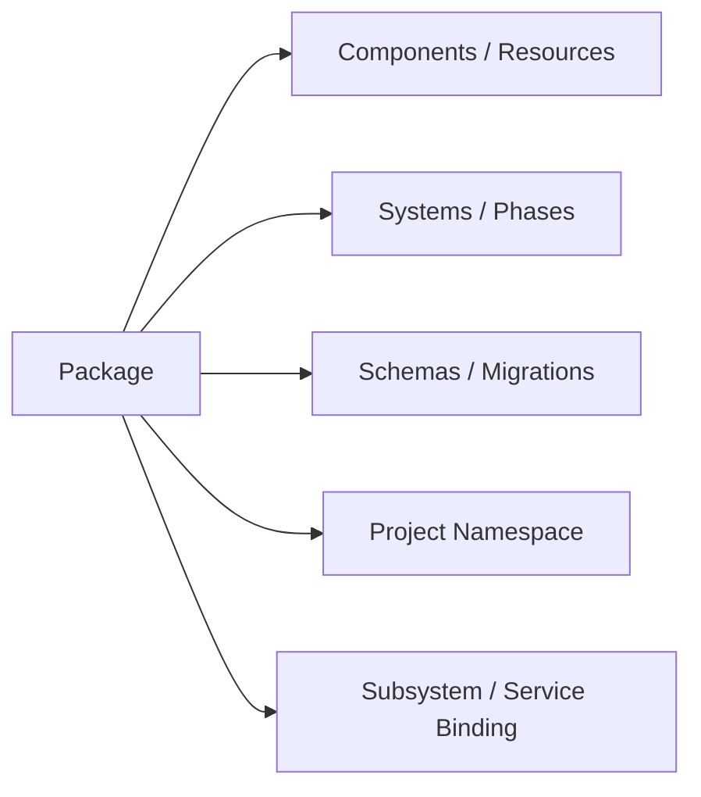

# Kiến Trúc Gói Tính Năng Mở Rộng (Feature Packages & Extensibility)

Tài liệu này đặc tả cơ chế đóng gói và mở rộng tính năng (Feature Package System) trong `ifol-animation`.

> **Quy tắc Vàng:**
> Core (`ifol-ecs`, `ifol-engine`) định nghĩa **luật chơi**. Package định nghĩa
> contribution. Project chỉ định package nào cần dùng.

---

## 1. Một Package Contract, Không Taxonomy Runtime



Runtime không gắn nhãn foundation/content/composition. Render, Asset, Shape,
Transform hay package game đều dùng cùng manifest/registration transaction.
Dependency DAG và phase graph mô tả quan hệ mà không cần taxonomy bổ sung.

---

## 2. Package Là Đơn Vị Phân Phối, Feature Là Contribution

Ba hình thức có thể dùng chung manifest/contract:

1. **Built-in static package:** compile cùng binary, đăng ký programmatically;
   đây là cơ chế phải xây trước và dùng được trên mọi platform.
2. **Manifest-selected package:** project/config chọn `PackageId`; Engine resolver
   ánh xạ ID tới package đã có sẵn.
3. **Dynamic third-party plugin:** native/WASM/script package; để giai đoạn sau
   khi ABI, permission, sandbox và migration contract đã ổn định.

Không yêu cầu runtime plugin loader để hoàn thành base engine.

---

## 3. Cấu Trúc Ví Dụ Của Một Package

Một gói Feature mở rộng tự mang theo mọi thứ nó cần:

```text
features/feature-video/
├── feature.json       # ID, version, dependencies, capabilities, platform support
├── components.rs      # Dữ liệu ECS: VideoComponent { asset_id, start_time, speed }
├── systems.rs         # Logic ECS: VideoFrameSelectSystem gắn vào stable PhaseId
├── render.rs          # Hạ tầng vẽ: VideoRenderPrepareSystem (ghi RenderCache)
├── shaders/           # Mã GPU: yuv420_to_rgba.wgsl
├── commands.rs        # Concrete commands: SetVideoSource, TrimRange
└── importer.rs        # Trình nạp tài nguyên: VideoAssetImporter (metadata fps, duration)
```

Các file trên là ví dụ, không phải package nào cũng phải có. Một feature thuần
logic có thể chỉ đăng ký component/system; shader data package có thể không chứa
Rust code.

Package registration có thể đóng góp qua một context transactional:

```text
RegistrationContext
├── schema/components/properties/migrations thuộc engine project module
├── ECS component/world-singleton/system registration qua ifol-ecs API
├── root resource providers/service handles
├── project namespace claim
└── package-owned typed command/query/event contracts
```

Registration phải transactional: nếu dependency, schema hoặc system validation
thất bại thì package không được active một phần.

---

## 4. Khởi Động Theo Manifest (Startup Pipeline)

Khi `ifol-engine` mở project, nó giải quyết package dependency DAG:

```mermaid
flowchart LR
    ReadManifest["1. Đọc required_packages"]
    --> Discover["2. Discover package candidates"]
    --> ResolveDAG["3. Resolve dependency/version DAG"]
    --> Validate["4. Validate platform/capability/permission"]
    --> Prepare["5. Prepare mọi contribution"]
    --> ValidateTx["6. Validate transaction"]
    --> RegSystems["7. Commit schema/resource/system/phase/namespace"]
    --> CompileSchedule["8. ifol-ecs validate + compile schedule DAG"]
    --> LoadEntities["9. Nạp Scene records vào World"]
    --> Ready["10. Sẵn sàng step"]
```



Một project chỉ dùng Shape không cần khởi tạo video codec hoặc 3D importer. Mọi
tuyên bố startup time/RAM phải được đo bằng benchmark, không suy ra từ lazy load.

---

## 5. Phase Và System Ordering

Feature gửi stable `PhaseId`/`SystemId`, binding và quan hệ `before/after` qua API
`ifol-ecs`; phase graph và compiled schedule thuộc ECS, không thuộc feature.
Project/config có thể enable, disable hoặc chọn implementation, nhưng ECS phải từ
chối cycle/missing dependency.

Ví dụ Render Core đăng ký:

```text
render.prepare → render.graph-build → render.submit
```

Content feature chỉ gắn system vào anchor phase phù hợp. Nếu Render Core không
được cài, các phase render không tồn tại.

---

## 6. Resolution Và Đường Dẫn

Project lưu `PackageId + version range`, không lưu path tuyệt đối. Desktop host có
thể map ID tới plugin directory; Web/Mobile có thể map cùng ID tới built-in hoặc
WASM/data package. Programmatic registration vẫn là đường chuẩn cho test và base.
