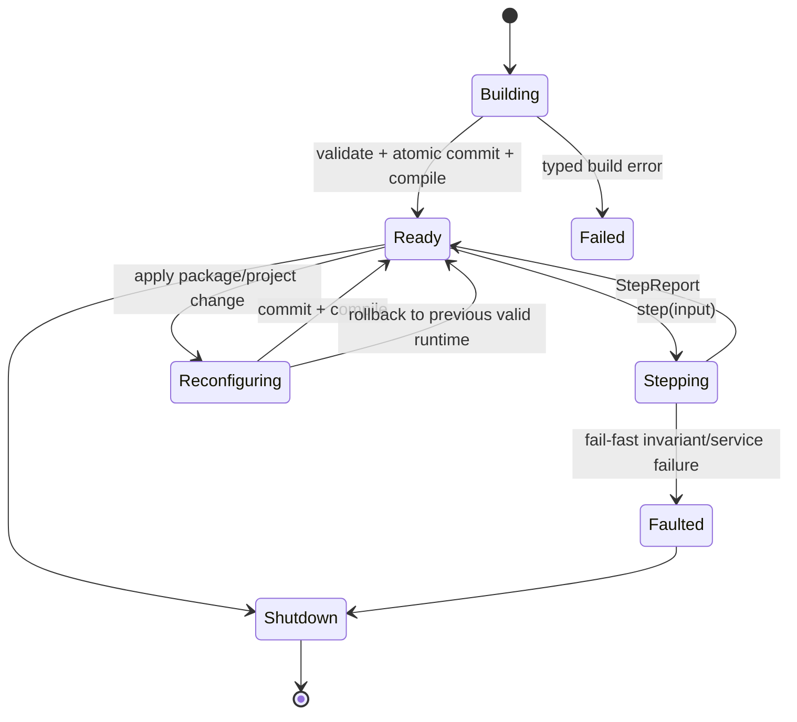

# Ownership và lifecycle

## 1. EngineRuntime

`EngineRuntime` là một session headless hữu hạn, sở hữu một `EcsRuntime` và
metadata composition cần để load/reconfigure/snapshot.

```text
EngineRuntime
├── EcsRuntime
├── ActivePackageSet
├── SchemaRegistry
├── ProjectSession?
├── EngineRevision
└── Diagnostics
```

Registry nghiệp vụ không được nhân đôi dữ liệu ECS. `ActivePackageSet` chỉ giữ
identity/version/lifecycle package; component/system/phase thực tế thuộc ECS.

`ifol-engine` là library crate phụ thuộc `ifol-ecs` bằng public Rust API. Engine
không phụ thuộc trực tiếp `ifol-gpu`, `ifol-asset` hoặc package production. Test
fixtures là dev-dependencies và không được rò vào public API.

`EngineBuilder::with_project` chuyển quyền sở hữu một `ProjectContainer` vào
runtime. Project manifest chọn required package roots; resolver chỉ activate
transitive dependency closure của các roots đó. Runtime giữ project session và
active `PackageLock` cùng lifecycle revision.

## 2. State machine



Một method chỉ hợp lệ ở state đã định nghĩa; lời gọi sai state trả typed error,
không panic và không âm thầm no-op.

## 3. Loop boundary

Engine không sở hữu `while`, `requestAnimationFrame`, window event loop, sleep,
frame pacing hoặc worker queue.

```rust
while let Some(input) = host.next_input()? {
    let report = engine.step(input)?;
    host.consume(report)?;
}
```

Engine sở hữu semantics của một step:

1. validate input envelope/revision;
2. publish package-owned input resources nếu có provider;
3. apply queued host changes tại safe boundary;
4. gọi `EcsRuntime::run_once()` đúng một lần;
5. thu diagnostics/service results đã publish;
6. trả `StepReport`.

Không tự retry, sleep hoặc bắt đầu step thứ hai. Reentrancy và concurrent mutable
step bị từ chối.

## 4. Resource root

Service/capability dùng chung được expose bằng component trên `WORLD_ENTITY`:

```text
register_provider(provider)
  -> register_world_singleton<T>()
  -> provider.create(context)
  -> insert_world_component<T>(value)
```

Provider có thể tạo pure state hoặc typed handle tới subsystem. Provider failure
phải rollback toàn registration batch. Shutdown gọi cleanup theo thứ tự dependency
ngược; không dựa vào global mutable static.

## 5. Clear, unload và shutdown

- `clear_scene`: xóa entity scene, giữ root resources/package registrations;
- `unload_project`: đóng scene/project state và package-owned project resources
  theo policy, không hủy platform service được host chia sẻ;
- `reconfigure`: chuẩn bị runtime mới hoặc transactional delta rồi publish khi
  compile thành công; ECS, command/schema/migration registry và package lock
  được swap cùng một commit, lỗi staging giữ nguyên runtime cũ; lỗi teardown
  provider chuyển runtime sang `Faulted` vì external side effect không rollback;
- `shutdown`: ngăn step mới, drain/cancel job theo policy, drop root resources,
  shutdown ECS và trả report.

Mỗi operation phải idempotent hoặc trả typed state error rõ ràng.
