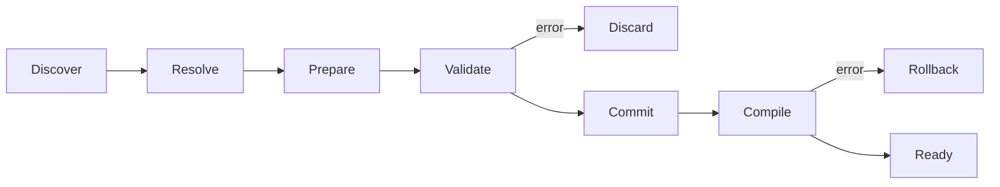

# Package và registration contract

## 1. Khái niệm tối thiểu

```text
Package  = đơn vị phân phối/version/dependency
Feature  = một contribution được package đăng ký
Plugin   = một cách cung cấp package từ bên ngoài (tùy chọn về sau)
```

Runtime không phân loại feature thành foundation/content/composition. Package có
thể đăng ký bất kỳ tổ hợp contract hợp lệ nào; dependency và phase graph quyết
định quan hệ.

Package author surface là `EnginePackage`: package cung cấp immutable
`PackageManifest` và một lần `register(&mut RegistrationContext)`. Builder thu
thập toàn bộ manifest trước, resolve dependency graph, sau đó gọi registration
theo `PackageLock` deterministic. Package không được đăng ký contribution trước
khi graph resolve thành công.

## 2. Manifest

Manifest generic tối thiểu:

```text
PackageManifest
├── stable PackageId
├── semantic Version
├── engine/API compatibility range
├── dependencies + version constraints
├── platform/capability requirements
├── claimed project namespaces
└── declared contributions summary/fingerprint
```

ID không phụ thuộc crate name, file path hoặc load address. Project lock lưu
identity/version/fingerprint, không lưu đường dẫn tuyệt đối.

## 3. RegistrationContext

Package chỉ góp contract qua context giới hạn:

```text
RegistrationContext
├── register_component<T>(schema)
├── register_system(system, access, conditions)
├── register_phase(id)
├── add_phase_edge(from, to)
├── attach_system(phase, system)
├── register_schema(schema_id, codec)
├── register_migration(schema_id, from, to, fn)
├── register_provider(provider)
├── register_command(command_id, version, handler)
├── register_query(query_id, version, handler)
├── register_event(event_id, version, descriptor)
└── claim_project_namespace(id, policy)
```

Không trả `&mut World`, registry nội bộ hoặc subsystem implementation cho package
trong giai đoạn prepare.

## 4. Atomic registration



Validation bao gồm:

- duplicate/collision ID;
- dependency missing/version conflict/cycle;
- unsupported capability/platform;
- namespace collision;
- schema/codec/migration gaps;
- resource provider dependency cycle;
- component provenance và access descriptor;
- phase/system binding, missing phase và phase cycle;
- deterministic order khi input order khác nhau.

`RegistrationTransaction` chỉ commit vào các staging candidates đã được caller
chuyển quyền sở hữu. Nó trả ECS runtime, command registry, schema registry,
migration registry và provider manager lại sau khi compile thành công; provider
chỉ được initialize sau khi ECS schedule compile thành công. Lỗi làm rơi toàn
bộ candidates, nên live runtime không thể bị mutate một phần qua API transaction.

## 5. Resource provider

Resource component không được tự động tạo bằng `Default` ngầm. Package phải cung
cấp provider hoặc host binding explicit:

```text
Owned provider: package tạo pure runtime state
Bound provider: host đưa typed external service handle
Derived provider: tạo từ resource dependency đã resolve
```

Provider DAG khởi tạo theo topological order và teardown theo reverse order.
Provider không được blocking vô hạn hoặc thực hiện irreversible external side
effect trước commit boundary.

## 6. Reconfiguration

Add/remove/replace package là transaction. Runtime cũ tiếp tục hợp lệ cho tới khi
runtime/config mới validate và compile. Nếu migration không thể rollback an toàn,
engine phải dùng staged runtime rồi swap ở safe boundary.
Provider candidate được initialize trong staging trước khi swap. Provider cũ được
teardown ngay trước publish; nếu teardown thất bại, engine chuyển sang `Faulted`
và không chạy tiếp, vì external side effect không thể rollback vật lý.
