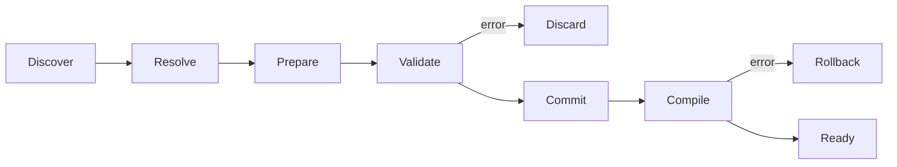

# Package và registration contract

## 1. Khái niệm tối thiểu

```text
Package  = đơn vị phân phối/version/dependency
Feature  = một contribution được package đăng ký
Plugin   = một cách cung cấp package từ bên ngoài (tùy chọn về sau)
```

Runtime không phân loại feature thành foundation/content/composition. Package có
thể đăng ký bất kỳ tổ hợp contract hợp lệ nào; dependency và phase graph quyết
định quan hệ.

## 2. Manifest

Manifest generic tối thiểu:

```text
PackageManifest
├── stable PackageId
├── semantic Version
├── engine/API compatibility range
├── dependencies + version constraints
├── platform/capability requirements
├── claimed project namespaces
└── declared contributions summary/fingerprint
```

ID không phụ thuộc crate name, file path hoặc load address. Project lock lưu
identity/version/fingerprint, không lưu đường dẫn tuyệt đối.

## 3. RegistrationContext

Package chỉ góp contract qua context giới hạn:

```text
RegistrationContext
├── register_component<T>(schema)
├── register_resource<T>(schema, provider)
├── register_system(system, access, conditions)
├── register_phase(id)
├── add_phase_edge(from, to)
├── attach_system(phase, system)
├── register_codec(schema_id, version, codec)
├── register_migration(schema_id, from, to, fn)
├── register_command(command_id, version, handler)
├── register_query(query_id, version, handler)
├── register_event(event_id, version, descriptor)
└── claim_project_namespace(id, policy)
```

Không trả `&mut World`, registry nội bộ hoặc subsystem implementation cho package
trong giai đoạn prepare.

## 4. Atomic registration



Validation bao gồm:

- duplicate/collision ID;
- dependency missing/version conflict/cycle;
- unsupported capability/platform;
- namespace collision;
- schema/codec/migration gaps;
- resource provider dependency cycle;
- component provenance và access descriptor;
- phase/system binding, missing phase và phase cycle;
- deterministic order khi input order khác nhau.

## 5. Resource provider

Resource component không được tự động tạo bằng `Default` ngầm. Package phải cung
cấp provider hoặc host binding explicit:

```text
Owned provider: package tạo pure runtime state
Bound provider: host đưa typed external service handle
Derived provider: tạo từ resource dependency đã resolve
```

Provider DAG khởi tạo theo topological order và teardown theo reverse order.
Provider không được blocking vô hạn hoặc thực hiện irreversible external side
effect trước commit boundary.

## 6. Reconfiguration

Add/remove/replace package là transaction. Runtime cũ tiếp tục hợp lệ cho tới khi
runtime/config mới validate và compile. Nếu migration không thể rollback an toàn,
engine phải dùng staged runtime rồi swap ở safe boundary.
