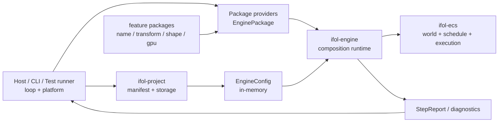
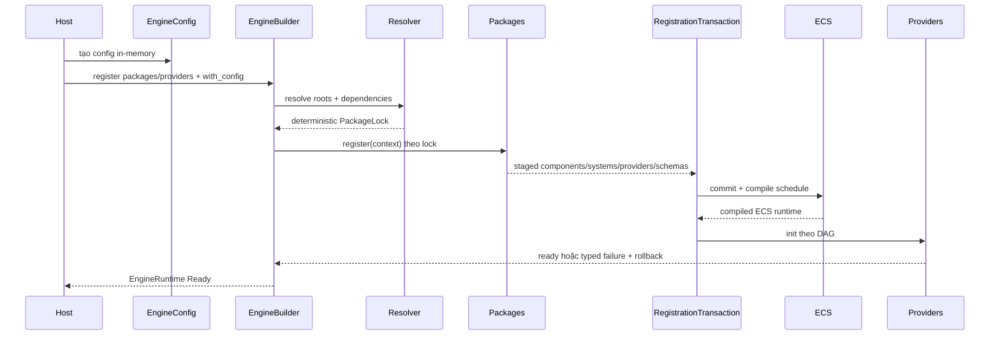
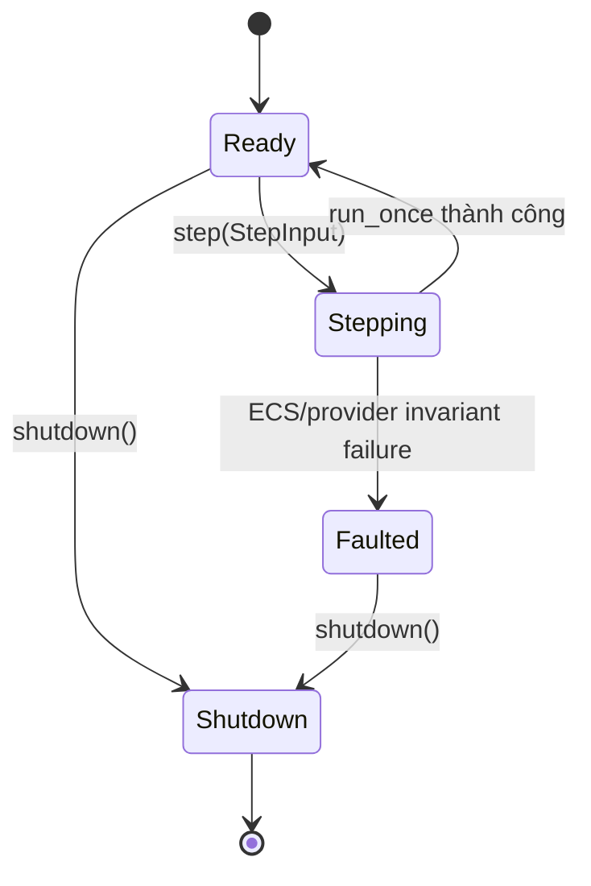
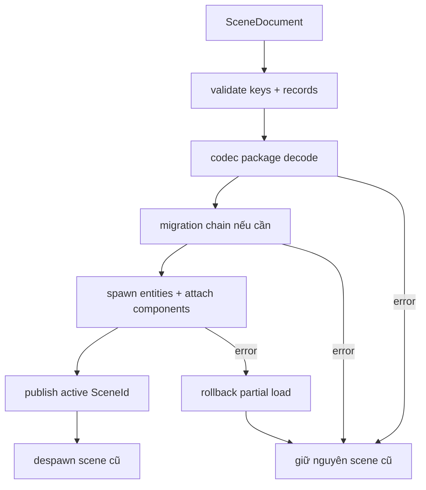

# ifol-engine — sơ đồ kiến trúc và luồng hoạt động

## 1. Một câu trả lời ngắn

`ifol-engine` là headless composition runtime: nhận package, config runtime và
provider từ bên ngoài; đăng ký chúng vào `ifol-ecs`; sau đó cung cấp lifecycle,
scene session, `step`, reconfigure và shutdown.

Nó không phải application, project editor, asset manager, renderer hoặc event
loop.

## 2. Vị trí trong hệ thống



## 3. Engine sở hữu gì

```text
EngineBuilder
├── package candidates
├── EngineConfig
├── provider candidates
└── registration candidates

EngineRuntime
├── ifol_ecs::EcsRuntime
├── resolved PackageLock
├── CommandRegistry
├── ProviderManager
├── SchemaRegistry / MigrationRegistry
├── NamespaceRegistry
├── active SceneId + scene entity ownership
├── EngineState
└── monotonic revision
```

Project storage, asset files, GPU device, window, clock, thread pool và loop
không nằm trong runtime.

## 4. Dữ liệu đầu vào và đầu ra

| Input | Ai tạo | Engine làm gì | Output |
|---|---|---|---|
| `EngineConfig` | host/project adapter | chọn package roots, kiểm tra expected lock, nhận namespace snapshot | resolved runtime composition |
| `EnginePackage` | feature/plugin bên ngoài | resolve dependency rồi gọi `register` theo thứ tự deterministic | staged ECS/provider/schema contribution |
| `ResourceProvider` | package/host | init theo dependency DAG, teardown ngược | root resource/service trong ECS |
| `SceneDocument` + `SceneId` | host/project/codec | validate, decode/migrate, load-new-before-replace | `SceneLoadResult`, active scene |
| `StepInput` | host loop | chạy ECS đúng một lần | `StepReport`, revision mới |
| `ReconfigurationRequest` | host/package coordinator | compile candidate rồi swap atomic | `ReconfigurationReport` |
| shutdown request | host | teardown provider + ECS | `ShutdownReport` |

Engine không nhận trực tiếp TOML, đường dẫn file, keyboard event, window event,
asset path hay GPU command.

## 5. Luồng build



## 6. Luồng một step



```text
step(input)
  -> kiểm tra Ready
  -> chuyển Stepping, chặn reentrancy
  -> EcsRuntime::run_once()
  -> tăng revision nếu thành công
  -> chuyển Ready
  -> trả StepReport
```

Engine không tự lặp, không sleep, không pacing và không tự gọi step lần hai.

## 7. Luồng scene



`WORLD_ENTITY` và world singleton resources không thuộc ownership của active
scene nên không bị `clear_scene` xóa.

## 8. Luồng reconfigure

```text
live runtime
  -> caller chuẩn bị candidate transaction/registries
  -> tạo ECS staging runtime
  -> commit registration + compile
  -> init candidate providers
  -> teardown provider cũ
  -> swap ECS/registries/lock cùng một boundary
  -> revision++ và trả report
```

Nếu staging thất bại, live runtime không đổi. Nếu teardown side effect thất bại,
engine chuyển `Faulted` vì không thể rollback external side effect.

## 9. Những thứ phải nằm bên ngoài

```text
ifol-project : project files, save/load, storage, lock syntax
ifol-asset   : asset identity, import, decoder, cache policy
ifol-gpu     : device, resources, render graph, pipeline, execution
feature pkg  : name, hierarchy, transform, shape, animation semantics
host         : loop, window, input, timing, platform, process lifecycle
```

Các phần trên chỉ tương tác với engine qua package/provider/codec/transaction
contract; engine không hard-code domain enum để biết chúng là gì.
