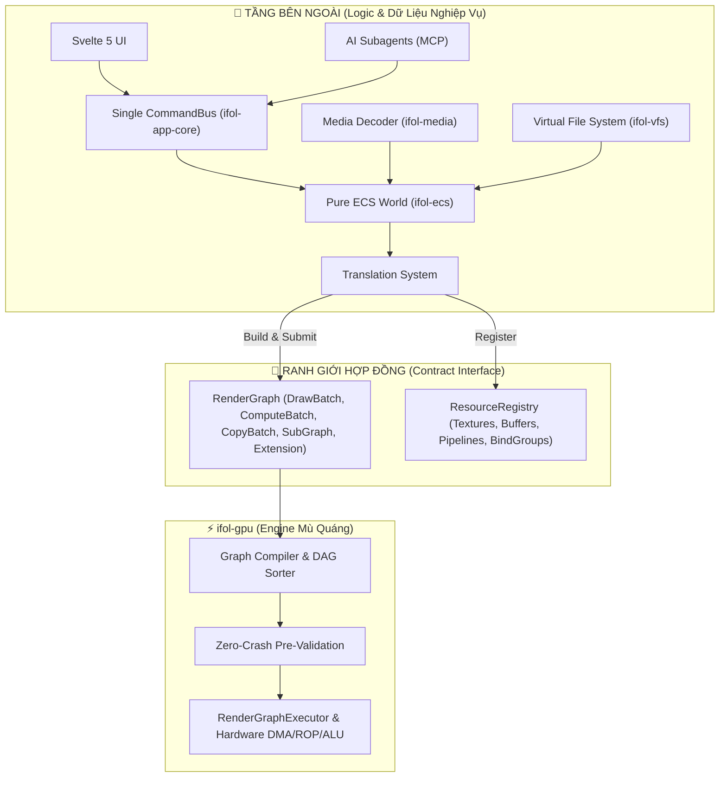

# Hợp Đồng Kiến Trúc & Ranh Giới Trách Nhiệm (Architecture Contracts)

Tài liệu này xác lập các nguyên tắc và hợp đồng bất biến của Crate `ifol-gpu` đối với các tầng kiến trúc bên ngoài trong hệ sinh thái **iFol Animation**.

---

## 1. Triết Lý Cốt Lõi: "Blind Agnostic GPU Engine" (Engine Mù Quáng)

`ifol-gpu` được thiết kế theo mô hình **Agnostic Render/Compute Graph Executor**:

### Các Điều Khoản Bất Biến (Invariants):
1. **Engine không chứa Business Logic:** `ifol-gpu` không biết khái niệm Layer, Keyframe, Animation Clip, Video File, hay User Mouse Click. Nó chỉ tiếp nhận các đối tượng đồ họa cơ bản (Primitives).
2. **Không Mutate State của Tầng Ngoài:** `ifol-gpu` là một hệ thống thực thi thuần túy (Pure Functional Executor). Nó chỉ đọc Graph & Registry, mã hóa vào GPU Command Buffer và trả về `ExecutionReport` hoặc `SubmissionIndex` qua các API execution checked.
3. **Cấm UI / MCP can thiệp trực tiếp vào GPU:** Mọi tương tác UI hoặc AI đều phải đi qua `CommandBus` $\rightarrow$ cập nhật ECS $\rightarrow$ `TranslationSystem` dựng `RenderGraph` $\rightarrow$ nạp `ifol-gpu`.

---

## 2. Phân Định Ranh Giới Trách Nhiệm (Responsibility Matrix)

| Chức Năng | Đơn Vị Phụ Trách | `ifol-gpu` Có Trách Nhiệm Không? |
| :--- | :--- | :---: |
| **Quản lý Scene, Timeline, Keyframe, Tweening** | `ifol-ecs` | ❌ **KHÔNG** |
| **Đọc file `.mp4`, `.mov`, Decode H.264/AV1/ProRes** | `ifol-media` (FFmpeg / WebCodecs) | ❌ **KHÔNG** |
| **Undo / Redo, Command History Coalescing** | `ifol-app-core` | ❌ **KHÔNG** |
| **Quản lý bộ nhớ VRAM tạm thời (Transient Pools)** | `ifol-gpu::memory` | ✅ **CÓ** |
| **Sắp xếp thứ tự DAG, Phẳng hóa SubGraph** | `ifol-gpu::graph` | ✅ **CÓ** |
| **Hardware DMA Blit, Depth Isolation** | `ifol-gpu::execution` | ✅ **CÓ** |
| **Thực thi Compute Shader, Parallel Tree Reduction** | `ifol-gpu::execution` | ✅ **CÓ** |
| **Zero-Crash Resilience & Fallback Recovery** | `ifol-gpu::execution` | ✅ **CÓ** |

---

## 3. Hợp Đồng Về Bộ Nhớ & Tài Nguyên (Resource & Memory Contracts)

1. **In-Flight Resource Protection:**
   - Bất kỳ Texture hoặc Buffer nào được cấp phát từ `TransientTexturePool` / `TransientBufferPool` và nạp vào GPU Queue **không được phép tái sử dụng** cho đến khi GPU hoàn tất thực thi Frame đó (`SubmissionTracker` đã pass qua fence).
2. **Dynamic Offset Uniform Ring Buffer:**
   - Mọi Uniform cấp phát trên Ring Buffer phải tuân thủ chuẩn căn lề phần cứng `256-byte alignment`. Khi Ring Buffer đầy trong 1 Frame, hàm trả về `None` an toàn để fallback sang cấp phát mới, không bao giờ panic.
3. **SubGraph Recursion Depth:**
   - Hệ thống cho phép lồng ghép SubGraph lên tới **8 cấp**. Khi vượt quá hoặc xuất hiện vòng lặp vô tận (Cycle Dependency), `compile_flat_graph` lập tức trả về lỗi `RenderGraphValidationError::DependencyCycle` hoặc `SubGraphDepthExceeded`.
4. **Resilience & Fallback:**
   - Nếu một node gặp lỗi (thiếu Pipeline, thiếu Texture), Executor không panic mà kích hoạt Node Cứu Hộ (`FallbackCheckerboardNode`), giữ cho ứng dụng chạy mượt mà 0% crash.
