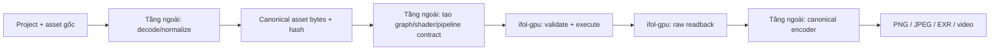

# Canonical render và media output contract

## Mục đích

Tài liệu này định nghĩa cách dự án đạt mục tiêu: cùng một project, graph và
tài nguyên phải tạo ra cùng dữ liệu frame/file trên Desktop, Web và các host
khác. Màn hình hiển thị có thể khác do display, browser hoặc color management;
file canonical mới là source of truth.

## Phân biệt preview và export

```text
Project graph + canonical assets
              │
              ├── Preview path: GPU của từng nền tảng
              │                 có thể có sai số hiển thị nhỏ
              │
              └── Canonical export path
                    ↓
              raw frame chuẩn
                    ↓
              encoder chuẩn
                    ↓
              PNG / EXR / video / frame sequence
```

Preview path phục vụ tương tác. Canonical export path phục vụ file source of
truth. Không được dùng ảnh chụp canvas hoặc output đã qua compositor của
browser làm bằng chứng canonical.

## Ai quản lý canonical render/export path?

Canonical path là một workflow của tầng ngoài, không phải một tính năng ẩn bên
trong `ifol-gpu`. Tầng ngoài phải gọi cùng một quy trình chuẩn hóa cho Desktop,
Web và các host khác:



Tầng ngoài chịu trách nhiệm chọn và khóa decoder, asset bytes, color/alpha
metadata, renderer/export policy, encoder, codec profile và metadata file.
`ifol-gpu` chỉ nhận contract đã được quyết định, thực thi nó và trả raw bytes.
Vì vậy việc `ifol-gpu` không có API decode/encode không phải thiếu chức năng;
đó là boundary bắt buộc để core không phụ thuộc nền tảng hay định dạng media.

Nếu cần bit-exact giữa Desktop và Web, hai host phải gửi cùng canonical input và
cùng graph/shader/pipeline contract vào một canonical renderer. Việc chỉ gọi
`ifol-gpu` trên hai GPU khác nhau có thể đạt raw parity cho các case đã chứng
minh, nhưng không tự động là cam kết bit-exact cho mọi thiết bị.

## Ranh giới trách nhiệm

### Tầng ngoài (`ifol-asset`, media/export hoặc application host)

- đọc JPG, PNG, WebP, video frame và các định dạng media khác;
- giải mã bằng decoder được kiểm soát hoặc chuẩn hóa trước khi chạy;
- tạo canonical pixel bytes và hash của input;
- quyết định color metadata, alpha policy và media encoding;
- quản lý canonical renderer/exporter và encoder;
- ghi file output với metadata, profile và codec policy cố định.

### `ifol-gpu`

`ifol-gpu` không biết file gốc là JPG hay PNG. Core chỉ nhận resource contract,
ví dụ:

```rust,ignore
TextureUpload {
    width: u32,
    height: u32,
    pixels: &[u8],
    format: TextureFormat,
    // color/alpha metadata do higher layer quản lý
}
```

Core chịu trách nhiệm:

- tạo và quản lý GPU texture theo descriptor;
- thực thi graph, shader, pipeline, blend và depth contract;
- render vào target được caller chỉ định;
- trả raw readback kèm width, height và format;
- không tự decode asset, đổi màu, encode PNG/JPEG/video hoặc quyết định display
  policy.

API tối thiểu mà tầng ngoài sử dụng là: upload/register resource, tạo graph và
pipeline contract, execute, rồi readback raw. Tầng ngoài không được lấy
`Surface`/canvas preview làm dữ liệu export canonical.

## Điều kiện để output giống tuyệt đối

Phải cố định đồng thời:

1. graph và shader bytes;
2. asset bytes sau decode và asset hash;
3. texture/target format;
4. linear/sRGB, alpha và blend policy;
5. sampler, filtering, MSAA, depth compare và coordinate convention;
6. floating-point/deterministic rendering policy;
7. raw readback layout;
8. encoder, codec profile, metadata và compression settings.

Cùng graph nhưng mỗi nền tảng tự giải mã JPG, tự render bằng backend GPU và tự
encode video sẽ không bảo đảm bit-exact. WebGPU/Vulkan cũng không cam kết mọi
GPU/backend cho cùng kết quả floating-point ở mọi pixel.

Nếu cần bit-exact trên mọi thiết bị, canonical export phải dùng một renderer
deterministic dùng chung, software/CPU renderer, hoặc một export service chuẩn.
GPU preview có thể tiếp tục được dùng để tương tác.

## Quy tắc hiện tại

PNG canonical trong `tests/shared_assets/textures/` là fixture kiểm thử để loại
decoder JPG khác nhau khỏi một phép đo. Đây không phải giới hạn định dạng của
`ifol-gpu` và không phải yêu cầu sản phẩm chỉ dùng PNG. Khi tầng asset chung đã
hoàn thiện, test nên truyền canonical decoded bytes thay vì phụ thuộc decoder
của Desktop/Web.
