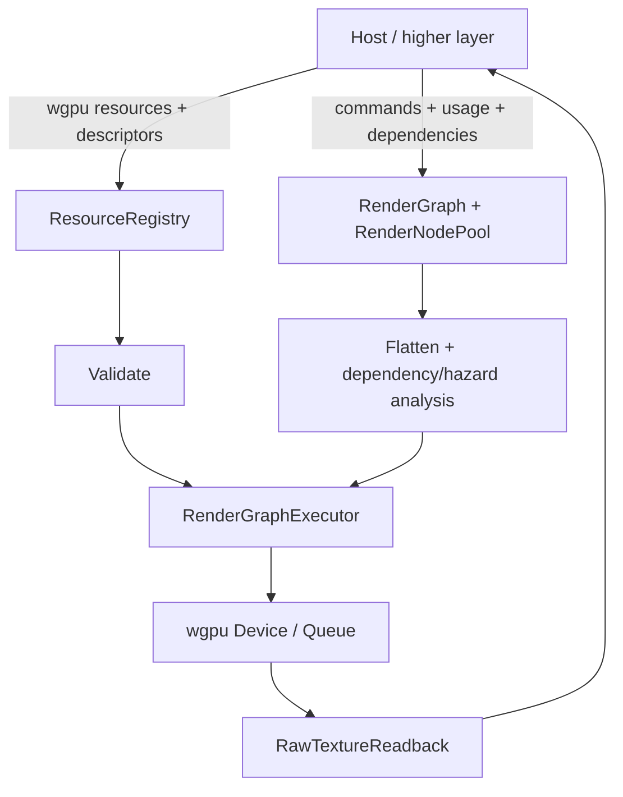

# Hợp đồng kiến trúc của `ifol-gpu`

`ifol-gpu` là một execution substrate. Nó nhận resource, pipeline, shader
contract và graph do host tạo; core validate, flatten, encode, submit và có thể
đọc lại raw bytes. Core không biết scene, animation, media, màu sản phẩm hay
chính sách hiển thị.

## Ranh giới chính thức

### Core được phép biết

- adapter, device, queue, features, limits và surface contract của `wgpu`;
- texture, buffer, bind group, pipeline, mesh handle và descriptor metadata;
- graph node, dependency, resource usage, hazard, render/compute/copy command;
- submission-safe lifetime, transient pool, deferred destruction và raw readback.

### Core không sở hữu

- ECS, scene, layer, timeline, keyframe, material hoặc editor policy;
- decoder/encoder PNG, JPEG, WebP, EXR, video hoặc audio;
- color management, transfer function, gamut, tone mapping hoặc alpha policy;
- window event loop, asset loading, canonical export format và UI fallback policy.

## Invariants của implementation hiện tại

1. `execute_checked*` phải validate trước khi submit. Graph không hợp lệ trả về
   `RenderGraphValidationError` có kiểu; core không tự thay node bằng
   checkerboard và không hứa hẹn “0% crash” cho mọi lỗi của host/GPU.
2. Subgraph được flatten và dependency cycle bị từ chối bằng
   `RenderGraphValidationError::DependencyCycle`. Không có contract giới hạn
   độ sâu cố định trong public API.
3. Graph giữ typed handle và usage contract; registry giữ resource/descriptor
   metadata. Host phải giữ resource sống qua submission cuối cùng sử dụng nó.
4. Ring buffer và transient/deferred pools chỉ tái sử dụng resource khi
   `SubmissionTracker` xác nhận submission tương ứng đã hoàn tất.
5. Executor có thể cập nhật cache/bundle state trong node pool; đây là execution
   state nội bộ, vì vậy core không được mô tả là pure functional/stateless.

## Responsibility matrix

| Trách nhiệm | `ifol-gpu` | Host/higher layer |
|---|:---:|:---:|
| Graph, dependency, hazard và validation | Có | Tạo input |
| GPU resource registry và lifetime primitives | Có | Chọn policy/lifetime |
| Render, compute, copy, surface và raw readback | Có | Chọn pipeline/target |
| Scene/ECS/timeline/material | Không | Có |
| Decode asset, màu/alpha policy, encode media | Không | Có |
| UI fallback và thông báo lỗi | Không | Có |

Các quy tắc về canonical input, màu và file output nằm trong
[canonical render/media contract](18-canonical-render-and-media-output-contract.md).
