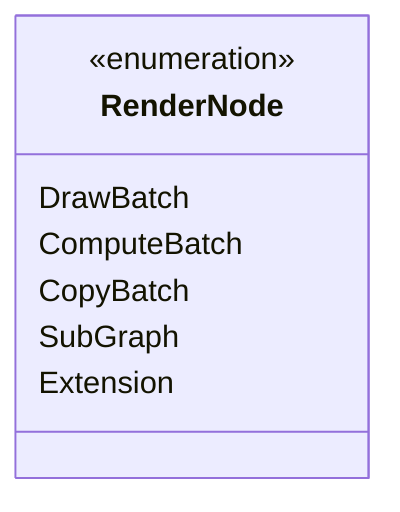

# Tài Liệu Đặc Tả Public API Chuẩn Công Nghiệp (`ifol-gpu`)

Tài liệu này cung cấp danh mục tra cứu API đầy đủ cho các kỹ sư và lập trình viên khi tích hợp `ifol-gpu` vào ứng dụng.

---

## 1. Module `backend`: Khởi Tạo & Quản Lý GPU Context

`backend` là module canonical cho device, adapter và surface. Module `api` chỉ
re-export các backend type cùng profiling primitives; code mới nên import
backend trực tiếp.

### `struct GpuEngine<'a>`
Engine gốc bọc kết nối WebGPU / WGPU Native.

```rust
impl<'a> GpuEngine<'a> {
    pub fn device(&self) -> &wgpu::Device;
    pub fn queue(&self) -> &wgpu::Queue;
    pub fn adapter(&self) -> &wgpu::Adapter;
    pub fn capabilities(&self) -> &GpuCapabilities;
    pub fn adapter_info(&self) -> &wgpu::AdapterInfo;
    pub fn surface(&self) -> Option<&wgpu::Surface<'a>>;
    pub fn try_resize_surface(&self, width: u32, height: u32) -> Result<(), SurfaceResizeError>;
    pub fn reconfigure_surface(&self) -> Result<(), SurfaceResizeError>;
    pub fn surface_format(&self) -> Option<wgpu::TextureFormat>;
    pub fn read_texture_to_raw_with_format_checked(
        &self,
        texture: &wgpu::Texture,
        format: wgpu::TextureFormat,
    ) -> Result<RawTextureReadback, ReadbackError>;
}
```

`ifol-gpu` chỉ cung cấp raw readback. Việc lưu PNG/JPEG/EXR hoặc encode video
thuộc về tầng higher-level bên ngoài core.

### Canonical media boundary

Public API của crate không bao gồm decoder, color converter, image encoder hay
video encoder. Host phải chuẩn hóa asset bytes trước khi đăng ký texture và
phải tự đóng gói `RawTextureReadback` thành file media. Cùng một file output
giữa Desktop/Web chỉ có thể được cam kết khi host khóa cùng input bytes, graph,
shader/pipeline contract và encoder policy; surface preview không phải output
canonical.

### `struct GpuEngineBuilder<'a>`
Builder khởi tạo đa nền tảng linh hoạt.

```rust
impl<'a> GpuEngineBuilder<'a> {
    pub fn new() -> Self;
    pub fn with_power_preference(mut self, pref: wgpu::PowerPreference) -> Self;
    pub fn with_required_features(mut self, features: wgpu::Features) -> Self;
    pub fn with_required_limits(mut self, limits: wgpu::Limits) -> Self;
    pub async fn build(self) -> Result<GpuEngine<'a>, GpuError>;
}
```

---

## 2. Module `resources`: Đăng Ký Tài Nguyên Tập Trung (`ResourceRegistry`)

Hệ thống định danh số nguyên nhẹ (`Handle-based`) tránh chi phí reference counting và cho phép truy cập tài nguyên với tốc độ $O(1)$.

### Các Loại Handle:
*   `TextureHandle(u64)`: Định danh Texture trong VRAM.
*   `BufferHandle(u64)`: Định danh Storage / Uniform / Vertex Buffer.
*   `PipelineHandle(u64)`: Render Pipeline đã biên dịch.
*   `ComputePipelineHandle(u64)`: Compute Pipeline đã biên dịch.
*   `BindGroupHandle(u64)`: Bind Group kết nối tài nguyên với Shader.
*   `MeshHandle(u64)`: Vertex Buffer + Index Buffer kết hợp.

### `struct ResourceRegistry`
```rust
impl ResourceRegistry {
    pub fn new() -> Self;
    
    // Đăng ký Texture sở hữu
    pub fn insert_owned_texture(
        &mut self,
        handle: TextureHandle,
        texture: wgpu::Texture,
        descriptor: TextureResourceDescriptor,
        max_dimension: u32,
    ) -> Result<Option<OwnedTextureResource>, ResourceDescriptorError>;
    
    // Đăng ký Buffer với kích thước & usages
    pub fn insert_buffer_with_descriptor(&mut self, handle: BufferHandle, buffer: wgpu::Buffer, descriptor: BufferResourceDescriptor) -> Result<Option<wgpu::Buffer>, BufferDescriptorError>;
    
    // Đăng ký BindGroup
    pub fn insert_bind_group_with_descriptor(
        &mut self,
        handle: BindGroupHandle,
        bg: wgpu::BindGroup,
        descriptor: BindGroupResourceDescriptor,
    ) -> Result<Option<wgpu::BindGroup>, BindGroupDescriptorError>;
    
    // Truy xuất đối tượng WGPU
    pub fn texture(&self, handle: &TextureHandle) -> Option<&(wgpu::TextureView, wgpu::TextureFormat)>;
    pub fn buffer(&self, handle: &BufferHandle) -> Option<&wgpu::Buffer>;
    pub fn pipeline(&self, handle: &PipelineHandle) -> Option<&wgpu::RenderPipeline>;
    pub fn compute_pipeline(&self, handle: &ComputePipelineHandle) -> Option<&wgpu::ComputePipeline>;
    pub fn bind_group(&self, handle: &BindGroupHandle) -> Option<&wgpu::BindGroup>;
}
```

---

## 3. Module `graph`: Xây Dựng Đồ Thị Kết Xuất (`RenderGraph`)

### 5 Loại Node Cơ Bản (`RenderNode`):



1. **`DrawBatch` (`pool.alloc_batch(commands)`):** Chứa các lệnh vẽ hình học/shader thông qua Rasterizer & Blend States.
2. **`ComputeBatch` (`pool.alloc_compute_batch(commands)`):** Chứa các lệnh tính toán song song, phân tán workgroups.
3. **`CopyBatch` (`pool.alloc_copy_batch(commands)`):** Sao chép trực tiếp qua phần cứng DMA (Buffer $\leftrightarrow$ Buffer, Texture $\leftrightarrow$ Texture, Depth Aspect).
4. **`SubGraph` (`pool.alloc_subgraph(name, graph, outputs)`):** Đồ thị con lồng ghép, hỗ trợ phẳng hóa tự động và tái sử dụng Render Target.
5. **`Extension` (`pool.alloc_extension(id, usages)`):** Điểm cắm plugin can thiệp trực tiếp vào Command Buffer.

### `struct RenderGraph`
```rust
impl RenderGraph {
    pub fn new(target: RenderTarget) -> Self;
    pub fn with_clear_color(mut self, color: [f64; 4]) -> Self;
    pub fn with_depth_stencil(mut self, handle: TextureHandle) -> Self;
    
    // Thêm Node vào đồ thị
    pub fn add_node_id(&mut self, node_id: NodeId);
    
    // Thiết lập quan hệ phụ thuộc DAG
    pub fn add_dependency(&mut self, from: NodeId, to: NodeId);
}
```

---

## 4. Module `execution`: Điều Phối & Thực Thi An Toàn

### `struct RenderGraphExecutor`
```rust
impl RenderGraphExecutor {
    pub fn new() -> Self;
    pub fn with_extension_dispatchers(dispatchers: ExtensionDispatchRegistry) -> Self;
    
    // Thực thi có kiểm tra lỗi toàn diện và trả về báo cáo
    pub fn execute_checked_with_report(
        &self,
        engine: &GpuEngine,
        registry: &ResourceRegistry,
        pool: &mut RenderNodePool,
        graph: &RenderGraph,
    ) -> Result<ExecutionReport, RenderGraphValidationError>;
}
```

### `struct ExecutionReport`
Báo cáo thống kê chi tiết sau khi thực thi 1 frame:
*   `flattened_nodes`: Tổng số node sau khi bung toàn bộ cây SubGraph.
*   `draw_commands`: Số lệnh Draw.
*   `compute_commands`: Số lệnh Compute Dispatch.
*   `copy_commands`: Số lệnh Hardware DMA Copy.
*   `submission`: WGPU Submission Index để theo dõi hoàn thành trên GPU.
