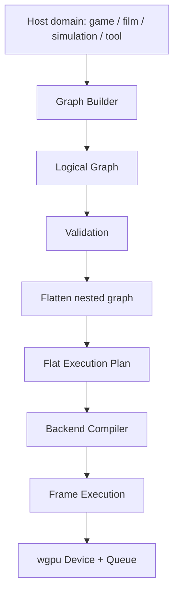

# IFOL GPU Graph Engine: Kiến trúc của một graph

## Sơ đồ tổng quan



## Một graph gồm những gì?

```text
Graph
├── GraphId / label
├── Inputs
├── Outputs
├── Nodes hoặc Passes
├── Resource declarations
├── Dependencies
├── Ordering policy
├── Execution options
└── Debug metadata
```

### GraphId và label

- `GraphId` dùng cho identity/debug/cache;
- label chỉ phục vụ diagnostics;
- label không được là nguồn logic execution.

### Inputs

Resource do graph nhận từ bên ngoài:

- texture input;
- buffer input;
- sampler/bind group input;
- external surface;
- constant/config input.

### Outputs

Resource graph tạo hoặc xuất ra:

- color texture;
- depth texture;
- storage buffer;
- indirect command buffer;
- readback buffer;
- present target.

### Nodes/Passes

Đây là các công việc GPU thực sự. Một graph có thể chứa:

- render pass;
- compute pass;
- copy pass;
- clear pass;
- resolve/mipmap pass;
- nested subgraph.

### Resource declarations

Graph phải biết resource nào được đọc/ghi, không chỉ biết handle nào xuất hiện trong command.

### Dependencies

Dependency mô tả quan hệ trước/sau do resource hoặc ordering tạo ra.

### Ordering policy

- preserve order;
- dependency order;
- opaque reorder được phép;
- strict order;
- custom host policy.

### Execution options

- validation level;
- debug labels;
- allow bundle/cache;
- async/sync readback;
- submission policy;
- profiling markers.

## Graph input và flat output

```text
Logical Graph                     Flat Execution Plan

Root                              01 Upload A
├── Upload A                      02 Shadow Render
├── SubGraph Shadow               03 Geometry Render
│   ├── Shadow Compute            04 Bloom Horizontal
│   └── Shadow Render             05 Bloom Vertical
├── Geometry Render               06 Composite Render
└── SubGraph PostFX               07 Readback
    ├── Bloom H
    └── Bloom V
```

Flat plan là kết quả compile, không phải format duy nhất mà host phải sử dụng.
