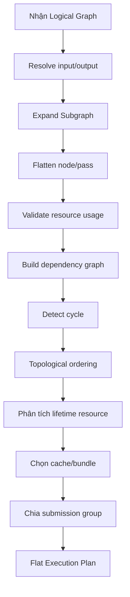

# IFOL GPU Graph Engine: Flatten và compile graph

## Mục tiêu

Giữ graph input dễ đọc, dễ compose và gần với cách host tổ chức công việc; nhưng biến nó thành một execution plan phẳng, deterministic và dễ kiểm tra trước khi gửi cho GPU.

## Ví dụ graph lồng

```text
RootGraph
├── UploadFrame
├── ShadowGraph
│   ├── ShadowCompute
│   └── ShadowRender
├── MainRender
└── PostGraph
    ├── BloomHorizontal
    ├── BloomVertical
    └── Composite
```

## Flatten result

```text
FlatPlan
01 UploadFrame
02 ShadowCompute
03 ShadowRender
04 MainRender
05 BloomHorizontal
06 BloomVertical
07 Composite
```

Nếu dependency declaration cho biết một pass độc lập, compiler có thể nhóm hoặc reorder pass đó theo policy. Nếu không chắc chắn, giữ thứ tự khai báo.

## Các bước compile



## 1. Resolve input/output

Compiler xác định:

- external resource;
- graph-local resource;
- graph output;
- resource alias nếu được phép;
- target/surface context.

## 2. Expand subgraph

Subgraph được mở rộng thành các pass con, đồng thời giữ mapping:

```text
SubGraphNodeId -> FlatPassIds
```

Mapping này cần cho debug, error và profiling.

## 3. Validate resource usage

Compiler kiểm tra:

- resource tồn tại;
- usage phù hợp;
- attachment format phù hợp;
- pipeline layout phù hợp;
- dynamic offset hợp lệ;
- output có được tạo trước khi đọc.

## 4. Build dependency graph

Ví dụ:

```text
ShadowRender --writes--> ShadowTexture
MainRender   --reads---> ShadowTexture

=> ShadowRender -> MainRender
```

## 5. Detect cycle

Nếu có:

```text
A writes X -> B reads X -> B writes Y -> A reads Y
```

graph phải fail compile với error chỉ rõ chuỗi dependency.

## 6. Topological ordering

Compiler tạo thứ tự phẳng hợp lệ. Nếu có nhiều thứ tự hợp lệ, ưu tiên:

1. explicit dependency;
2. declaration order;
3. optimization policy được bật;
4. deterministic tie-breaker.

## 7. Phân tích lifetime

Compiler xác định resource sống từ pass đầu tiên tới pass cuối cùng dùng nó. Kết quả dùng cho transient resource reuse.

## 8. Cache và bundle

Compiler chỉ dùng compiled artifact nếu cache key khớp:

```text
Pass identity
+ pipeline version
+ resource/binding version
+ target format
+ depth/sample state
+ dynamic/static mode
```

## 9. Chia submission

Compiler có thể tạo một hoặc nhiều submission group. Việc chia phụ thuộc:

- host yêu cầu readback;
- async upload;
- synchronization boundary;
- surface present;
- device/queue policy.

## Tính deterministic

Cùng graph, cùng resource descriptor, cùng capability và cùng policy phải tạo cùng flat plan về mặt logic. Backend cache handle hoặc pointer không được làm thay đổi thứ tự semantics.
