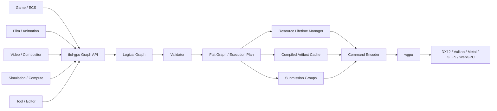

# IFOL GPU Graph Engine: Sơ đồ kiến trúc và quan hệ

## Sơ đồ từ domain tới GPU



## Quan hệ ownership

```text
Host owns:             domain state và graph input
Graph owns:            logical pass/resource references
Resource manager owns: GPU object lifetime
Compiler owns:         flat plan trong một lần compile
Cache owns:            compiled artifact có version/context key
Frame context owns:    transient allocation và submission tracking
Backend owns:          device/queue execution
```

## Ranh giới không được vi phạm

```text
ifol-gpu KHÔNG gọi ngược:
    ECS
    Scene
    Animation
    Asset loader
    Video decoder
    UI

Host KHÔNG tự chọc vào:
    cache validity
    resource deferred destruction
    unsafe frame allocator reset
```

## Luồng một frame tổng quát

```text
1. Host cập nhật data và build graph
2. Graph khai báo pass/resource/usage
3. Compiler validate
4. Compiler flatten graph
5. Compiler phân tích dependency/lifetime
6. Compiler tạo execution plan
7. Frame context cấp phát dynamic/transient data
8. Executor encode command
9. Queue submit một hoặc nhiều group
10. Completion tracker giải phóng/reuse an toàn
```

## Tính sạch sẽ

Kiến trúc được xem là sạch khi:

- thêm compute pass không cần sửa render pass semantic;
- thêm copy pass không cần biết ECS;
- thêm backend không cần đổi logical graph;
- thay cache policy không đổi graph input;
- thay resource allocator không đổi DrawCommand;
- thay host domain không đổi compiler contract;
- mọi resource read/write đều nhìn thấy trong graph;
- mọi artifact cache đều có context/version rõ ràng.

## Tính dễ mở rộng

Muốn thêm loại công việc mới, ưu tiên mở rộng theo hướng:

```text
NewPassKind
    -> declare usages
    -> validate
    -> flatten
    -> compile
    -> encode
```

Không nên thêm một nhánh đặc biệt rải rác trong `RenderGraph`, `ResourceRegistry`, `RenderNode` và `RenderGraphExecutor` cùng lúc.
