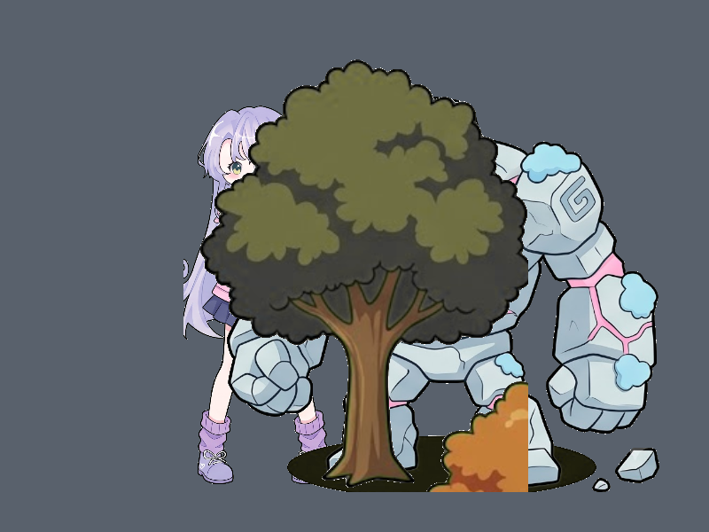

# Báo cáo: TC03 - Loại bỏ và kiểm thử chiều sâu Z-Buffer

Đây là báo cáo kiểm thử hai môi trường dùng chung manifest và hợp đồng graph.

## 1. Mô tả và graph dùng chung

- **Manifest:** `tests/shared_assets/manifests/tc03_zbuffer.json`
- **Graph fingerprint (FNV-1a):** `4be686fcf64eff99`
- **Mô tả test case:** Render ba sprite đã crop có vùng chồng lấn và xác nhận độ sâu, không phải thứ tự submit, quyết định phần hiển thị.
- **Target:** `800x600`, `Rgba8UnormSrgb`
- **Shader/WGSL:** `chroma_key_cropped.wgsl`
- **Asset/input:** `canonical_bg_forest_props1.png`, `canonical_sprites_heroes.png`, `canonical_sprites_monsters.png`
- **Chính sách input:** Dùng PNG canonical để Desktop/WebGPU giải mã cùng một input byte-level.
- **Depth/stencil:** `{"format": "Depth32Float", "compare": "LessEqual", "write": true, "clear": 1.0}`
- **Desktop/Web dùng cùng manifest fingerprint:** `ĐẠT`

## 2. Môi trường Desktop

- **Thời gian render lần đầu (cold):** `9.7564 ms`
- **Thời gian render lần hai (warm/cache):** `1.1124 ms`
- **Adapter/backend:** `Intel(R) Iris(R) Xe Graphics` / `Vulkan`
- **Phạm vi timing:** `execute_checked + submit queue + device.poll(Wait); không gồm khởi tạo device/pipeline và readback`
- **Dữ liệu raw:** `tests/outputs/desktop/tc03_zbuffer_desktop.bin`
- **Dấu vân tay raw (FNV-1a):** `e87669973f7b9d0f`
- **SHA-256:** `99410f3b41577246dfdaff461b800f0ed9ed10b08f1e911dc5a52fa4cb3fbbee`
- **Ảnh:** 
- **Đánh giá nội dung:** `ĐẠT`
- **Đánh giá bằng vision:** ĐẠT: cây ở z=0.2 nằm trước và che các lớp phía sau; Warrior và Golem vẫn hiện ở vùng không bị che, không thấy Z-fighting.

## 3. Môi trường WebGPU

- **Thời gian render lần đầu (cold):** `7.6000 ms`
- **Thời gian render lần hai (warm/cache):** `4.6000 ms`
- **Adapter:** `gen-12lp`
- **Phạm vi timing:** `execute offscreen + submit queue + onSubmittedWorkDone; không gồm khởi tạo device/pipeline và readback`
- **Dữ liệu raw:** `tests/outputs/web/tc03_zbuffer_web.bin`
- **Dấu vân tay raw (FNV-1a):** `87fa54196f78031b`
- **SHA-256:** `a6a37e115b0ffb0ee56c0096cdbf142e2097c405be77d0d0b595f5980e330f95`
- **Ảnh:** 
- **Đánh giá nội dung:** `ĐẠT`
- **Đánh giá bằng vision:** ĐẠT: bố cục và thứ tự lớp giống Desktop; cây che đúng các vùng chồng lấn, không thấy Z-fighting.

## 4. So sánh và kết luận

| Tiêu chí | Kết quả |
| --- | --- |
| Graph/manifest giống nhau | `ĐẠT` |
| Kích thước dữ liệu raw giống nhau | `ĐẠT` |
| Byte raw giống tuyệt đối | `KHÔNG ĐẠT` |
| Số byte khác nhau | `127376` |
| Số pixel khác nhau | `52429` |
| Sai số kênh màu lớn nhất | `255/255` |
| Khác biệt màu/presentation | `CÓ - cần theo dõi để đạt byte parity` |
| Số pixel non-background Desktop/Web | `185689 / 185300` |
| Bounding box Desktop | `(207, 67, 743, 554)` |
| Bounding box WebGPU | `(207, 67, 743, 554)` |
| Bounding box non-background giống nhau | `ĐẠT` |
| Số pixel mask khác nhau | `401` (ngưỡng `1024`) |
| Parity cấu trúc không phụ thuộc màu | `ĐẠT` |
| Đúng mô tả test case | `ĐẠT` |

**Kết luận:** `ĐẠT CÓ ĐIỀU KIỆN - graph và cấu trúc render giống; khác biệt còn lại thuộc pixel/màu và nằm trong ngưỡng đã khai báo.`

## 5. Phân tích hiệu suất

Các giá trị trên đo thời gian thực thi graph, submit lệnh và chờ GPU hoàn tất;
không bao gồm khởi tạo device/pipeline hoặc readback. Vì vậy `cold` ở đây là
lần execute đầu sau khi resource/pipeline đã được tạo, không phải cold start
của toàn bộ ứng dụng. Giá trị dưới `1 ms` tương đương microsecond và cần được
đọc theo đơn vị đó khi phân tích.
