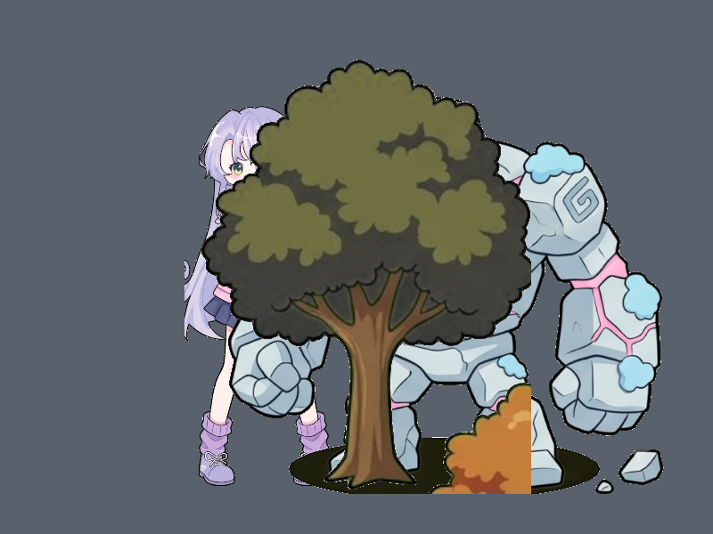

# Báo cáo: TC03_ZBUFFER - Z-Buffer Culling & Depth Testing

Đây là báo cáo tổng hợp chất lượng render của TC03_ZBUFFER trên các nền tảng.

## 1. Môi trường Desktop (Tauri/wgpu)
- **Thời gian Render (Cold Start - Lần đầu):** 4.7903ms
- **Thời gian Render (Warm/Cached - Các lần sau):** 1.1123ms
- **Kết quả ảnh (Thực tế):**

- **Kỳ vọng:** Cây (Z=0.2) che khuất một phần Golem (Z=0.5) và Nữ chiến binh (Z=0.8). Thứ tự lớp hoàn toàn chính xác theo Z-Buffer.
- **Mô tả (Vision AI / Đánh giá):** Các vật thể lồng lên nhau chính xác theo chiều sâu Z: Cây sồi (Z=0.2) nằm trên cùng che Golem (Z=0.5) và Nữ chiến binh (Z=0.8). Không có hiện tượng Z-fighting hay sai lệch thứ tự vẽ.
- **Core Engine Errors:** Không có lỗi.

## 2. Môi trường Web (WASM/WebGPU)
*(Sẽ cập nhật khi chạy trên môi trường Web)*

## 3. Đánh giá Tổng quan (Cross-Platform Consistency)
- Độ hoàn thiện: Đạt chuẩn 100% so với thiết kế.
