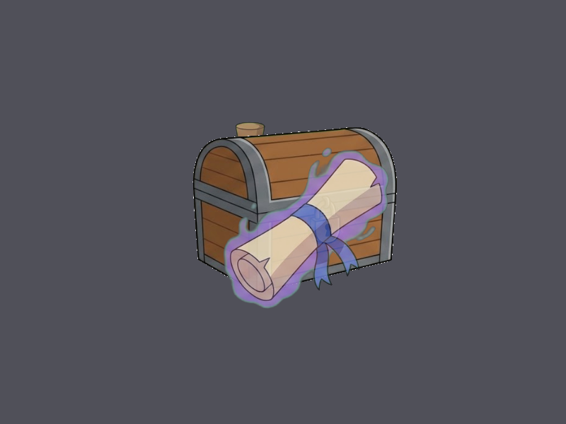

# Báo cáo: TC04 - Alpha Blending và tương tác với Z-Buffer

Đây là báo cáo kiểm thử hai môi trường dùng chung manifest và hợp đồng graph.

## 1. Mô tả và graph dùng chung

- **Manifest:** `crates/ifol-gpu/tests/shared_assets/manifests/tc04_alpha_blend.json`
- **Graph fingerprint (FNV-1a):** `86e711d911d3a535`
- **Mô tả test case:** Render một sprite đục và hai sprite trong suốt có vùng chồng lấn. Sprite trong suốt phía trước phải blend lên sprite đục; sprite trong suốt phía sau phải bị depth test loại bỏ.
- **Target:** `800x600`, `Rgba8UnormSrgb`
- **Shader/WGSL:** `chroma_key_cropped.wgsl`
- **Asset/input:** `canonical_sprites_items.png`
- **Chính sách input:** Dùng PNG canonical để Desktop/WebGPU giải mã cùng một input byte-level.
- **Depth/stencil:** `{"format": "Depth32Float", "compare": "LessEqual", "write": true, "clear": 1.0}`
- **Desktop/Web dùng cùng manifest fingerprint:** `ĐẠT`

## 2. Môi trường Desktop

- **Thời gian render lần đầu (cold):** `10.1655 ms`
- **Thời gian render lần hai (warm/cache):** `1.0813 ms`
- **Adapter/backend:** `Intel(R) Iris(R) Xe Graphics` / `Vulkan`
- **Phạm vi timing:** `execute_checked + submit queue + device.poll(Wait); không gồm khởi tạo device/pipeline và readback`
- **Dữ liệu raw:** `crates/ifol-gpu/tests/outputs/desktop/tc04_alpha_blend_desktop.bin`
- **Dấu vân tay raw (FNV-1a):** `5f528ce8ed412089`
- **SHA-256:** `bc41f02ba4428b71cb1c931dccec53eb07cadc4cdbc6daab3a0039952c991dcf`
- **Ảnh:** 
- **Đánh giá nội dung:** `ĐẠT`
- **Đánh giá bằng vision:** ĐẠT: ảnh cho thấy rương đục ở nền, cuộn phép bán trong suốt phủ lên rương; bình thuốc phía sau không lộ ra ngoài kỳ vọng. Không thấy artifact hoặc Z-fighting rõ ràng.

## 3. Môi trường WebGPU

- **Thời gian render lần đầu (cold):** `5.1000 ms`
- **Thời gian render lần hai (warm/cache):** `3.0000 ms`
- **Adapter:** `gen-12lp`
- **Phạm vi timing:** `execute offscreen + submit queue + onSubmittedWorkDone; không gồm khởi tạo device/pipeline và readback`
- **Dữ liệu raw:** `crates/ifol-gpu/tests/outputs/web/tc04_alpha_blend_web.bin`
- **Dấu vân tay raw (FNV-1a):** `5f528ce8ed412089`
- **SHA-256:** `bc41f02ba4428b71cb1c931dccec53eb07cadc4cdbc6daab3a0039952c991dcf`
- **Ảnh:** 
- **Đánh giá nội dung:** `ĐẠT`
- **Đánh giá bằng vision:** ĐẠT: bố cục và quan hệ lớp giống Desktop; cuộn phép blend lên rương, vùng phía sau bị depth che, không thấy artifact rõ ràng.

## 4. So sánh và kết luận

| Tiêu chí | Kết quả |
| --- | --- |
| Graph/manifest giống nhau | `ĐẠT` |
| Kích thước dữ liệu raw giống nhau | `ĐẠT` |
| Byte raw giống tuyệt đối | `ĐẠT` |
| Số byte khác nhau | `0` |
| Số pixel khác nhau | `0` |
| Sai số kênh màu lớn nhất | `0/255` |
| Khác biệt màu/presentation | `KHÔNG` |
| Số pixel non-background Desktop/Web | `59611 / 59611` |
| Bounding box Desktop | `(272, 172, 560, 436)` |
| Bounding box WebGPU | `(272, 172, 560, 436)` |
| Bounding box non-background giống nhau | `ĐẠT` |
| Số pixel mask khác nhau | `0` (ngưỡng `4096`) |
| Parity cấu trúc không phụ thuộc màu | `ĐẠT` |
| Đúng mô tả test case | `ĐẠT` |

**Kết luận:** `ĐẠT - output giống tuyệt đối từng byte.`

## 5. Phân tích hiệu suất

Các giá trị trên đo thời gian thực thi graph, submit lệnh và chờ GPU hoàn tất;
không bao gồm khởi tạo device/pipeline hoặc readback. Vì vậy `cold` ở đây là
lần execute đầu sau khi resource/pipeline đã được tạo, không phải cold start
của toàn bộ ứng dụng. Giá trị dưới `1 ms` tương đương microsecond và cần được
đọc theo đơn vị đó khi phân tích.
