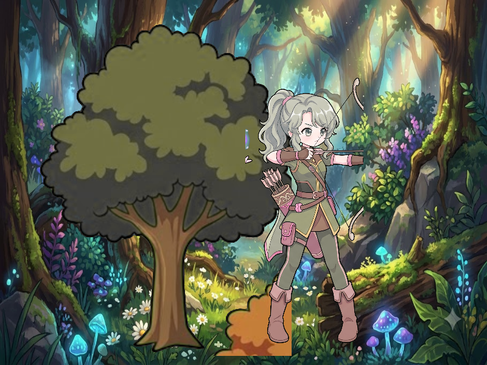

# Báo cáo: TC05 - Compositing nhiều pass offscreen nối tiếp

Đây là báo cáo kiểm thử hai môi trường dùng chung manifest và hợp đồng graph.

## 1. Mô tả và graph dùng chung

- **Manifest:** `crates/ifol-gpu/tests/shared_assets/manifests/tc05_interleaved.json`
- **Graph fingerprint (FNV-1a):** `4beacb1e5a7570ea`
- **Mô tả test case:** Thực thi ba pass offscreen phụ thuộc nhau: nền rừng vào A, A cộng cây đã chroma key vào B, rồi B cộng cung thủ đã chroma key vào C.
- **Target:** `800x600`, `Rgba8UnormSrgb`
- **Shader/WGSL:** `chroma_key_cropped.wgsl`, `texture_blit.wgsl`
- **Asset/input:** `canonical_bg_forest.png`, `canonical_bg_forest_props1.png`, `canonical_sprites_archer.png`
- **Chính sách input:** Dùng PNG canonical để Desktop/WebGPU giải mã cùng một input byte-level.
- **Depth/stencil:** `Không áp dụng`
- **Chuỗi pass:** A (Background Pass, target A) → B (Environment Pass, target B) → C (Hero Pass, target C)
- **Số pass:** `3`
- **Desktop/Web dùng cùng manifest fingerprint:** `ĐẠT`

## 2. Môi trường Desktop

- **Thời gian render lần đầu (cold):** `10.1237 ms`
- **Thời gian render lần hai (warm/cache):** `2.2401 ms`
- **Adapter/backend:** `Intel(R) Iris(R) Xe Graphics` / `Vulkan`
- **Phạm vi timing:** `execute_checked của 3 pass + submit queue + device.poll(Wait); không gồm khởi tạo device/pipeline và readback`
- **Dữ liệu raw:** `crates/ifol-gpu/tests/outputs/desktop/tc05_interleaved_desktop.bin`
- **Dấu vân tay raw (FNV-1a):** `72224b24e9f7562a`
- **SHA-256:** `bba7ae1788edc4c988469cb3b674657dbe16292adae3190b9cebdbe01040c4fe`
- **Ảnh:** 
- **Đánh giá nội dung:** `ĐẠT`
- **Đánh giá bằng vision:** ĐẠT: nền rừng đầy đủ; cây đã loại phông nằm bên trái; cung thủ tóc xanh nằm bên phải; không thấy mất dữ liệu giữa ba pass hoặc artifact rõ ràng.

## 3. Môi trường WebGPU

- **Thời gian render lần đầu (cold):** `10.3000 ms`
- **Thời gian render lần hai (warm/cache):** `5.7000 ms`
- **Adapter:** `gen-12lp`
- **Phạm vi timing:** `execute offscreen của 3 pass + submit queue + onSubmittedWorkDone; không gồm khởi tạo device/pipeline và readback`
- **Dữ liệu raw:** `crates/ifol-gpu/tests/outputs/web/tc05_interleaved_web.bin`
- **Dấu vân tay raw (FNV-1a):** `72224b24e9f7562a`
- **SHA-256:** `bba7ae1788edc4c988469cb3b674657dbe16292adae3190b9cebdbe01040c4fe`
- **Ảnh:** 
- **Đánh giá nội dung:** `ĐẠT`
- **Đánh giá bằng vision:** ĐẠT: bố cục A→B→C giống Desktop; nền, cây và cung thủ xuất hiện đúng lớp; không thấy artifact hoặc mất pass.

## 4. So sánh và kết luận

| Tiêu chí | Kết quả |
| --- | --- |
| Graph/manifest giống nhau | `ĐẠT` |
| Kích thước dữ liệu raw giống nhau | `ĐẠT` |
| Byte raw giống tuyệt đối | `ĐẠT` |
| Số byte khác nhau | `0` |
| Số pixel khác nhau | `0` |
| Sai số kênh màu lớn nhất | `0/255` |
| Khác biệt màu/presentation | `KHÔNG` |
| Số pixel non-background Desktop/Web | `479030 / 479030` |
| Bounding box Desktop | `(0, 0, 799, 599)` |
| Bounding box WebGPU | `(0, 0, 799, 599)` |
| Bounding box non-background giống nhau | `ĐẠT` |
| Số pixel mask khác nhau | `0` (ngưỡng `0`) |
| Parity cấu trúc không phụ thuộc màu | `ĐẠT` |
| Đúng mô tả test case | `ĐẠT` |

**Kết luận:** `ĐẠT - output giống tuyệt đối từng byte.`

## 5. Phân tích hiệu suất

Các giá trị trên đo thời gian thực thi graph, submit lệnh và chờ GPU hoàn tất;
không bao gồm khởi tạo device/pipeline hoặc readback. Vì vậy `cold` ở đây là
lần execute đầu sau khi resource/pipeline đã được tạo, không phải cold start
của toàn bộ ứng dụng. Giá trị dưới `1 ms` tương đương microsecond và cần được
đọc theo đơn vị đó khi phân tích.
