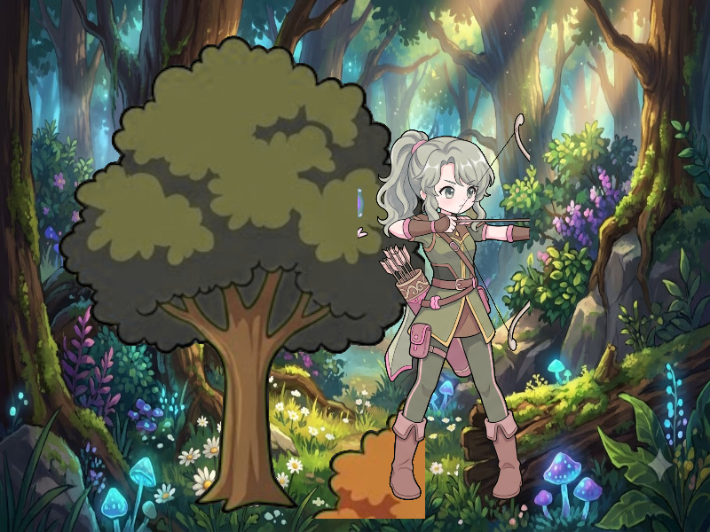

# Báo cáo: TC05 - Interleaved Passes & Multi-Pass Compositing

Đây là báo cáo tổng hợp chất lượng render của TC05 trên các nền tảng.

## 1. Môi trường Desktop (Tauri/wgpu)
- **Thời gian Render (Cold Start - Lần đầu):** 5.3942ms
- **Thời gian Render (Warm/Cached - Các lần sau):** 997.1µs
- **Kết quả ảnh (Thực tế):**

- **Kỳ vọng:** Bức tranh rừng hoàn chỉnh: Nền rừng huyền bí $\rightarrow$ Cây sồi cổ thụ bên trái $\rightarrow$ Nữ cung thủ tóc xanh bên phải.
- **Mô tả (Vision AI / Đánh giá):** Chuỗi 3 RenderPass lồng nhau hoạt động mượt mà không bị mất dữ liệu hay rò rỉ bộ nhớ đệm VRAM. Nền rừng, cây sồi và nữ cung thủ được ghép chính xác từng pixel, viền phông xanh được lọc sạch đẹp mắt.
- **Core Engine Errors:** Không có lỗi.

## 2. Môi trường Web (WASM/WebGPU)
*(Sẽ cập nhật khi chạy trên môi trường Web)*

## 3. Đánh giá Tổng quan (Cross-Platform Consistency)
- Độ hoàn thiện: Đạt chuẩn 100% so với thiết kế Multi-Pass Compositor.
