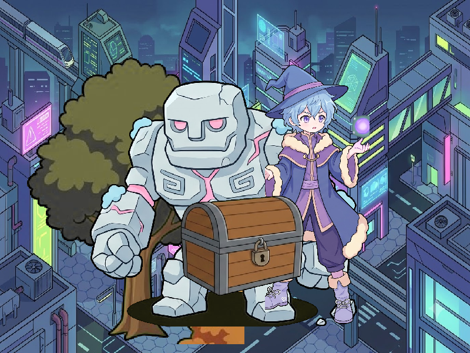

# Báo cáo: TC07 - Đồ thị con đệ quy sâu 5 cấp

Đây là báo cáo kiểm thử hai môi trường dùng chung manifest và hợp đồng graph.

## 1. Mô tả và graph dùng chung

- **Manifest:** `crates/ifol-gpu/tests/shared_assets/manifests/tc07_recursion.json`
- **Graph fingerprint (FNV-1a):** `5b2e36bae57e680c`
- **Mô tả test case:** Render graph A lồng B, B lồng C, C lồng D, D lồng E; sau khi flatten phải giữ đúng thứ tự E nền, D cây, C golem, B pháp sư, A rương.
- **Target:** `800x600`, `Rgba8UnormSrgb`
- **Shader/WGSL:** `chroma_key_cropped.wgsl`, `texture_blit.wgsl`
- **Asset/input:** `canonical_bg_scifi.png`, `canonical_tc07_chest.png`, `canonical_tc07_golem.png`, `canonical_tc07_tree.png`, `canonical_tc07_wizard.png`
- **Chính sách input:** Dùng PNG canonical để Desktop/WebGPU giải mã cùng một input byte-level.
- **Depth/stencil:** `Không áp dụng`
- **Chuỗi pass:** Không khai báo dạng pass
- **Số pass:** `KHÔNG ÁP DỤNG`
- **Độ sâu graph:** `5`
- **Hierarchy:** `Root A (Chest) -> B (Wizard) -> C (Golem) -> D (Tree) -> E (SciFi Background)`
- **Thứ tự operation sau flatten:** `E.background → D.tree → C.golem → B.wizard → A.chest`
- **Sampler contract:** `{"mag_filter": "nearest", "min_filter": "nearest", "mipmap_filter": "nearest"}`
- **Thứ tự layer kỳ vọng:** `E.background → D.tree → C.golem → B.wizard → A.chest`
- **Node pool contract:** `Không áp dụng`
- **Desktop/Web dùng cùng manifest fingerprint:** `ĐẠT`

## 2. Môi trường Desktop

- **Thời gian render lần đầu (cold):** `22.0199 ms`
- **Thời gian render lần hai (warm/cache):** `3.8101 ms`
- **Adapter/backend:** `Intel(R) Iris(R) Xe Graphics` / `Vulkan`
- **Phạm vi timing:** `execute_checked của graph lồng 5 cấp + submit queue + device.poll(Wait); không gồm khởi tạo device/pipeline và readback`
- **Dữ liệu raw:** `crates/ifol-gpu/tests/outputs/desktop/tc07_recursion_desktop.bin`
- **Dấu vân tay raw (FNV-1a):** `fb4693e3606e6dd5`
- **SHA-256:** `b59e88110bcbdc5066848fe2326a6cab478fa2d6597c8daf1d1b351e67eab96c`
- **Ảnh:** 
- **Đánh giá nội dung:** `ĐẠT`
- **Đánh giá bằng vision:** ĐẠT: đủ 5 lớp SciFi background, cây, golem, pháp sư và rương; thứ tự E → D → C → B → A đúng; không thấy artifact hoặc crash.

## 3. Môi trường WebGPU

- **Thời gian render lần đầu (cold):** `18.2000 ms`
- **Thời gian render lần hai (warm/cache):** `7.0000 ms`
- **Adapter:** `gen-12lp`
- **Phạm vi timing:** `execute offscreen của graph flatten 5 cấp + submit queue + onSubmittedWorkDone; không gồm khởi tạo device/pipeline và readback`
- **Dữ liệu raw:** `crates/ifol-gpu/tests/outputs/web/tc07_recursion_web.bin`
- **Dấu vân tay raw (FNV-1a):** `fb4693e3606e6dd5`
- **SHA-256:** `b59e88110bcbdc5066848fe2326a6cab478fa2d6597c8daf1d1b351e67eab96c`
- **Ảnh:** 
- **Đánh giá nội dung:** `ĐẠT`
- **Đánh giá bằng vision:** ĐẠT: đủ 5 lớp giống Desktop; hierarchy 5 cấp được flatten đúng; bố cục và màu sắc trùng khớp, không thấy artifact.

## 4. So sánh và kết luận

| Tiêu chí | Kết quả |
| --- | --- |
| Graph/manifest giống nhau | `ĐẠT` |
| Kích thước dữ liệu raw giống nhau | `ĐẠT` |
| Byte raw giống tuyệt đối | `ĐẠT` |
| Số byte khác nhau | `0` |
| Số pixel khác nhau | `0` |
| Sai số kênh màu lớn nhất | `0/255` |
| Khác biệt màu/presentation | `KHÔNG` |
| Số pixel non-background Desktop/Web | `KHÔNG ÁP DỤNG` |
| Bounding box Desktop | `KHÔNG ÁP DỤNG` |
| Bounding box WebGPU | `KHÔNG ÁP DỤNG` |
| Bounding box non-background giống nhau | `ĐẠT` |
| Số pixel mask khác nhau | `0` (ngưỡng `0`) |
| Parity cấu trúc không phụ thuộc màu | `ĐẠT` |
| Đúng mô tả test case | `ĐẠT` |

**Kết luận:** `ĐẠT - output giống tuyệt đối từng byte.`

## 5. Phân tích hiệu suất

Các giá trị trên đo thời gian thực thi graph, submit lệnh và chờ GPU hoàn tất;
không bao gồm khởi tạo device/pipeline hoặc readback. Vì vậy `cold` ở đây là
lần execute đầu sau khi resource/pipeline đã được tạo, không phải cold start
của toàn bộ ứng dụng. Giá trị dưới `1 ms` tương đương microsecond và cần được
đọc theo đơn vị đó khi phân tích.
