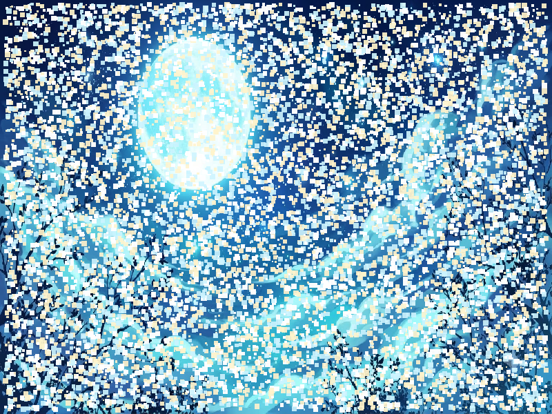

# Báo cáo: TC08 - Một draw command với 10.000 hạt procedural

Đây là báo cáo kiểm thử hai môi trường dùng chung manifest và hợp đồng graph.

## 1. Mô tả và graph dùng chung

- **Manifest:** `crates/ifol-gpu/tests/shared_assets/manifests/tc08_massive.json`
- **Graph fingerprint (FNV-1a):** `ca8fd2b5d55bb950`
- **Mô tả test case:** Render nền trời đêm canonical và 10.000 hạt procedural bằng một draw command trong cùng graph.
- **Target:** `800x600`, `Rgba8UnormSrgb`
- **Shader/WGSL:** `particles_10k.wgsl`, `texture_blit.wgsl`
- **Asset/input:** `canonical_bg_nightsky.png`
- **Chính sách input:** Dùng PNG canonical để Desktop/WebGPU giải mã cùng một input byte-level.
- **Depth/stencil:** `Không áp dụng`
- **Chuỗi pass:** Không khai báo dạng pass
- **Số pass:** `KHÔNG ÁP DỤNG`
- **Độ sâu graph:** `KHÔNG ÁP DỤNG`
- **Hierarchy:** `Không khai báo`
- **Thứ tự operation sau flatten:** `background → particles`
- **Sampler contract:** `{"mag_filter": "nearest", "min_filter": "nearest", "mipmap_filter": "nearest"}`
- **Thứ tự layer kỳ vọng:** `Không khai báo`
- **Graph resources:** nodes=`1`, draw commands=`2`, tổng instances=`10001`, procedural particles=`10000`
- **Node pool contract:** `Không áp dụng`
- **Desktop/Web dùng cùng manifest fingerprint:** `ĐẠT`

## 2. Môi trường Desktop

- **Thời gian render lần đầu (cold):** `2.5229 ms`
- **Thời gian render lần hai (warm/cache):** `0.9816 ms (981.6 µs)`
- **Adapter/backend:** `Intel(R) Iris(R) Xe Graphics` / `Vulkan`
- **Phạm vi timing:** `execute_checked của graph 1 node/2 draw command với 10.000 instance + submit queue + device.poll(Wait); không gồm khởi tạo device/pipeline và readback`
- **Dữ liệu raw:** `crates/ifol-gpu/tests/outputs/desktop/tc08_massive_desktop.bin`
- **Dấu vân tay raw (FNV-1a):** `895fef5150f66a69`
- **SHA-256:** `35f64aa6f4b52632d0f5e0a1b750e03cdab0d8d47f8e0ee0093e7c260cf29f63`
- **Ảnh:** 
- **Đánh giá nội dung:** `ĐẠT`
- **Đánh giá bằng vision:** ĐẠT: nền trời đêm phủ toàn ảnh; 10.000 hạt procedural màu vàng, cyan và trắng phân bố dày trên khung hình; không thấy crash hoặc artifact bất thường.
- **Graph thực tế:** nodes=1, draw commands=2, instances=10000

## 3. Môi trường WebGPU

- **Thời gian render lần đầu (cold):** `279.6000 ms`
- **Thời gian render lần hai (warm/cache):** `3.1000 ms`
- **Adapter:** `gen-12lp`
- **Phạm vi timing:** `execute offscreen của graph 1 node/2 draw command với 10.000 instance + submit queue + onSubmittedWorkDone; không gồm khởi tạo device/pipeline và readback`
- **Dữ liệu raw:** `crates/ifol-gpu/tests/outputs/web/tc08_massive_web.bin`
- **Dấu vân tay raw (FNV-1a):** `895fef5150f66a69`
- **SHA-256:** `35f64aa6f4b52632d0f5e0a1b750e03cdab0d8d47f8e0ee0093e7c260cf29f63`
- **Ảnh:** 
- **Đánh giá nội dung:** `ĐẠT`
- **Đánh giá bằng vision:** ĐẠT: bố cục và mật độ hạt giống Desktop; nền và ba nhóm màu hiển thị đầy đủ; không thấy artifact.
- **Graph thực tế:** nodes=1, draw commands=2, instances=10000

## 4. So sánh và kết luận

| Tiêu chí | Kết quả |
| --- | --- |
| Graph/manifest giống nhau | `ĐẠT` |
| Kích thước dữ liệu raw giống nhau | `ĐẠT` |
| Byte raw giống tuyệt đối | `ĐẠT` |
| Số byte khác nhau | `0` |
| Số pixel khác nhau | `0` |
| Sai số kênh màu lớn nhất | `0/255` |
| Khác biệt màu/presentation | `KHÔNG` |
| Số pixel non-background Desktop/Web | `KHÔNG ÁP DỤNG` |
| Bounding box Desktop | `KHÔNG ÁP DỤNG` |
| Bounding box WebGPU | `KHÔNG ÁP DỤNG` |
| Bounding box non-background giống nhau | `ĐẠT` |
| Số pixel mask khác nhau | `0` (ngưỡng `0`) |
| Parity cấu trúc không phụ thuộc màu | `ĐẠT` |
| Đúng mô tả test case | `ĐẠT` |

**Kết luận:** `ĐẠT - output giống tuyệt đối từng byte.`

## 5. Phân tích hiệu suất

Các giá trị trên đo thời gian thực thi graph, submit lệnh và chờ GPU hoàn tất;
không bao gồm khởi tạo device/pipeline hoặc readback. Vì vậy `cold` ở đây là
lần execute đầu sau khi resource/pipeline đã được tạo, không phải cold start
của toàn bộ ứng dụng. Giá trị dưới `1 ms` tương đương microsecond và cần được
đọc theo đơn vị đó khi phân tích.
