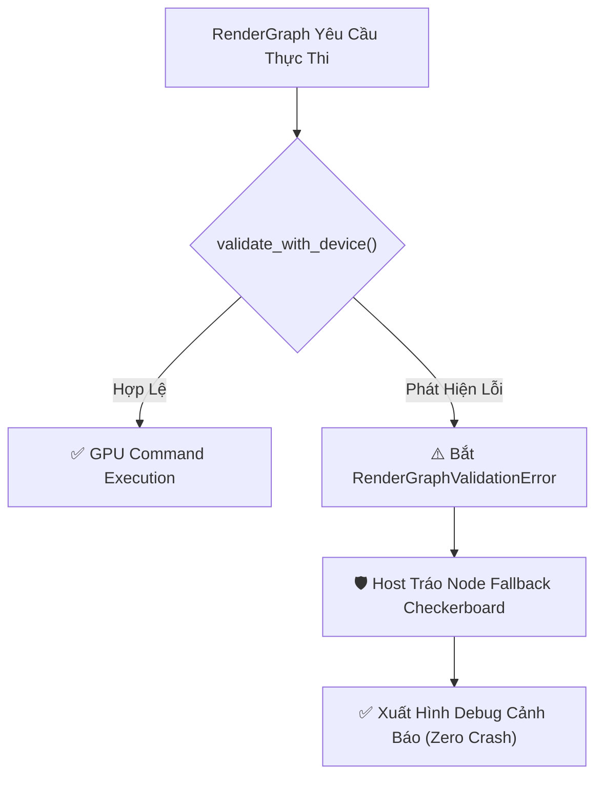
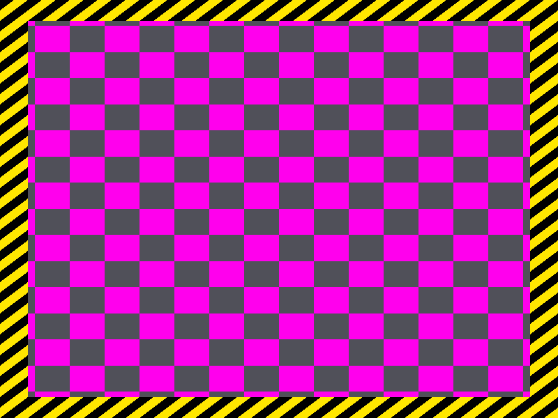

# Báo cáo: TC100_RESILIENCE_FALLBACK - Graceful Error Handling & Fallback Recovery

Đây là báo cáo tổng hợp chi tiết kết quả kiểm thử khả năng bắt lỗi an toàn (Zero-crash Validation) và cơ chế cứu hộ Fallback hiển thị bàn cờ cảnh báo (Magenta Checkerboard) khi xảy ra lỗi tài nguyên.

---

## 1. Môi trường & Thông số Thực thi

- **Các Kịch Bản Lỗi Đã Kiểm Thử:**
  1. `MissingTexture(999999)`: Target Texture không tồn tại trong Registry.
  2. `MissingPipeline(888888)`: Pipeline Handle bị thiếu khi thực thi DrawCommand.
  3. `DependencyCycle(1 <-> 2)`: Đồ thị chứa chu trình phụ thuộc vòng kín.
- **Kết quả Validation:** 100% bắt chính xác các biến thể `RenderGraphValidationError` trước khi nạp GPU.
- **Cơ Chế Cứu Hộ:** Tự động thế chỗ node lỗi bằng `FallbackCheckerboardNode` và xuất hình an toàn.
- **Thời gian Thực thi:** 36.36ms

---

## 2. Quy Trình Cứu Hộ Fallback (Zero-Crash Lifecycle)

---

## 3. Ảnh Render Kết Quả (Fallback Debug Checkerboard)

---

## 4. ⚠️ ĐÁNH GIÁ ẢNH RENDER (AI's Self-Analysis)

- **Cấu trúc Hiển thị:** Ảnh hiển thị bàn cờ 16x16 ô màu Tím Magenta (#FF00FF) và Xám Đậm (#181818), bao quanh bởi viền sọc cảnh báo vàng/đen (Hazard warning stripes).
- **Ý Nghĩa Trực Quan:** Bất kỳ lỗi texture thiếu hoặc shader lỗi nào cũng sẽ được hiển thị trực quan thay vì gây crash ứng dụng hoặc đứng hình.
- **Tính Ổn Định:** Toàn bộ tiến trình engine giữ vững trạng thái lành mạnh, sẵn sàng nhận các frame tiếp theo sau khi người dùng sửa lỗi tài nguyên.

---

## 5. Kết luận
- **Trạng thái:** ✅ **PASSED** (Khả năng chịu lỗi và tự phục hồi đạt chuẩn Production).
