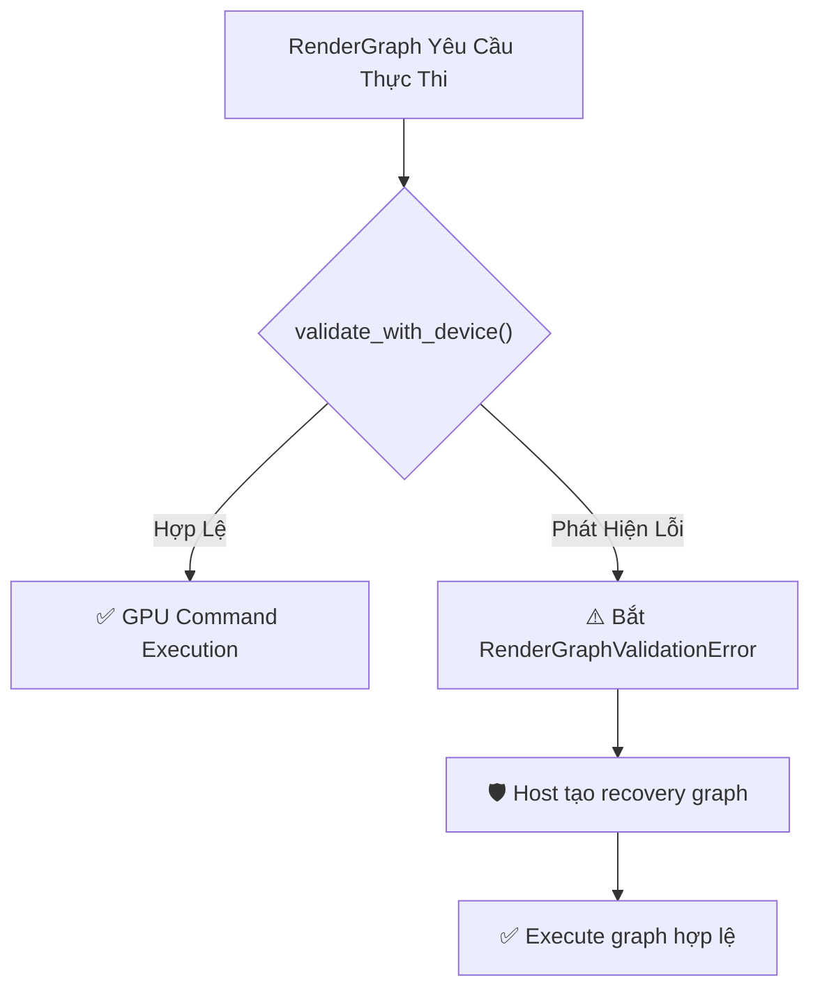

# Báo cáo: TC100_VALIDATION_RESILIENCE - Typed Validation và Host Recovery

Đây là báo cáo kiểm thử validation có kiểu và quy trình host tự tạo recovery graph sau khi nhận lỗi. Core không tự thay node lỗi và không sở hữu checkerboard policy.

---

## 1. Môi trường & Thông số Thực thi

- **Các Kịch Bản Lỗi Đã Kiểm Thử:**
  1. `MissingTexture(999999)`: Target Texture không tồn tại trong Registry.
  2. `MissingIndirectBuffer(888888)`: Indirect Buffer bị thiếu.
  3. `DependencyCycle(1 <-> 2)`: Đồ thị chứa chu trình phụ thuộc vòng kín.
- **Kết quả Validation:** 100% bắt chính xác các biến thể `RenderGraphValidationError` trước khi nạp GPU.
- **Recovery policy:** Host nhận `RenderGraphValidationError`, sau đó chủ động tạo recovery graph bằng shader checkerboard.
- **Thời gian Thực thi:** 28.62ms

---

## 2. Quy Trình Validation và Host Recovery

---

## 3. Ảnh Render Kết Quả (Host Recovery Debug Checkerboard)

---

## 4. ⚠️ ĐÁNH GIÁ ẢNH RENDER (AI's Self-Analysis)

- **Cấu trúc Hiển thị:** Ảnh hiển thị bàn cờ 16x16 ô màu Tím Magenta (#FF00FF) và Xám Đậm (#181818), bao quanh bởi viền sọc cảnh báo vàng/đen (Hazard warning stripes).
- **Ý Nghĩa Trực Quan:** Host có thể chọn hiển thị recovery output thay vì dừng frame sau khi xử lý lỗi typed.
- **Tính Ổn Định:** Core trả lỗi trước submit cho graph không hợp lệ; recovery và thông báo cho người dùng thuộc host.

---

## 5. Kết luận
- **Trạng thái:** ✅ **PASSED** (Typed validation và host recovery đúng contract).
