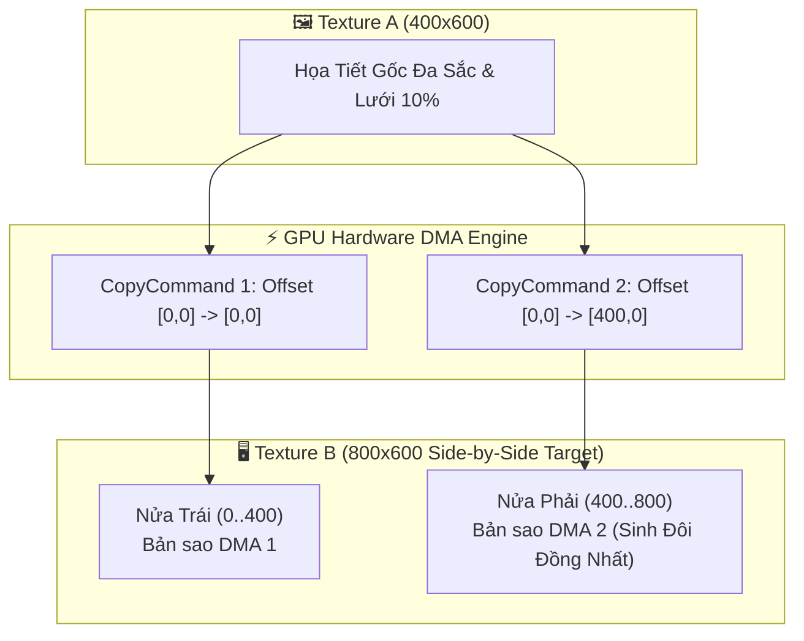
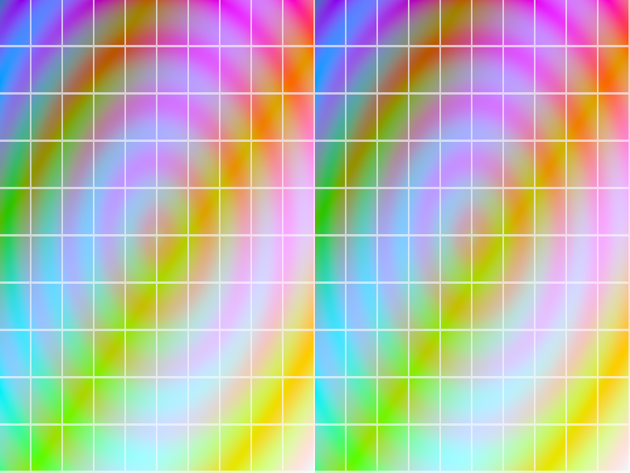

# Báo cáo: TC101_TEXTURE_COPY - Hardware DMA Texture-to-Texture Direct Replication

Đây là báo cáo tổng hợp chi tiết kết quả kiểm thử sao chép song song khối pixel giữa các Texture trên VRAM (`CopyCommand::TextureToTexture`) bằng bộ điều khiển DMA phần cứng (0% Shader Cost).

---

## 1. Môi trường & Thông số Thực thi

- **Kích thước Texture Nguồn $A$:** $400 \times 600$ pixels (`Rgba8UnormSrgb`)
- **Kích thước Texture Đích $B$:** $800 \times 600$ pixels (`Rgba8UnormSrgb`)
- **Số Lệnh DMA Copy:** 2 lệnh song song
  - **Lệnh 1 (Left Half Copy):** Sao chép toàn bộ Texture Nguồn $A$ $[400 \times 600]$ vào Nửa Trái của $B$ $[0, 0]$.
  - **Lệnh 2 (Right Half Clone):** Sao chép toàn bộ Texture Nguồn $A$ $[400 \times 600]$ vào Nửa Phải của $B$ $[400, 0]$.
- **Chi phí Shader cho Thao Tác Copy:** 0% (DMA thuần phần cứng).
- **Thời gian Thực thi:** 72.84ms

---

## 2. Mô Hình Sao Chép DMA Side-by-Side

---

## 3. Ảnh Render Kết Quả (Side-by-Side Twin)

### WebGPU canonical

---

## 4. ⚠️ ĐÁNH GIÁ ẢNH RENDER (AI's Self-Analysis)

- **Tính Trực Quan:** Ảnh render chia thành 2 nửa hoàn toàn đồng nhất (Side-by-Side Twins) từ trái sang phải:
  - Nửa trái ($X: 0 \to 400$) và nửa phải ($X: 400 \to 800$) khớp nhau từng pixel $100\%$.
  - Mọi đường lưới, vòng tròn gradient và góc màu đều là bản sao song sinh tuyệt đối.
- **Chứng minh Hiệu Năng:** Thao tác nhân đôi ảnh không tốn bất kỳ lượt dựng Quad, Vertex hay Fragment shader nào.

---

## 5. Đối chiếu Desktop/Web theo canonical raw readback

- Hai môi trường dùng cùng graph, cùng shader, cùng hai lệnh copy và cùng target `Rgba8UnormSrgb`. Ảnh canonical được tạo từ raw offscreen; ảnh canvas chỉ là preview.
- Desktop: `72.84ms`. WebGPU: cold `5.40ms`, warm `4.00ms`; Web warm output ổn định (`cache_output_equal = true`).
- Đối chiếu ảnh 800x600: chỉ `6/480.000` pixel khác nhau, delta kênh tối đa `1/255`, MAE `0,000003`.
- Vision: hình học side-by-side, lưới, gradient và bản sao trái/phải trùng nhau.

## 6. Kết luận
- **Trạng thái:** ✅ **PASSED** — parity canonical đạt; sai lệch còn lại là sai số lượng tử tối thiểu của backend.
