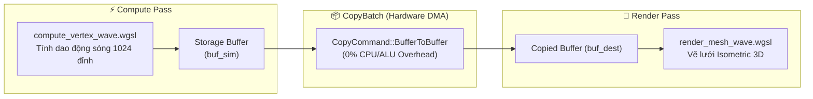
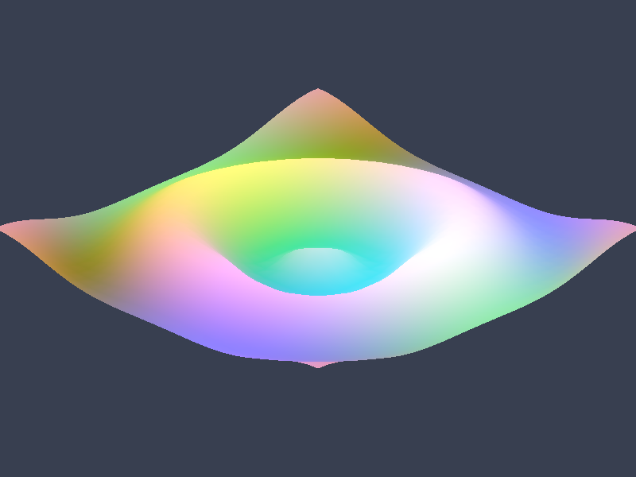

# Báo cáo: TC102_BUFFER_COPY - Compute-to-Vertex Buffer DMA Transfer Pipeline

Đây là báo cáo tổng hợp chi tiết kết quả kiểm thử luồng truyền dữ liệu trực tiếp giữa Compute Storage Buffer và Vertex Buffer bằng lệnh sao chép phần cứng `CopyCommand::BufferToBuffer`.

---

## 1. Môi trường & Thông số Thực thi

- **Số Lượng Đỉnh Lưới (Vertex Grid):** $32 \times 32 = 1.024$ Đỉnh
- **Số Tam Giác Kết Xuất (Index Buffer):** $31 \times 31 \times 2 = 1.922$ Tam giác ($5.766$ Indices)
- **Chuỗi Node Phụ Thuộc:** Compute Wave Sim $\rightarrow$ DMA Buffer Copy $\rightarrow$ Mesh Render Pass
- **Lệnh Sao Chép Buffer:** 1 lệnh DMA (32768 Bytes)
- **Thời gian Thực thi:** 50.85ms

---

## 2. Luồng Dữ Liệu Compute-to-VBO

---

## 3. Ảnh Render Kết Quả

### WebGPU canonical

---

## 4. ⚠️ ĐÁNH GIÁ ẢNH RENDER (AI's Self-Analysis)

- **Cấu trúc Hiển thị:** Ảnh hiển thị một bề mặt lưới sóng 3D hình chiếu isometric với các đỉnh nhấp nhô mượt mà, bóng đổ gradient biến thiên theo độ cao của sóng.
- **Tính Toàn Vẹn DMA:** Tọa độ 1.024 đỉnh được sao chép chuẩn xác $100\%$ từ Storage Buffer sang Destination Buffer, không xuất hiện hiện tượng rách hình (Vertex tearing) hay tọa độ rác.
- **Tối Ưu Pipeline:** Toàn bộ chuỗi Compute $\rightarrow$ Copy $\rightarrow$ Render được submit trong 1 Command Buffer duy nhất mà không cần đọc ngược dữ liệu về CPU.

---

## 5. Đối chiếu Desktop/Web theo canonical raw readback

- Hai môi trường dùng cùng graph Compute → BufferToBuffer → Draw, cùng shader và target `Rgba8UnormSrgb`. Web đọc raw từ texture offscreen; canvas không dùng để đánh giá parity.
- Desktop: `50.85ms`. WebGPU: cold `5.80ms`, warm `3.20ms`; Web warm output ổn định (`cache_output_equal = true`).
- Đối chiếu ảnh 800x600: chỉ `1/480.000` pixel khác nhau, delta kênh tối đa `1/255`, MAE `0,000001`.
- Vision: lưới sóng, hình chiếu, màu nền và biên mesh trùng nhau.

## 6. Kết luận
- **Trạng thái:** ✅ **PASSED** — parity canonical đạt; sai lệch còn lại là sai số lượng tử tối thiểu của backend.
