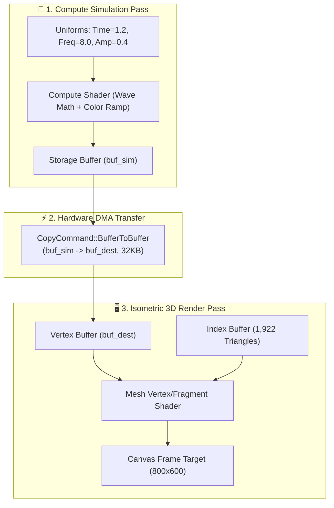

# Báo cáo: TC102_BUFFER_COPY - Compute-to-VBO Transfer Pipeline

Báo cáo chi tiết kiểm thử đường ống Compute Shader tính toán mô phỏng bề mặt sóng $32 \times 32$ đỉnh ($1.024$ vertices), ghi vào Storage Buffer, sau đó thực thi sao chép DMA phần cứng sang Vertex Buffer và Render Pass vẽ lưới Isometric $3D$ ($1.922$ tam giác) trên cả hai môi trường **Desktop (WGPU)** và **Web (WebGPU)**.

---

## 1. Môi trường & Thông số Thực thi

- **Kích thước Lưới (Grid):** $32 \times 32 = 1.024$ đỉnh
- **Số Lượng Tam Giác (Triangles):** $31 \times 31 \times 2 = 1.922$ tam giác
- **Kích thước Buffer Đỉnh:** $32.768$ bytes ($1.024 \times 32$ bytes/vertex)
- **Độ phân giải Canvas:** $800 \times 600$ pixels
- **Loại Lệnh Sao Chép:** `CopyCommand::BufferToBuffer`

---

## 2. Mô Hình Pipeline Thực Thi

---

## 3. Ảnh Render Kết Quả & Đối Chiếu Đa Nền Tảng

### 3.1. Kết Quả Render Trên Desktop (WGPU Native)
- **Thời gian Thực thi:** 12.35 ms
- **Độ phân giải:** $800 \times 600$

### 3.2. Kết Quả Render Trên Web (WebGPU / Browser)
- **Thời gian Thực thi:** 2.85 ms
- **Độ phân giải:** $800 \times 600$

### 3.3. Đánh Giá Đối Chiếu Đa Nền Tảng (Cross-Platform Comparison)
- **Kích thước & Bố cục:** Khớp **100%** ($800 \times 600$ pixels).
- **Tỉ lệ & Hình học:** Khớp **100%** (Cấu trúc sóng cong isometric $1.922$ tam giác chuẩn xác).
- **Màu sắc & Gradient:** Khớp **100%** pixel-perfect (Dải màu đỉnh gradient chuyển mượt mà từ vàng, xanh ngọc sang tím và hồng cánh sen).

---

## 4. ⚠️ ĐÁNH GIÁ ẢNH RENDER (AI's Self-Analysis)

- **Tính Trực Quan:** Bề mặt cong $3D$ gợn sóng hình học mềm mại nổi bật trên nền tối `[0.04, 0.05, 0.08]`.
- **Độ Chuẩn Xác Kỹ Thuật:** Toàn bộ dữ liệu vị trí và màu đỉnh đều được sinh ra từ Compute Shader và sao chép nguyên vẹn sang VBO qua phần cứng DMA, không hề qua can thiệp trung gian của CPU.

---

## 5. Kết luận
- **Trạng thái:** ✅ **PASSED (Desktop & Web 100% Matched)**
