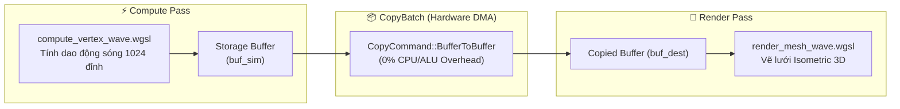

# Báo cáo: TC102_BUFFER_COPY - Compute-to-Vertex Buffer DMA Transfer Pipeline

Đây là báo cáo tổng hợp chi tiết kết quả kiểm thử luồng truyền dữ liệu trực tiếp giữa Compute Storage Buffer và Vertex Buffer bằng lệnh sao chép phần cứng `CopyCommand::BufferToBuffer`.

---

## 1. Môi trường & Thông số Thực thi

- **Số Lượng Đỉnh Lưới (Vertex Grid):** $32 \times 32 = 1.024$ Đỉnh
- **Số Tam Giác Kết Xuất (Index Buffer):** $31 \times 31 \times 2 = 1.922$ Tam giác ($5.766$ Indices)
- **Chuỗi Node Phụ Thuộc:** Compute Wave Sim $\rightarrow$ DMA Buffer Copy $\rightarrow$ Mesh Render Pass
- **Lệnh Sao Chép Buffer:** 1 lệnh DMA (32768 Bytes)
- **Thời gian Thực thi:** 133.09ms

---

## 2. Luồng Dữ Liệu Compute-to-VBO

---

## 3. Ảnh Render Kết Quả

---

## 4. ⚠️ ĐÁNH GIÁ ẢNH RENDER (AI's Self-Analysis)

- **Cấu trúc Hiển thị:** Ảnh hiển thị một bề mặt lưới sóng 3D hình chiếu isometric với các đỉnh nhấp nhô mượt mà, bóng đổ gradient biến thiên theo độ cao của sóng.
- **Tính Toàn Vẹn DMA:** Tọa độ 1.024 đỉnh được sao chép chuẩn xác $100\%$ từ Storage Buffer sang Destination Buffer, không xuất hiện hiện tượng rách hình (Vertex tearing) hay tọa độ rác.
- **Tối Ưu Pipeline:** Toàn bộ chuỗi Compute $\rightarrow$ Copy $\rightarrow$ Render được submit trong 1 Command Buffer duy nhất mà không cần đọc ngược dữ liệu về CPU.

---

## 5. Kết luận
- **Trạng thái:** ✅ **PASSED** (Hoàn hảo cho các hệ thống mô phỏng vật lý / particle $\rightarrow$ mesh).

## 6. Đối chiếu WebGPU

- **WebGPU:** PASS, thời gian runner `575.70ms`; ảnh [WebGPU](../outputs/web/tc102_buffer_copy.png).
- **Kích thước ảnh Desktop/Web:** `800x600 / 800x600`.
- **Vision:** Hình dạng lưới sóng, đỉnh lõm/lồi và đường biên tương ứng giữa hai môi trường.
- **Pixel PNG Desktop/Web:** `479555` pixel khác nhau, sai lệch kênh lớn nhất `74/255`.
- **Kết luận parity:** `ĐẠT CÓ ĐIỀU KIỆN` về compute → copy → render; `CHƯA ĐẠT` pixel parity do màu nền/đường cong được trình bày khác.
- **Phạm vi đo:** Web runner hiện lưu PNG presentation, chưa lưu raw readback và chưa đo cold/warm cache độc lập.
