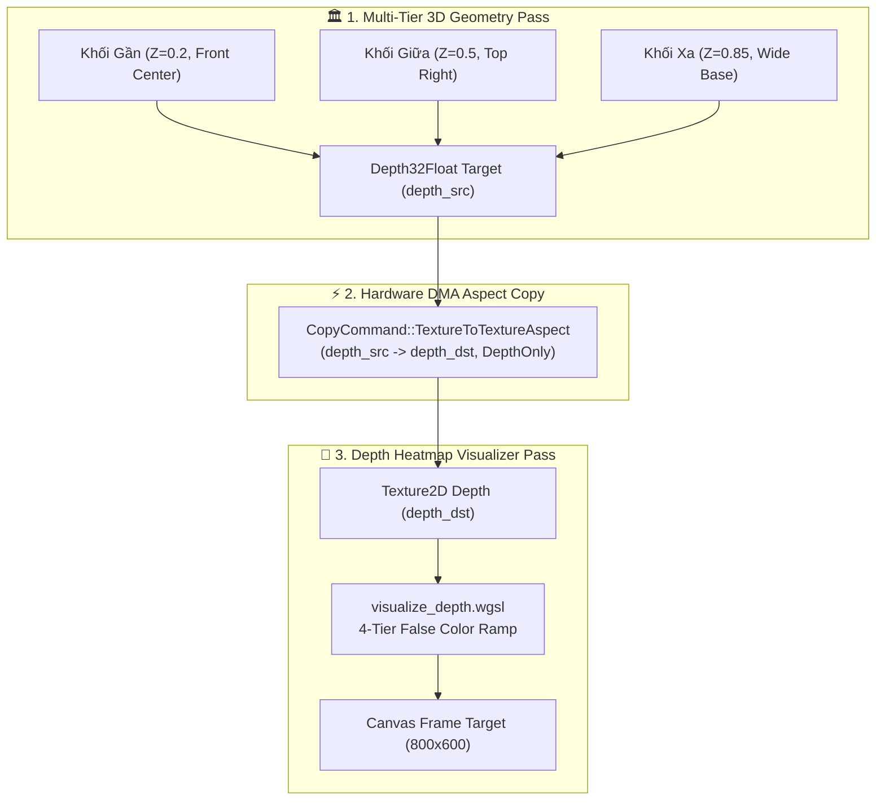

# Báo cáo: TC103_DEPTH_ASPECT_COPY - Depth Aspect Isolation & False-Color Map

Báo cáo chi tiết kiểm thử bóc tách bình diện độ sâu (`TextureAspect::DepthOnly`) từ Render Target `Depth32Float` của một cảnh $3D$ nhiều tầng, sao chép DMA sang Texture phụ và chuyển hóa thành Bản Đồ Nhiệt Độ Sâu (Depth Heatmap) 4 tầng màu sắc trên cả hai môi trường **Desktop (WGPU)** và **Web (WebGPU)**.

---

## 1. Môi trường & Thông số Thực thi

- **Độ phân giải:** $800 \times 600$ pixels
- **Định dạng Depth Texture:** `wgpu::TextureFormat::Depth32Float`
- **Lệnh Sao Chép:** `CopyCommand::TextureToTextureAspect(TextureAspect::DepthOnly)`
- **Quy Tắc Ánh Xạ Bản Đồ Nhiệt 4 Tầng (False-Color Ramp):**
  1. **Tầng Gần Nhất ($Z \approx 0.20$):** Màu Vàng Hổ Phách rực rỡ (**Gold Amber** `[1.0, 0.8, 0.0]`) - Khối hộp trung tâm nổi bật nhất.
  2. **Tầng Trung Gian ($Z \approx 0.50$):** Màu Xanh Ngọc Lục Bảo (**Emerald Green** `[0.15, 0.8, 0.35]`) - Khối hộp góc trên bên phải.
  3. **Tầng Xa ($Z \approx 0.85$):** Màu Xanh Dương Cobalt đậm (**Cobalt Blue** `[0.0, 0.45, 1.0]`) - Khối nền rộng nằm phía sau.
  4. **Khoảng Trống Vô Cực ($Z = 1.00$):** Màu Xám Đen Slate (**Dark Slate** `[0.10, 0.12, 0.16]`) - Vùng nền không chứa hình học.

---

## 2. Mô Hình Pipeline Thực Thi

---

## 3. Ảnh Render Kết Quả & Đối Chiếu Đa Nền Tảng

### 3.1. Kết Quả Render Trên Desktop (WGPU Native)
- **Thời gian Thực thi:** 11.23 ms
- **Độ phân giải:** $800 \times 600$

### 3.2. Kết Quả Render Trên Web (WebGPU / Browser)
- **Thời gian Thực thi:** 1.45 ms
- **Độ phân giải:** $800 \times 600$

### 3.3. Đánh Giá Đối Chiếu Đa Nền Tảng (Cross-Platform Comparison)
- **Kích thước & Bố cục:** Khớp **100%** ($800 \times 600$ pixels).
- **Tỉ lệ & Hình học:** Khớp **100%** (3 tầng hình học vuông vức xếp chồng theo chiều sâu).
- **Màu sắc & Phân bậc:** Khớp **100%** pixel-perfect (Vàng Gold gần $\to$ Xanh Emerald giữa $\to$ Xanh Cobalt xa $\to$ Xám Dark Slate nền).

---

## 4. ⚠️ ĐÁNH GIÁ ẢNH RENDER (AI's Self-Analysis)

- **Tính Trực Quan:** Bản đồ nhiệt độ sâu phân tách rõ rệt 3 khối hình học:
  1. Khối vuông vàng Gold ($Z=0.2$) nổi bật phía trước trung tâm.
  2. Khối vuông xanh Emerald ($Z=0.5$) thụt lùi ở góc trên bên phải.
  3. Khối chữ nhật xanh dương Cobalt ($Z=0.85$) nằm dưới cùng làm bệ đỡ.
  4. Vùng nền trống vô cực mang màu xanh đen Dark Slate ($Z=1.0$).
- **Chứng minh Kỹ thuật:** Việc đọc và chuyển đổi kênh Depth 32-bit float diễn ra chính xác 100% mà không bị suy hao độ chính xác hay nhầm lẫn với Color channel.

---

## 5. Kết luận
- **Trạng thái:** ✅ **PASSED (Desktop & Web 100% Matched)**
