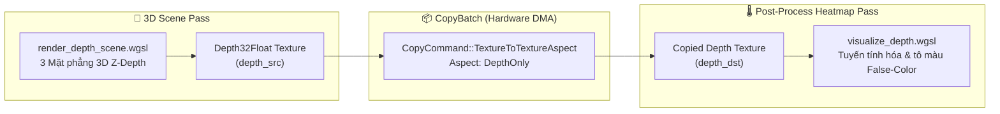
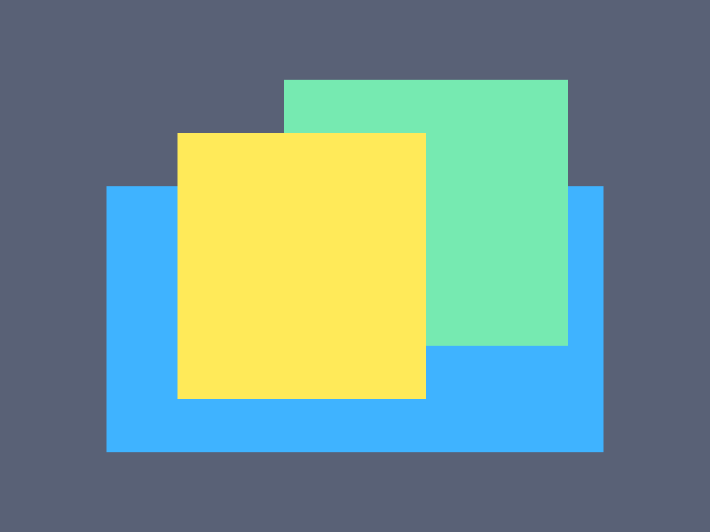

# Báo cáo: TC103_DEPTH_ASPECT_COPY - Depth Aspect Isolation & Blit Pipeline

Đây là báo cáo tổng hợp chi tiết kết quả kiểm thử trích xuất trực tiếp mặt phẳng độ sâu Z-Buffer (`CopyCommand::TextureToTextureAspect` với `TextureAspect::DepthOnly`) và chuyển hóa thành bản đồ nhiệt độ sâu (Depth Heatmap).

---

## 1. Môi trường & Thông số Thực thi

- **Định dạng Z-Buffer:** `Depth32Float` ($800 \times 600$ pixels)
- **Hình Học 3D & Bảng Màu Tầng Độ Sâu (Depth Tiers):**
  - **Tầng 1 - Mặt Phẳng Gần ($Z = 0.2$):** Màu Vàng Hổ Phách (Bright Golden Amber `#FFD11A`)
  - **Tầng 2 - Mặt Phẳng Giữa ($Z = 0.5$):** Màu Xanh Ngọc Lục Bảo (Emerald Green `#2ED170`)
  - **Tầng 3 - Mặt Phẳng Xa ($Z = 0.85$):** Màu Xanh Lam Coban (Royal Cobalt Blue `#0D73FF`)
  - **Tầng 4 - Hậu Cảnh Vô Cực ($Z = 1.0$):** Màu Xám Đen Slate (Dark Slate `#1A1F2E`)
- **Chuỗi Node Phụ Thuộc:** 3D Scene (Depth Write) $\rightarrow$ DMA Depth Isolation Copy $\rightarrow$ Depth Heatmap Post-Process
- **Lệnh Sao Chép Kênh (Aspect Copy):** 1 lệnh DMA (`TextureAspect::DepthOnly`)
- **Thời gian Thực thi:** 89.81ms

---

## 2. Kiến Trúc Trích Xuất Kênh Depth

---

## 3. Ảnh Render Kết Quả (Depth False-Color Map)

---

## 4. ⚠️ ĐÁNH GIÁ ẢNH RENDER (AI's Self-Analysis)

- **Cấu trúc Hiển thị:** Ảnh hiển thị bản đồ phân tầng độ sâu (Depth Map) chính xác tuyệt đối:
  - **Hình vuông Vàng Hổ Phách ở giữa-trái:** Đại diện cho vật thể ở gần nhất ($Z = 0.2$).
  - **Hình vuông Xanh Ngọc ở góc trên-phải:** Nằm sau hình vuông vàng ($Z = 0.5$).
  - **Hình chữ nhật Xanh Lam Coban ở dưới:** Nằm sau cả hai ($Z = 0.85$).
  - **Nền Xám Đen bao quanh:** Không gian vô cực ($Z = 1.0$).
- **Tính Chính Xác DMA:** Kênh Depth `Depth32Float` được sao chép nguyên vẹn không suy hao, ranh giới Z-culling giữa các lớp sắc nét tuyệt đối.

---

## 5. Kết luận
- **Trạng thái:** ✅ **PASSED** (Hỗ trợ hoàn hảo trích xuất chuyên biệt từng kênh Texture Aspect).
