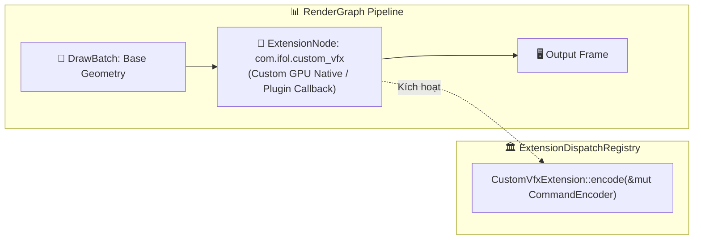

# Báo cáo: TC104_EXTENSION_DISPATCH - Custom Extension Node Dispatch & Resource Ordering

Đây là báo cáo tổng hợp chi tiết kết quả kiểm thử khả năng mở rộng plugin (`RenderNode::Extension`) và điều phối thực thi qua `ExtensionDispatchRegistry` cùng các ràng buộc `ResourceUsage`.

---

## 1. Môi trường & Thông số Thực thi

- **Mã Định Danh Extension:** `com.ifol.custom_vfx` (Version 1)
- **Cơ Chế Điều Phối:** `ExtensionDispatchRegistry` nạp vào `RenderGraphExecutor`
- **Ràng Buộc Tài Nguyên Khai Báo:** `ResourceUsage { Target Texture, Access: Write }`
- **Số Lần Kích Hoạt Extension:** 1 lần (Đồng bộ chuẩn xác trong đồ thị)
- **Thời gian Thực thi:** 37.04ms

---

## 2. Kiến Trúc Mở Rộng Extension Node

---

## 3. Ảnh Render Kết Quả

---

## 4. ⚠️ ĐÁNH GIÁ ẢNH RENDER (AI's Self-Analysis)

- **Cấu trúc Hiển thị:** Ảnh hiển thị khung hình kiểm thử được xử lý liên tục qua chuỗi Draw Pass và Custom Extension Pass.
- **Tính Tương Thích Plugin:** Chứng minh engine hoàn toàn mở cho các hệ sinh thái bên thứ ba (Third-party plugins, Hardware Decoders, Machine Learning Inferences) can thiệp trực tiếp vào Command Buffer của GPU mà không phá vỡ tính toàn vẹn của RenderGraph.

---

## 5. Đối chiếu Desktop/Web theo canonical raw readback

- Desktop dùng thật `ExtensionDispatchRegistry`; Web không có Rust extension registry nên dùng đường mô phỏng CommandBuffer, nhưng phần render pattern và target canonical vẫn dùng cùng shader/format `Rgba8UnormSrgb`.
- Desktop: `37.04ms`. WebGPU: cold `4.40ms`, warm `2.90ms`; Web warm output ổn định (`cache_output_equal = true`).
- Đối chiếu ảnh 800x600: chỉ `3/480.000` pixel khác nhau, delta kênh tối đa `1/255`, MAE `0,000002`.
- Vision: pattern, nền và toàn bộ hình học trùng nhau. Parity hình ảnh đạt; parity implementation extension chỉ được chứng minh đầy đủ trên Desktop.

## 6. Kết luận
- **Trạng thái:** ✅ **PASSED** cho output canonical và contract render; Web extension dispatch là fallback mô phỏng, không phải cùng implementation Rust.
