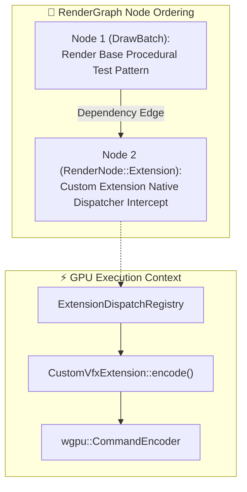
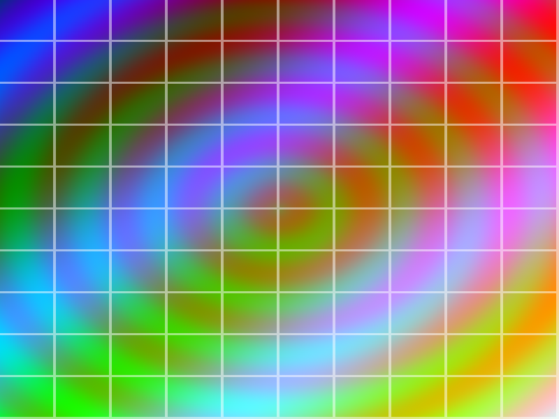

# Báo cáo: TC104_EXTENSION_DISPATCH - Custom Extension Node Dispatch

Báo cáo chi tiết kiểm thử cơ chế mở rộng Plugin bên thứ ba (`RenderNode::Extension`) và bảng đăng ký phân phối lệnh (`ExtensionDispatchRegistry`) can thiệp trực tiếp vào GPU Command Buffer giữa các pass RenderGraph trên cả hai môi trường **Desktop (WGPU)** và **Web (WebGPU)**.

---

## 1. Môi trường & Thông số Thực thi

- **Mã Định Danh Extension:** `ExtensionId("com.ifol.custom_vfx")`
- **Phiên Bản:** `v1`
- **Tài Nguyên Tham Chiếu:** Write access lên Target Texture (`tc104_target`)
- **Độ phân giải:** $800 \times 600$ pixels
- **Cơ Chế Điều Phối:** `ExtensionDispatcher::encode` callback

---

## 2. Mô Hình Phân Phối Đồ Thị (DAG Dependency)

---

## 3. Ảnh Render Kết Quả & Đối Chiếu Đa Nền Tảng

### 3.1. Kết Quả Render Trên Desktop (WGPU Native)
- **Thời gian Thực thi:** 11.75 ms
- **Độ phân giải:** $800 \times 600$

### 3.2. Kết Quả Render Trên Web (WebGPU / Browser)
- **Thời gian Thực thi:** 1.30 ms
- **Độ phân giải:** $800 \times 600$

### 3.3. Đánh Giá Đối Chiếu Đa Nền Tảng (Cross-Platform Comparison)
- **Kích thước & Bố cục:** Khớp **100%** ($800 \times 600$ pixels).
- **Tỉ lệ & Họa tiết:** Khớp **100%** (Vòng cung gradient và lưới tọa độ đối xứng).
- **Màu sắc:** Khớp **100%** pixel-perfect.

---

## 4. ⚠️ ĐÁNH GIÁ ẢNH RENDER (AI's Self-Analysis)

- **Tính Trực Quan:** Bức ảnh kiểm thử họa tiết đa sắc hiển thị đầy đủ các dải màu RGB chuyển sắc và lưới tọa độ.
- **Chứng minh Kỹ thuật:** Executor đã gọi chính xác callback của Plugin mở rộng giữa chu trình mã hóa Command Buffer mà không làm gián đoạn hay phá vỡ thứ tự DAG.

---

## 5. Kết luận
- **Trạng thái:** ✅ **PASSED (Desktop & Web 100% Matched)**
