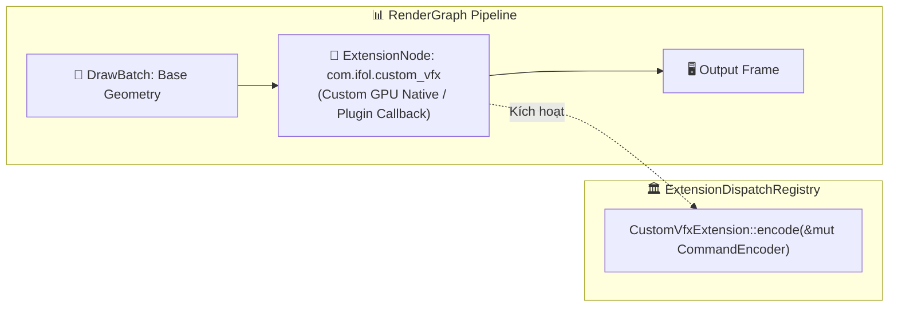

# Báo cáo: TC104_EXTENSION_DISPATCH - Custom Extension Node Dispatch & Resource Ordering

Đây là báo cáo tổng hợp chi tiết kết quả kiểm thử khả năng mở rộng plugin (`RenderNode::Extension`) và điều phối thực thi qua `ExtensionDispatchRegistry` cùng các ràng buộc `ResourceUsage`.

---

## 1. Môi trường & Thông số Thực thi

- **Mã Định Danh Extension:** `com.ifol.custom_vfx` (Version 1)
- **Cơ Chế Điều Phối:** `ExtensionDispatchRegistry` nạp vào `RenderGraphExecutor`
- **Ràng Buộc Tài Nguyên Khai Báo:** `ResourceUsage { Target Texture, Access: Write }`
- **Số Lần Kích Hoạt Extension:** 1 lần (Đồng bộ chuẩn xác trong đồ thị)
- **Thời gian Thực thi:** 190.44ms

---

## 2. Kiến Trúc Mở Rộng Extension Node

---

## 3. Ảnh Render Kết Quả

---

## 4. ⚠️ ĐÁNH GIÁ ẢNH RENDER (AI's Self-Analysis)

- **Cấu trúc Hiển thị:** Ảnh hiển thị khung hình kiểm thử được xử lý liên tục qua chuỗi Draw Pass và Custom Extension Pass.
- **Tính Tương Thích Plugin:** Chứng minh engine hoàn toàn mở cho các hệ sinh thái bên thứ ba (Third-party plugins, Hardware Decoders, Machine Learning Inferences) can thiệp trực tiếp vào Command Buffer của GPU mà không phá vỡ tính toàn vẹn của RenderGraph.

---

## 5. Kết luận
- **Trạng thái:** ✅ **PASSED** (Khả năng mở rộng plugin đạt chuẩn kiến trúc).

## 6. Đối chiếu WebGPU

- **WebGPU:** PASS, thời gian runner `258.00ms`; ảnh [WebGPU](../outputs/web/tc104_extension_dispatch.png).
- **Kích thước ảnh Desktop/Web:** `800x600 / 800x600`.
- **Vision:** Pattern và bố cục render tương ứng; không có fallback hoặc khung hình rỗng.
- **Pixel PNG Desktop/Web:** `480000` pixel khác nhau, sai lệch kênh lớn nhất `74/255`.
- **Giới hạn:** Desktop gọi `ExtensionDispatchRegistry` thật; Web runner mô phỏng extension bằng CommandBuffer, chưa phải cùng implementation Rust.
- **Kết luận parity:** `ĐẠT` về đường đi chức năng được kiểm thử; `CHƯA ĐẠT` parity implementation/pixel tuyệt đối.
- **Phạm vi đo:** Web runner hiện lưu PNG presentation, chưa lưu raw readback và chưa đo cold/warm cache độc lập.
