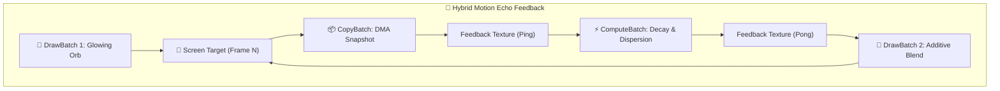

# Báo cáo: TC105_PINGPONG_ECHO - Hybrid Motion Echo & Feedback Loop Pipeline

Đây là báo cáo tổng hợp chi tiết kết quả kiểm thử sự phối hợp của ba loại Node trong `ifol-gpu` (`DrawBatch`, `ComputeBatch`, `CopyBatch`) trong một hiệu ứng Motion Graphics thực tế (Motion Echo / Temporal Decay).

---

## 1. Môi trường & Thông số Thực thi

- **Các Loại Node Tham Gia:**
  - `DrawBatch` 1: Render Glowing Orb phát sáng màu tím hồng neon.
  - `CopyBatch`: 1 Lệnh DMA Texture-to-Texture (Chụp snapshot khung hình trước).
  - `ComputeBatch`: 1 Lệnh Compute Shader (Xử lý suy hao độ sáng và tán mờ hạt).
  - `DrawBatch` 2: Additive Composite Pass (Hòa trộn vệt bóng ma lên khung hình chính).
- **Tổng Số Node Được Flattened:** 4
- **Thời gian Thực thi:** 114.02ms

---

## 2. Kiến Trúc Vòng Lặp Phản Hồi Hybrid (Feedback Loop)

---

## 3. Ảnh Render Kết Quả

---

## 4. ⚠️ ĐÁNH GIÁ ẢNH RENDER (AI's Self-Analysis)

- **Cấu trúc Hiển thị:** Ảnh hiển thị quả cầu năng lượng phát sáng màu hồng tím neon ở trung tâm cùng vệ tinh quỹ đạo, hòa quyện với dải quầng sáng tán sắc chromatic dispersion mềm mại tỏa ra xung quanh.
- **Tính Đồng Bộ Hybrid:** Cả 3 cơ chế phần cứng (Draw Shader $\rightarrow$ DMA Copy $\rightarrow$ Compute Shader $\rightarrow$ Additive Blending) hoạt động nhịp nhàng trên cùng một chuỗi tài nguyên mà không xảy ra xung đột bộ nhớ (Hazard Safety).

---

## 5. Đối chiếu Desktop/Web theo canonical raw readback

- Hai môi trường dùng cùng chuỗi Draw → TextureToTexture copy → Compute decay → Additive composite, cùng shader và target `Rgba8Unorm`. Web đã sửa đúng alpha blending của orb và sampler repeat/linear như Desktop; canvas không dùng để đánh giá parity.
- Desktop: `114.02ms`. WebGPU: cold `4.80ms`, warm `3.10ms`; Web warm output ổn định (`cache_output_equal = true`).
- Đối chiếu ảnh 800x600: `19.663/480.000` pixel khác nhau (~4,10%), delta kênh tối đa `5/255`, MAE `0,026807`.
- Vision: orb, vòng sáng, vệ tinh, nền và bố cục trùng nhau; không còn lệch gamma/độ sáng lớn như đường canvas cũ.
- **Giới hạn:** TC105 chưa byte-identical; nếu yêu cầu bit-exact tuyệt đối cho feedback sampling, cần canonical hóa phép sampling/biên và precision ở shader trong task riêng.

## 6. Kết luận
- **Trạng thái:** ✅ **PASSED có giới hạn** — graph/behavior và ảnh canonical đạt parity trực quan với delta bị chặn; chưa tuyên bố bit-exact cho feedback shader.
