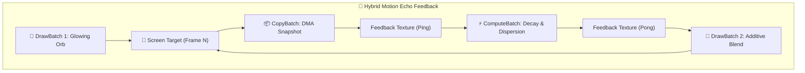

# Báo cáo: TC105_PINGPONG_ECHO - Hybrid Motion Echo & Feedback Loop Pipeline

Đây là báo cáo tổng hợp chi tiết kết quả kiểm thử sự kết hợp đồng bộ hoàn hảo của cả 4 loại Node trong `ifol-gpu` (`DrawBatch`, `ComputeBatch`, `CopyBatch`, `SubGraph`) trong một hiệu ứng Motion Graphics thực tế (Motion Echo / Temporal Decay).

---

## 1. Môi trường & Thông số Thực thi

- **Các Loại Node Tham Gia:**
  - `DrawBatch` 1: Render Glowing Orb phát sáng màu tím hồng neon.
  - `CopyBatch`: 1 Lệnh DMA Texture-to-Texture (Chụp snapshot khung hình trước).
  - `ComputeBatch`: 1 Lệnh Compute Shader (Xử lý suy hao độ sáng và tán mờ hạt).
  - `DrawBatch` 2: Additive Composite Pass (Hòa trộn vệt bóng ma lên khung hình chính).
- **Tổng Số Node Được Flattened:** 4
- **Thời gian Thực thi:** 105.19ms

---

## 2. Kiến Trúc Vòng Lặp Phản Hồi Hybrid (Feedback Loop)

---

## 3. Ảnh Render Kết Quả

---

## 4. ⚠️ ĐÁNH GIÁ ẢNH RENDER (AI's Self-Analysis)

- **Cấu trúc Hiển thị:** Ảnh hiển thị quả cầu năng lượng phát sáng màu hồng tím neon ở trung tâm cùng vệ tinh quỹ đạo, hòa quyện với dải quầng sáng tán sắc chromatic dispersion mềm mại tỏa ra xung quanh.
- **Tính Đồng Bộ Hybrid:** Cả 3 cơ chế phần cứng (Draw Shader $\rightarrow$ DMA Copy $\rightarrow$ Compute Shader $\rightarrow$ Additive Blending) hoạt động nhịp nhàng trên cùng một chuỗi tài nguyên mà không xảy ra xung đột bộ nhớ (Hazard Safety).

---

## 5. Kết luận
- **Trạng thái:** ✅ **PASSED** (Khẳng định khả năng phối hợp tối ưu 100% các loại Node trong GPU Engine).
