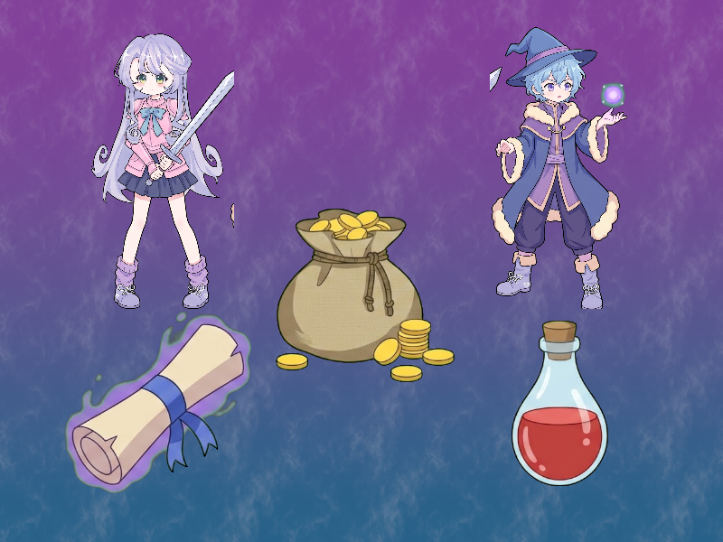

# Báo cáo: TC12 - Chroma key nhiều đối tượng với despill và alpha feathering

Đây là báo cáo kiểm thử hai môi trường dùng chung manifest và hợp đồng graph.

## 1. Mô tả và graph dùng chung

- **Manifest:** `crates/ifol-gpu/tests/shared_assets/manifests/tc12_chroma.json`
- **Graph fingerprint (FNV-1a):** `dd810535ec0c2efb`
- **Mô tả test case:** Render nền hoàng hôn canonical cùng năm sprite crop từ atlas; loại phông xanh, giảm viền xanh, feather alpha và hòa trộn đúng thứ tự.
- **Target:** `800x600`, `Rgba8UnormSrgb`
- **Shader/WGSL:** `chroma_key_cropped.wgsl`, `sky_composite.wgsl`
- **Asset/input:** `canonical_sprites_heroes.png`, `canonical_sprites_items.png`, `canonical_tc085_noise.png`
- **Chính sách input:** Dùng PNG canonical để Desktop/WebGPU giải mã cùng một input byte-level.
- **Depth/stencil:** `Không áp dụng`
- **Chuỗi pass:** main (Twilight background and five chroma-key sprites, target final)
- **Số pass:** `1`
- **Độ sâu graph:** `KHÔNG ÁP DỤNG`
- **Hierarchy:** `Không khai báo`
- **Thứ tự operation sau flatten:** `sky → paladin → mage → scroll → potion → bag`
- **Sampler contract:** `{"address_mode_u": "repeat", "address_mode_v": "repeat", "address_mode_w": "repeat", "mag_filter": "linear", "min_filter": "linear", "mipmap_filter": "linear"}`
- **Thứ tự layer kỳ vọng:** `sky → paladin → mage → scroll → potion → bag`
- **Graph resources:** nodes=`1`, draw commands=`6`, tổng instances=`6`, procedural particles=`Không khai báo`
- **Node pool contract:** `Không áp dụng`
- **Error/fallback contract:** `Không áp dụng`
- **Desktop/Web dùng cùng manifest fingerprint:** `ĐẠT`

## 2. Môi trường Desktop

- **Thời gian render lần đầu (cold):** `4.6816 ms`
- **Thời gian render lần hai (warm/cache):** `1.6123 ms`
- **Số lần warm được đo:** `1`
- **Output cold và warm giống nhau:** `True`
- **Speedup cold → warm:** `65.6%`
- **Adapter/backend:** `Intel(R) Iris(R) Xe Graphics` / `Vulkan`
- **Phạm vi timing:** `6 draw command execute_checked + submit queue + device.poll(Wait); không gồm khởi tạo device/pipeline và readback`
- **Dữ liệu raw:** `crates/ifol-gpu/tests/outputs/desktop/tc12_chroma_desktop.bin`
- **Dấu vân tay raw (FNV-1a):** `318f1c19918f77d8`
- **SHA-256:** `394d6c30ef64c3edc6d5796d3f90f7cba71610d4e36166dc4191d530f1c6fa2b`
- **Ảnh:** 
- **Đánh giá nội dung:** `ĐẠT`
- **Đánh giá bằng vision:** ĐẠT: Nền hoàng hôn phủ toàn khung; năm sprite đúng vị trí, crop và tỷ lệ; phông xanh bị loại bỏ, alpha feather mềm, không thấy artifact đáng kể.
- **Graph thực tế:** nodes=1, draw commands=6, instances=None

## 3. Môi trường WebGPU

- **Thời gian render lần đầu (cold):** `5.7000 ms`
- **Thời gian render lần hai (warm/cache):** `4.2000 ms`
- **Số lần warm được đo:** `1`
- **Output cold và warm giống nhau:** `True`
- **Speedup cold → warm:** `26.3%`
- **Adapter:** `gen-12lp`
- **Phạm vi timing:** `6 draw command execute offscreen + submit queue + onSubmittedWorkDone; không gồm khởi tạo device/pipeline và readback`
- **Dữ liệu raw:** `crates/ifol-gpu/tests/outputs/web/tc12_chroma_web.bin`
- **Dấu vân tay raw (FNV-1a):** `2d5cc614f5546150`
- **SHA-256:** `e8334799445183b4219d7fc962a4a7e2cd2b593ffc7f562cc2ba4ca592851188`
- **Ảnh:** 
- **Đánh giá nội dung:** `ĐẠT`
- **Đánh giá bằng vision:** ĐẠT: Hình ảnh Web có cùng bố cục, năm sprite, nền hoàng hôn và biên alpha sạch; không thấy artifact đáng kể.
- **Graph thực tế:** nodes=1, draw commands=6, instances=None

## 4. So sánh và kết luận

| Tiêu chí | Kết quả |
| --- | --- |
| Graph/manifest giống nhau | `ĐẠT` |
| Kích thước dữ liệu raw giống nhau | `ĐẠT` |
| Byte raw giống tuyệt đối | `KHÔNG ĐẠT` |
| Số byte khác nhau | `4` |
| Số pixel khác nhau | `4` |
| Sai số kênh màu lớn nhất | `1/255` |
| Khác biệt màu/presentation | `CÓ - 4 pixel khác 1 kênh R; không phải khác biệt canvas preview` |
| Số pixel non-background Desktop/Web | `KHÔNG ÁP DỤNG` |
| Bounding box Desktop | `KHÔNG ÁP DỤNG` |
| Bounding box WebGPU | `KHÔNG ÁP DỤNG` |
| Bounding box non-background giống nhau | `ĐẠT` |
| Số pixel mask khác nhau | `0` (ngưỡng `0`) |
| Parity cấu trúc không phụ thuộc màu | `ĐẠT` |
| Cache giữ nguyên output cold/warm ở cả hai môi trường | `ĐẠT` |
| Validation/fallback contract không panic | `ĐẠT` |
| Đúng mô tả test case | `ĐẠT` |

**Kết luận:** `ĐẠT CÓ ĐIỀU KIỆN - graph và cấu trúc render giống; khác biệt còn lại thuộc pixel/màu và nằm trong ngưỡng đã khai báo.`

### Chi tiết raw diff

Bốn pixel khác nhau đều chỉ ở kênh `R`, với sai số tuyệt đối `1/255`:

| Tọa độ `(x, y)` | Desktop R | WebGPU R |
| --- | ---: | ---: |
| `(5, 393)` | `91` | `92` |
| `(645, 393)` | `91` | `92` |
| `(417, 529)` | `62` | `61` |
| `(737, 529)` | `62` | `61` |

Đây là sai số lượng tử hóa màu ở biên alpha/blend giữa Vulkan và WebGPU; không
phải do hai host dùng khác manifest, asset hoặc canvas preview.

## 5. Phân tích hiệu suất

Các giá trị trên đo thời gian thực thi graph, submit lệnh và chờ GPU hoàn tất;
không bao gồm khởi tạo device/pipeline hoặc readback. Vì vậy `cold` ở đây là
lần execute đầu sau khi resource/pipeline đã được tạo, không phải cold start
của toàn bộ ứng dụng. Giá trị dưới `1 ms` tương đương microsecond và cần được
đọc theo đơn vị đó khi phân tích.
