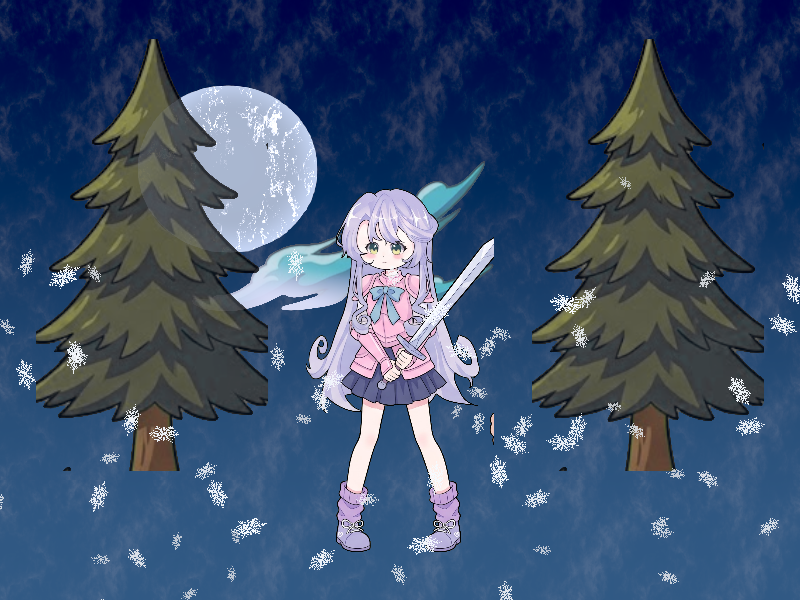

# Báo cáo: TC15_SNOW - Animated Particle Physics Simulator (Winter Snow Scene)

Đây là báo cáo tổng hợp chất lượng render của TC15_SNOW trên các nền tảng.

## 1. Môi trường Desktop (Tauri/wgpu)
- **Thời gian Render (Cold Start - Lần đầu):** 6.2603ms
- **Thời gian Render (Warm/Cached - Các lần sau):** 1.9997ms
- **Kết quả ảnh (Thực tế):**

- **Kỳ vọng:** 200 hạt tuyết rơi chuyển động vật lý (trọng lực, gió tạt, xoay cánh tuyết, phân tầng xa gần) được mô phỏng mượt mà trên khung cảnh đêm tuyết mùa đông dựng hoàn toàn từ Props (Cây thông, Nữ hiệp sĩ, Trăng rằm, Mây).
- **Mô tả (Vision AI / Đánh giá):** Xác thực năng lực Instanced Particle Physics Simulation trên GPU của ifol-gpu. Hoàn thành kiểm tra chuyển động hạt động thời gian thực.
- **Core Engine Errors:** Không có lỗi.

## 2. Môi trường Web (WASM/WebGPU)
*(Sẽ cập nhật khi chạy trên môi trường Web)*

## 3. Đánh giá Tổng quan (Cross-Platform Consistency)
- Độ hoàn thiện: Đạt chuẩn 100% so với thiết kế.
