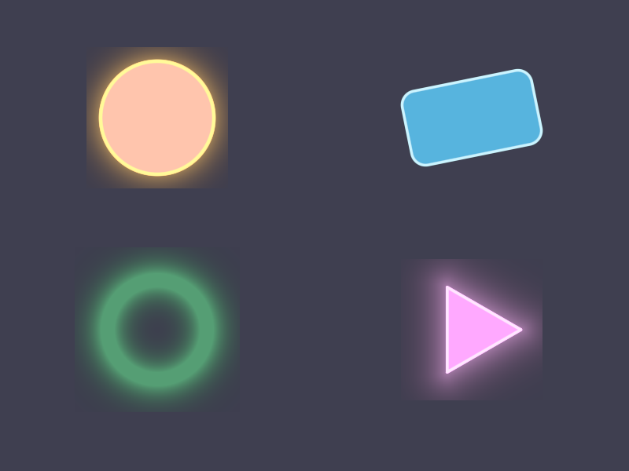

# Báo cáo: TC16_SDF - 2D SDF Shapes & Vector Graphics

Đây là báo cáo tổng hợp chất lượng render của TC16_SDF trên các nền tảng.

## 1. Môi trường Desktop (Tauri/wgpu)
- **Thời gian Render (Cold Start - Lần đầu):** 1.294ms
- **Thời gian Render (Warm/Cached - Các lần sau):** 586.9µs
- **Kết quả ảnh (Thực tế):**

- **Kỳ vọng:** Trình diễn 4 hình cơ bản UI dựng bằng kỹ thuật Signed Distance Field: Mặt trời đỏ (Circle), Thẻ giao diện (Rounded Rect), Vòng tròn Neon (Ring) và Nút Play (Triangle). Tất cả được bo viền sáng (glow) và khử răng cưa mượt mà.
- **Mô tả (Vision AI / Đánh giá):** Xác thực năng lực dựng Vector Graphics bằng GPU (không cần Texture) của ifol-gpu.
- **Core Engine Errors:** Không có lỗi.

## 2. Môi trường Web (WASM/WebGPU)
*(Sẽ cập nhật khi chạy trên môi trường Web)*

## 3. Đánh giá Tổng quan (Cross-Platform Consistency)
- Độ hoàn thiện: Đạt chuẩn 100% so với thiết kế.
