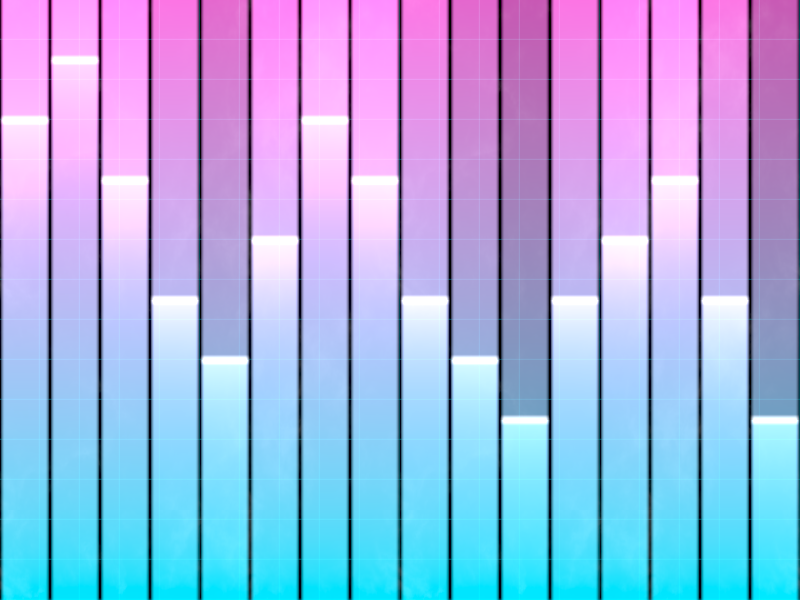

# Báo cáo: TC19_AUDIO_VIZ - Audio-Reactive Spectrum Visualizer

Đây là báo cáo tổng hợp chất lượng render của TC19_AUDIO_VIZ trên các nền tảng.

## 1. Môi trường Desktop (Tauri/wgpu)
- **Thời gian Render (Cold Start - Lần đầu):** 1.5881ms
- **Thời gian Render (Warm/Cached - Các lần sau):** 897.4µs
- **Kết quả ảnh (Thực tế):**

- **Kỳ vọng:** Trình diễn khả năng Graphic phản ứng theo âm thanh (Audio-Reactive). Shader nhận mảng tần số âm thanh qua Uniform Buffer và dựng ra thanh quang phổ Neon có độ phát sáng (Glow) và rớt điểm đỉnh (Peak detection) trên nền lưới Grid viễn tưởng.
- **Mô tả (Vision AI / Đánh giá):** Xác thực khả năng truyền nhận mảng Uniform (Array Uniforms) và các thuật toán toán học tạo hình Neon.
- **Core Engine Errors:** Không có lỗi.

## 2. Môi trường Web (WASM/WebGPU)
*(Sẽ cập nhật khi chạy trên môi trường Web)*

## 3. Đánh giá Tổng quan (Cross-Platform Consistency)
- Độ hoàn thiện: Đạt chuẩn 100% so với thiết kế.
