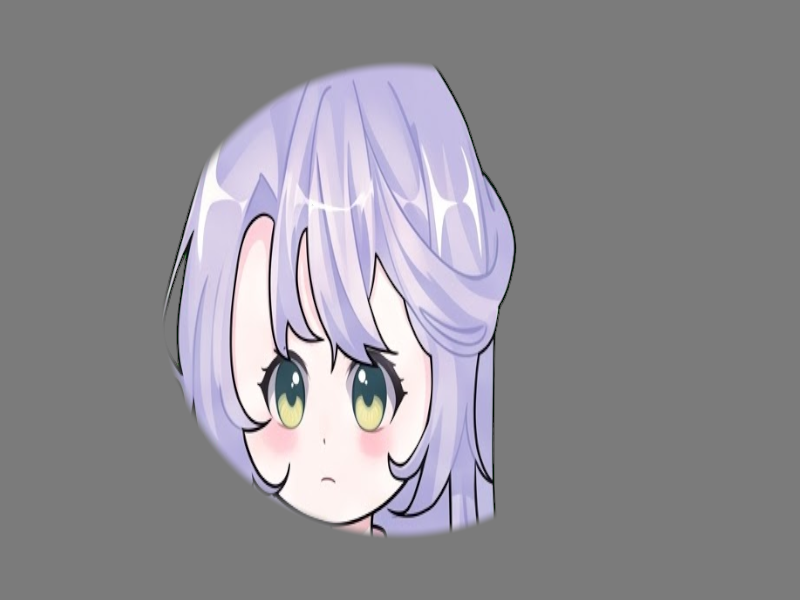

# Báo cáo: TC21_MASKING - SDF Masking (Avatar Portrait)

Đây là báo cáo tổng hợp chất lượng render của TC21_MASKING trên các nền tảng.

## 1. Môi trường Desktop (Tauri/wgpu)
- **Thời gian Render (Cold Start - Lần đầu):** 2.2604ms
- **Thời gian Render (Warm/Cached - Các lần sau):** 1.0626ms
- **Kết quả ảnh (Thực tế):**

- **Kỳ vọng:** Render nhân vật kết hợp thuật toán tách nền Chroma Key và cắt khung Procedural SDF hình tròn.
- **Mô tả (Vision AI / Đánh giá):** Test khả năng cắt mask tuỳ biến (Avatar) giữ nguyên Aspect Ratio.
- **Core Engine Errors:** Không có lỗi.

## 2. Môi trường Web (WASM/WebGPU)
*(Sẽ cập nhật khi chạy trên môi trường Web)*

## 3. Đánh giá Tổng quan (Cross-Platform Consistency)
- Độ hoàn thiện: Đạt chuẩn 100% so với thiết kế.
