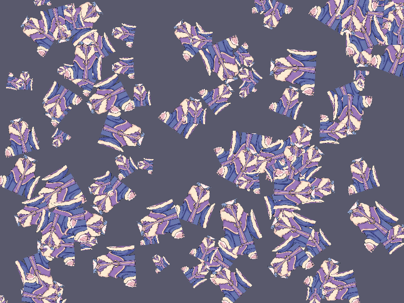

# Báo cáo: TC22_PARTICLES_INSTANCED - Hardware Instancing (Props)

Đây là báo cáo tổng hợp chất lượng render của TC22_PARTICLES_INSTANCED trên các nền tảng.

## 1. Môi trường Desktop (Tauri/wgpu)
- **Thời gian Render (Cold Start - Lần đầu):** 2.2932ms
- **Thời gian Render (Warm/Cached - Các lần sau):** 760.6µs
- **Kết quả ảnh (Thực tế):**

- **Kỳ vọng:** Render 100 instance của 1 vật phẩm (Prop) bằng cách dùng chung 1 lệnh draw.
- **Mô tả (Vision AI / Đánh giá):** Test khả năng tối ưu draw call của ECS khi có nhiều hạt hoặc prop giống nhau.
- **Core Engine Errors:** Không có lỗi.

## 2. Môi trường Web (WASM/WebGPU)
*(Sẽ cập nhật khi chạy trên môi trường Web)*

## 3. Đánh giá Tổng quan (Cross-Platform Consistency)
- Độ hoàn thiện: Đạt chuẩn 100% so với thiết kế.
