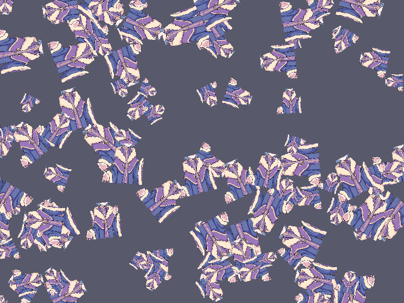

# Báo cáo: TC22 - Instancing phần cứng cho nhiều prop

Đây là báo cáo kiểm thử hai môi trường dùng chung manifest và hợp đồng graph.

## 1. Mô tả và graph dùng chung

- **Manifest:** `tests/shared_assets/manifests/tc22_particles_instanced.json`
- **Graph fingerprint (FNV-1a):** `91868a1a00433fd4`
- **Mô tả test case:** Render một crop sprite canonical bằng một draw command với 100 instance phần cứng xác định.
- **Target:** `800x600`, `Rgba8UnormSrgb`
- **Shader/WGSL:** `instanced_prop.wgsl`
- **Asset/input:** `canonical_sprites_heroes.png`
- **Chính sách input:** Dùng PNG canonical để Desktop/WebGPU giải mã cùng một input byte-level.
- **Depth/stencil:** `Không áp dụng`
- **Chuỗi pass:** instance_scene (One hundred instanced props, target final)
- **Số pass:** `1`
- **Độ sâu graph:** `KHÔNG ÁP DỤNG`
- **Hierarchy:** `Không khai báo`
- **Thứ tự operation sau flatten:** `instanced_props`
- **Sampler contract:** `{"address_mode_u": "repeat", "address_mode_v": "repeat", "address_mode_w": "repeat", "mag_filter": "linear", "min_filter": "linear", "mipmap_filter": "linear"}`
- **Thứ tự layer kỳ vọng:** `instance_scene`
- **Graph resources:** nodes=`1`, draw commands=`1`, tổng instances=`100`, procedural particles=`Không khai báo`
- **Node pool contract:** `Không áp dụng`
- **Error/fallback contract:** `Không áp dụng`
- **Desktop/Web dùng cùng manifest fingerprint:** `ĐẠT`

## 2. Môi trường Desktop

- **Thời gian render lần đầu (cold):** `9.4408 ms`
- **Thời gian render lần hai (warm/cache):** `1.1903 ms`
- **Số lần warm được đo:** `1`
- **Output cold và warm giống nhau:** `True`
- **Speedup cold → warm:** `87.4%`
- **Adapter/backend:** `Intel(R) Iris(R) Xe Graphics` / `Vulkan`
- **Phạm vi timing:** `1 pass (100 hardware instances in one draw command) + submit queue + device.poll(Wait); không gồm khởi tạo device/pipeline và readback`
- **Dữ liệu raw:** `tests/outputs/desktop/tc22_particles_instanced_desktop.bin`
- **Dấu vân tay raw (FNV-1a):** `d9d50f46d7d99da7`
- **SHA-256:** `29902a63fe25914df5ec0ee87707e3a62cd2118ecd90f02ebdcf75b2c0b58a1f`
- **Ảnh:** 
- **Đánh giá nội dung:** `ĐẠT`
- **Đánh giá bằng vision:** ĐẠT: Vision xác nhận một draw command tạo nhiều prop nhỏ phân bố và xoay khác nhau trên nền xanh đậm, crop sprite và loại phông xanh đúng, không có black output hoặc artefact.
- **Graph thực tế:** nodes=1, draw commands=1, instances=100

## 3. Môi trường WebGPU

- **Thời gian render lần đầu (cold):** `189.7000 ms`
- **Thời gian render lần hai (warm/cache):** `3.5000 ms`
- **Số lần warm được đo:** `1`
- **Output cold và warm giống nhau:** `True`
- **Speedup cold → warm:** `98.2%`
- **Adapter:** `gen-12lp`
- **Phạm vi timing:** `1 pass (100 hardware instances in one draw command) + submit queue + onSubmittedWorkDone; không gồm khởi tạo device/pipeline và readback`
- **Dữ liệu raw:** `tests/outputs/web/tc22_particles_instanced_web.bin`
- **Dấu vân tay raw (FNV-1a):** `d9d50f46d7d99da7`
- **SHA-256:** `29902a63fe25914df5ec0ee87707e3a62cd2118ecd90f02ebdcf75b2c0b58a1f`
- **Ảnh:** 
- **Đánh giá nội dung:** `ĐẠT`
- **Đánh giá bằng vision:** ĐẠT: Vision xác nhận một draw command tạo nhiều prop nhỏ phân bố và xoay khác nhau trên nền xanh đậm, crop sprite và loại phông xanh đúng, không có black output hoặc artefact.
- **Graph thực tế:** nodes=1, draw commands=1, instances=100

## 4. So sánh và kết luận

| Tiêu chí | Kết quả |
| --- | --- |
| Graph/manifest giống nhau | `ĐẠT` |
| Kích thước dữ liệu raw giống nhau | `ĐẠT` |
| Byte raw giống tuyệt đối | `ĐẠT` |
| Số byte khác nhau | `0` |
| Số pixel khác nhau | `0` |
| Sai số kênh màu lớn nhất | `0/255` |
| Khác biệt màu/presentation | `KHÔNG` |
| Số pixel non-background Desktop/Web | `KHÔNG ÁP DỤNG` |
| Bounding box Desktop | `KHÔNG ÁP DỤNG` |
| Bounding box WebGPU | `KHÔNG ÁP DỤNG` |
| Bounding box non-background giống nhau | `ĐẠT` |
| Số pixel mask khác nhau | `0` (ngưỡng `0`) |
| Parity cấu trúc không phụ thuộc màu | `ĐẠT` |
| Cache giữ nguyên output cold/warm ở cả hai môi trường | `ĐẠT` |
| Validation/fallback contract không panic | `ĐẠT` |
| Đúng mô tả test case | `ĐẠT` |

**Kết luận:** `ĐẠT - output giống tuyệt đối từng byte.`

## 5. Phân tích hiệu suất

Các giá trị trên đo thời gian thực thi graph, submit lệnh và chờ GPU hoàn tất;
không bao gồm khởi tạo device/pipeline hoặc readback. Vì vậy `cold` ở đây là
lần execute đầu sau khi resource/pipeline đã được tạo, không phải cold start
của toàn bộ ứng dụng. Giá trị dưới `1 ms` tương đương microsecond và cần được
đọc theo đơn vị đó khi phân tích.
