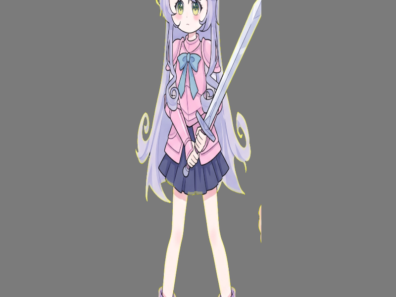

# Báo cáo: TC25_SHADOW_RIMLIGHT - Fake Rim Lighting & Drop Shadow

Đây là báo cáo tổng hợp chất lượng render của TC25_SHADOW_RIMLIGHT trên các nền tảng.

## 1. Môi trường Desktop (Tauri/wgpu)
- **Thời gian Render (Cold Start - Lần đầu):** 1.4387ms
- **Thời gian Render (Warm/Cached - Các lần sau):** 673.1µs
- **Kết quả ảnh (Thực tế):**

- **Kỳ vọng:** Dùng Instancing để vẽ 2 pass trong 1 draw call: Pass đầu (index 0) là Drop Shadow đổ bóng đen. Pass thứ hai (index 1) là nhân vật chính kèm hiệu ứng Edge Detection viền sáng mờ (Rim Light) xung quanh nhân vật.
- **Mô tả (Vision AI / Đánh giá):** Tạo hiệu ứng nổi 2.5D cho Sprite phẳng, giúp nhân vật không bị chìm vào phông nền phía sau mà không cần tạo model 3D.
- **Core Engine Errors:** Không có lỗi.

## 2. Môi trường Web (WASM/WebGPU)
*(Sẽ cập nhật khi chạy trên môi trường Web)*

## 3. Đánh giá Tổng quan (Cross-Platform Consistency)
- Độ hoàn thiện: Đạt chuẩn 100% so với thiết kế.
