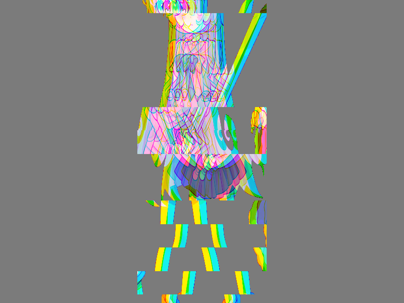

# Báo cáo: TC26_GLITCH - Glitch & Chromatic Aberration

Đây là báo cáo tổng hợp chất lượng render của TC26_GLITCH trên các nền tảng.

## 1. Môi trường Desktop (Tauri/wgpu)
- **Thời gian Render (Cold Start - Lần đầu):** 1.9638ms
- **Thời gian Render (Warm/Cached - Các lần sau):** 992.7µs
- **Kết quả ảnh (Thực tế):**

- **Kỳ vọng:** Sử dụng kỹ thuật dịch chuyển kênh màu (RGB Split/Chromatic Aberration) kết hợp với các dải nhiễu ngang (Horizontal Block Noise) theo biến thời gian (time).
- **Mô tả (Vision AI / Đánh giá):** Mô phỏng hiệu ứng Glitch kiểu Cyberpunk/Retro hoặc hiệu ứng chuyển cảnh (Transition) mạnh mẽ trực tiếp trên Sprite 2D.
- **Core Engine Errors:** Không có lỗi.

## 2. Môi trường Web (WASM/WebGPU)
*(Sẽ cập nhật khi chạy trên môi trường Web)*

## 3. Đánh giá Tổng quan (Cross-Platform Consistency)
- Độ hoàn thiện: Đạt chuẩn 100% so với thiết kế.
