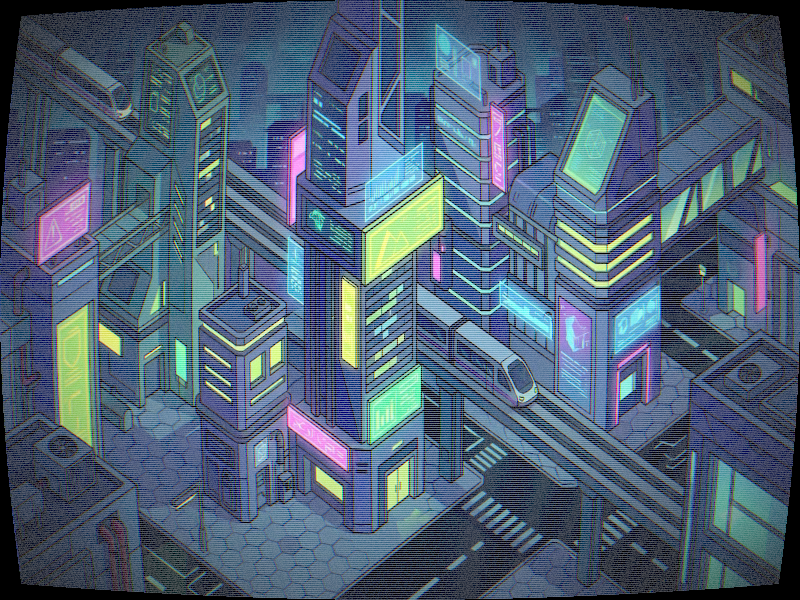

# Báo cáo: TC29 - Bộ lọc màn hình CRT và VHS

Đây là báo cáo kiểm thử hai môi trường dùng chung manifest và hợp đồng graph.

## 1. Mô tả và graph dùng chung

- **Manifest:** `tests/shared_assets/manifests/tc29_crt_vhs.json`
- **Graph fingerprint (FNV-1a):** `a54801bc417a3b00`
- **Mô tả test case:** Áp dụng cong thấu kính, scanline, vignette và tách RGB lên nền sci-fi canonical.
- **Target:** `800x600`, `Rgba8UnormSrgb`
- **Shader/WGSL:** `crt_vhs.wgsl`
- **Asset/input:** `canonical_bg_scifi.png`
- **Chính sách input:** Dùng PNG canonical để Desktop/WebGPU giải mã cùng một input byte-level.
- **Depth/stencil:** `Không áp dụng`
- **Chuỗi pass:** crt_scene (CRT/VHS screen treatment, target final)
- **Số pass:** `1`
- **Độ sâu graph:** `KHÔNG ÁP DỤNG`
- **Hierarchy:** `Không khai báo`
- **Thứ tự operation sau flatten:** `crt_vhs_filter`
- **Sampler contract:** `{"address_mode_u": "repeat", "address_mode_v": "repeat", "address_mode_w": "repeat", "mag_filter": "linear", "min_filter": "linear", "mipmap_filter": "linear"}`
- **Thứ tự layer kỳ vọng:** `crt_scene`
- **Graph resources:** nodes=`1`, draw commands=`1`, tổng instances=`1`, procedural particles=`Không khai báo`
- **Node pool contract:** `Không áp dụng`
- **Error/fallback contract:** `Không áp dụng`
- **Desktop/Web dùng cùng manifest fingerprint:** `ĐẠT`

## 2. Môi trường Desktop

- **Thời gian render lần đầu (cold):** `1.9612 ms`
- **Thời gian render lần hai (warm/cache):** `1.1991 ms`
- **Số lần warm được đo:** `1`
- **Output cold và warm giống nhau:** `True`
- **Speedup cold → warm:** `38.9%`
- **Adapter/backend:** `Intel(R) Iris(R) Xe Graphics` / `Vulkan`
- **Phạm vi timing:** `1 pass (CRT curvature + scanlines + vignette + RGB split + integer-hash noise) + submit queue + device.poll(Wait); không gồm khởi tạo device/pipeline và readback`
- **Dữ liệu raw:** `tests/outputs/desktop/tc29_crt_vhs_desktop.bin`
- **Dấu vân tay raw (FNV-1a):** `0e7312b72a8261ee`
- **SHA-256:** `06787db1cc11ef7c58341200cdff688309d876cc6972e32842457992d5fe30c0`
- **Ảnh:** 
- **Đánh giá nội dung:** `ĐẠT`
- **Đánh giá bằng vision:** ĐẠT: Vision xác nhận ảnh có khung CRT cong rõ ràng, scanlines dày, vignette ở biên, RGB split nhẹ và nhiễu ổn định; không có black output bất thường hoặc artefact ngoài mô tả.
- **Graph thực tế:** nodes=1, draw commands=1, instances=1

## 3. Môi trường WebGPU

- **Thời gian render lần đầu (cold):** `8.0000 ms`
- **Thời gian render lần hai (warm/cache):** `7.2000 ms`
- **Số lần warm được đo:** `1`
- **Output cold và warm giống nhau:** `True`
- **Speedup cold → warm:** `10.0%`
- **Adapter:** `gen-12lp`
- **Phạm vi timing:** `1 pass (CRT curvature + scanlines + vignette + RGB split + integer-hash noise) + submit queue + onSubmittedWorkDone; không gồm khởi tạo device/pipeline và readback`
- **Dữ liệu raw:** `tests/outputs/web/tc29_crt_vhs_web.bin`
- **Dấu vân tay raw (FNV-1a):** `6d26d354cf4defdf`
- **SHA-256:** `99614448ef5ec9f27273d92cc131d6b5073e802fc58a095a097810d8958067d6`
- **Ảnh:** 
- **Đánh giá nội dung:** `ĐẠT`
- **Đánh giá bằng vision:** ĐẠT: Vision xác nhận ảnh có khung CRT cong rõ ràng, scanlines dày, vignette ở biên, RGB split nhẹ và nhiễu ổn định; không có black output bất thường hoặc artefact ngoài mô tả.
- **Graph thực tế:** nodes=1, draw commands=1, instances=1

## 4. So sánh và kết luận

| Tiêu chí | Kết quả |
| --- | --- |
| Graph/manifest giống nhau | `ĐẠT` |
| Kích thước dữ liệu raw giống nhau | `ĐẠT` |
| Byte raw giống tuyệt đối | `KHÔNG ĐẠT` |
| Số byte khác nhau | `591` |
| Số pixel khác nhau | `588` |
| Sai số kênh màu lớn nhất | `1/255` |
| Khác biệt màu/presentation | `CÓ - cần theo dõi để đạt byte parity` |
| Số pixel non-background Desktop/Web | `KHÔNG ÁP DỤNG` |
| Bounding box Desktop | `KHÔNG ÁP DỤNG` |
| Bounding box WebGPU | `KHÔNG ÁP DỤNG` |
| Bounding box non-background giống nhau | `ĐẠT` |
| Số pixel mask khác nhau | `0` (ngưỡng `0`) |
| Parity cấu trúc không phụ thuộc màu | `ĐẠT` |
| Cache giữ nguyên output cold/warm ở cả hai môi trường | `ĐẠT` |
| Validation/fallback contract không panic | `ĐẠT` |
| Đúng mô tả test case | `ĐẠT` |

**Kết luận:** `ĐẠT CÓ ĐIỀU KIỆN - graph và cấu trúc render giống; khác biệt còn lại thuộc pixel/màu và nằm trong ngưỡng đã khai báo.`

## 5. Phân tích hiệu suất

Các giá trị trên đo thời gian thực thi graph, submit lệnh và chờ GPU hoàn tất;
không bao gồm khởi tạo device/pipeline hoặc readback. Vì vậy `cold` ở đây là
lần execute đầu sau khi resource/pipeline đã được tạo, không phải cold start
của toàn bộ ứng dụng. Giá trị dưới `1 ms` tương đương microsecond và cần được
đọc theo đơn vị đó khi phân tích.
