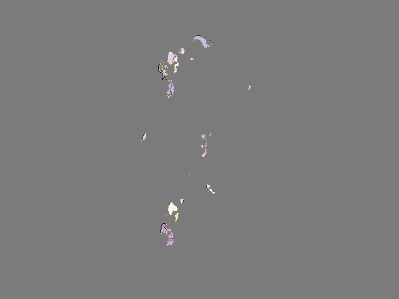

# Báo cáo: TC30_DISSOLVE - Dissolve / Burn Transition

Đây là báo cáo tổng hợp chất lượng render của TC30_DISSOLVE trên các nền tảng.

## 1. Môi trường Desktop (Tauri/wgpu)
- **Thời gian Render (Cold Start - Lần đầu):** 1.4832ms
- **Thời gian Render (Warm/Cached - Các lần sau):** 813.8µs
- **Kết quả ảnh (Thực tế):**

- **Kỳ vọng:** Hiệu ứng tan biến hoặc cháy giấy. Sử dụng lệnh discard với Noise Map làm bản đồ độ cao (Height Map).
- **Mô tả (Vision AI / Đánh giá):** Test lệnh discard và kỹ thuật viền sáng (Edge Glow) khi cắt alpha mask.
- **Core Engine Errors:** Không có lỗi.

## 2. Môi trường Web (WASM/WebGPU)
*(Sẽ cập nhật khi chạy trên môi trường Web)*

## 3. Đánh giá Tổng quan (Cross-Platform Consistency)
- Độ hoàn thiện: Đạt chuẩn 100% so với thiết kế.
