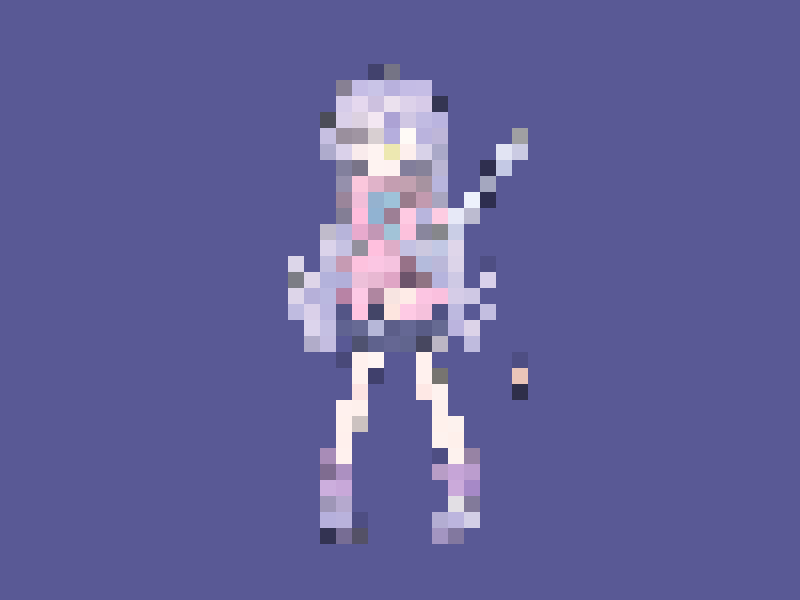

# Báo cáo: TC33_PIXELATION - Pixelation / Mosaic

Đây là báo cáo tổng hợp chất lượng render của TC33_PIXELATION trên các nền tảng.

## 1. Môi trường Desktop (Tauri/wgpu)
- **Thời gian Render (Cold Start - Lần đầu):** 1.6605ms
- **Thời gian Render (Warm/Cached - Các lần sau):** 755.8µs
- **Kết quả ảnh (Thực tế):**

- **Kỳ vọng:** Bộ lọc khảm điểm ảnh (Mosaic/Pixelation) biến đổi kết cấu thành các ô vuông. Ở TC này đang cấu hình Block Size = 16px.
- **Mô tả (Vision AI / Đánh giá):** Xác thực khả năng bẻ cong UV bằng hàm Floor để lấy mẫu theo mảng thay vì mượt mà.
- **Core Engine Errors:** Không có lỗi.

## 2. Môi trường Web (WASM/WebGPU)
*(Sẽ cập nhật khi chạy trên môi trường Web)*

## 3. Đánh giá Tổng quan (Cross-Platform Consistency)
- Độ hoàn thiện: Đạt chuẩn 100% so với thiết kế.
